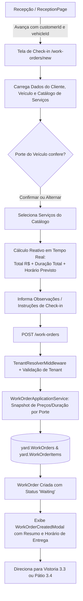

# Abertura da Ordem de Serviço — Fase 3.2

## Objetivo e estado

A abertura da ordem de serviço conclui o fluxo de entrada do veículo no lava-jato (check-in operacional). Partindo da recepção (Fase 3.1), o atendente seleciona ou confirma o porte do veículo, escolhe os serviços contratados do catálogo do estabelecimento, acompanha em tempo real o cálculo do valor total e previsão estimada de entrega, adiciona observações do check-in e emite a Ordem de Serviço (`WorkOrder`).

A implementação contempla de ponta a ponta:
- Backend: agregado `WorkOrder` com `WorkOrderItem`, cálculo de `EstimatedCompletionAtUtc`, registro opcional de `Notes`, persistência atômica no schema `yard`, repositório com isolamento multi-tenant estrito e endpoints autenticados REST sob a política `CreateWorkOrders`.
- Frontend: página de check-in (`NewWorkOrderPage` em `/work-orders/new`) e componentes isolados reutilizáveis (`CheckinCustomerHeader`, `ServiceSelectorCard`, `WorkOrderSummaryCard`, `WorkOrderCreatedModal`) com estética automotiva de alta fidelidade e reatividade imediata.
- Qualidade: 100% dos testes da solution aprovados (testes unitários, de arquitetura NetArchTest, de integração SQL Server via Testcontainers com validação cross-tenant e testes bUnit).

## Fluxo

## Regras de Negócio e Invariantes

- **Agregados e Entidades:** `WorkOrder` e `WorkOrderItem` pertencem ao módulo `YardOperations`; ambos implementam `IMustHaveTenant` e utilizam identificadores `Guid` sequenciais (`Guid.CreateVersion7()`).
- **Validação de Propriedade:** Uma OS só pode ser aberta para um `Vehicle` que comprovadamente pertença ao `Customer` informado e ambos pertençam ao mesmo `TenantId` da sessão autenticada. Referências cruzadas entre tenants retornam `404 Not Found`.
- **Portes e Precificação Dinâmica:** Os portes suportados são `HatchSedan`, `Suv`, `PickupVan` e `Motorcycle`. O check-in permite alternar o porte do veículo no ato, atualizando instantaneamente os preços e durações aplicáveis aos serviços.
- **Snapshot Imutável:** Ao abrir a OS, os preços unitários (`UnitPrice`), durações estimadas (`EstimatedDurationMinutes`) e nomes dos serviços são gravados diretamente nos itens da OS (`WorkOrderItem`), garantindo que alterações futuras no catálogo de serviços não afetem ordens de serviço já abertas.
- **Cálculo da Previsão de Entrega:** A previsão estimada de conclusão (`EstimatedCompletionAtUtc`) é calculada a partir de `CreatedAtUtc.AddMinutes(EstimatedDurationMinutes)`, sendo apresentada no fuso local do usuário (ex.: `Hoje às 16:45`).
- **Observações:** O campo `Notes` permite até 500 caracteres para anotações do check-in (ex.: cuidados especiais, pertences no interior do veículo).
- **Status Inicial:** A OS é iniciada invariavelmente com o status `Waiting` (*Aguardando*), pronta para a Vistoria de Entrada (3.3) e inclusão no Kanban Operacional (3.4).
- **Autorização:** A abertura de OS exige a política `CreateWorkOrders` (perfis `Administrator` e `Receptionist`). A visualização exige `ViewCustomers` (inclui também o perfil `Operator`).

## API REST

- `POST /work-orders`: cria uma nova ordem de serviço.
  - Body: `CreateWorkOrderRequest(Guid CustomerId, Guid VehicleId, IReadOnlyCollection<CreateWorkOrderItemRequest> Items, string? Notes)`.
  - Resposta: `201 Created` com header `Location: /work-orders/{id}` e payload `WorkOrderDto`.
  - Respostas de erro: `400 Bad Request` (validação de itens, notas ou porte não configurado), `404 Not Found` (cliente, veículo ou serviço inexistente), `409 Conflict` (veículo não pertence ao cliente ou serviços duplicados).
- `GET /work-orders/{id}`: retorna os detalhes completos da OS (`WorkOrderDto`).
- `GET /work-orders?limit=20`: lista as ordens de serviço recentes do estabelecimento autenticado.

## Componentes Blazor

- `CheckinCustomerHeader.razor` (`CarWashSaaS.Client.Components`): cabeçalho do check-in exibindo dados do cliente, placa automotiva estilizada (padrão Mercosul/Brasil) e seletor de porte com botões tipo pill interativos.
- `ServiceSelectorCard.razor` (`CarWashSaaS.Client.Components`): grade dos serviços disponíveis agrupados por categoria, com indicação de preço/tempo para o porte selecionado, estado de seleção iluminado e controladores de quantidade (+ / -).
- `WorkOrderSummaryCard.razor` (`CarWashSaaS.Client.Components`): painel lateral com cálculo reativo em tempo real do valor total, tempo acumulado, banner de previsão de entrega com relógio, campo de observações com contador de caracteres e botão de confirmação com loading state.
- `WorkOrderCreatedModal.razor` (`CarWashSaaS.Client.Components`): modal de confirmação com efeito de glassmorphism, indicador luminoso de sucesso, resumo do atendimento e ações para nova recepção ou visualização no pátio.
- `NewWorkOrderPage.razor` (`CarWashSaaS.Client.Web`): página orquestradora na rota `/work-orders/new`, conectada via query parameters (`customerId`, `vehicleId`) ou `ReceptionSessionState`.
- `WorkOrderApiClient.cs` (`CarWashSaaS.Client.Core`): cliente HTTP fortemente tipado com tratamento robusto de erros e deserialização de `WorkOrderDto`.
