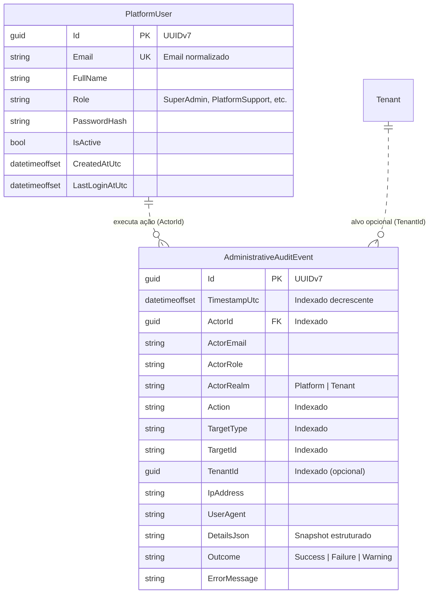
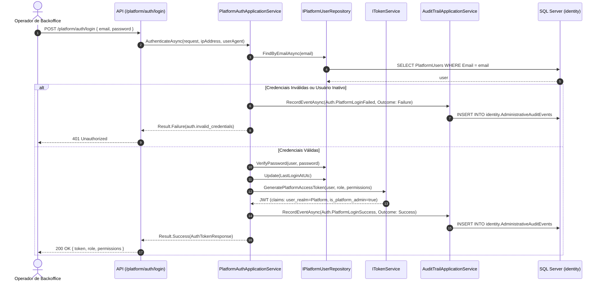
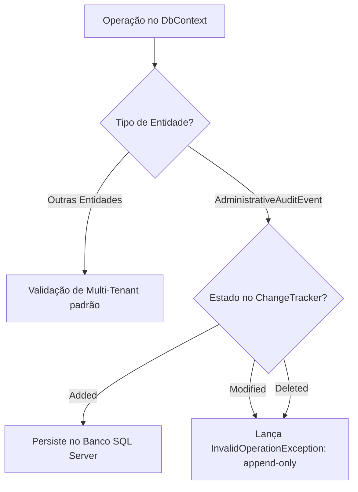

# Acesso Administrativo e Auditoria — Subfase 6.1

Este documento descreve a arquitetura, modelos e especificações executáveis implementados para acesso administrativo da plataforma (Backoffice do SaaS) e a trilha de auditoria append-only imutável.

---

## 1. Modelo de Domínio e Dados



---

## 2. Fluxo de Autenticação de Operador e Registro de Auditoria



---

## 3. Garantia de Imutabilidade (Append-Only Enforcement)



---

## 4. Endpoints REST da Camada de Apresentação

| Método | Rota | Autenticação | Política | Descrição |
| :--- | :--- | :--- | :--- | :--- |
| `POST` | `/platform/auth/login` | Anônimo | Nenhuma | Autentica operador de plataforma e audita a tentativa |
| `POST` | `/platform/users` | Bearer JWT | `PlatformSuperAdminPolicy` | Cadastra novo operador de plataforma com auditoria |
| `GET` | `/platform/users` | Bearer JWT | `PlatformSuperAdminPolicy` | Lista operadores cadastrados na plataforma |
| `GET` | `/platform/audit` | Bearer JWT | `PlatformAuditorPolicy` | Consulta trilha de auditoria com múltiplos filtros e paginação |
| `GET` | `/platform/audit/{id}` | Bearer JWT | `PlatformAuditorPolicy` | Detalhamento do evento e inspeção forense de payload |
| `POST` | `/platform/audit` | Bearer JWT | `PlatformUserPolicy` | Registra evento de auditoria customizado da plataforma |

---

## 5. Especificações Executáveis (BDD / Living Specs)

### Cenário 1: Login de Operador com Auditoria Automática
```gherkin
Cenário: Registro de login bem-sucedido na trilha de auditoria
  Dado que existe um operador de plataforma "superadmin@lavaway.com" com papel "SuperAdmin"
  Quando o operador autentica via "/platform/auth/login" com credenciais válidas
  Então o sistema emite um token JWT contendo as claims "user_realm: Platform" e "is_platform_admin: true"
  E um registro de auditoria é inserido com autor "superadmin@lavaway.com", ação "Auth.PlatformLoginSuccess", desfecho "Success" e data UTC atual
```

### Cenário 2: Tentativa de Acesso Maliciosa ou Inválida
```gherkin
Cenário: Registro de falha de autenticação na trilha de auditoria
  Dado que uma requisição de login informa credenciais inválidas para "admin@lavaway.com"
  Quando a chamada "/platform/auth/login" é processada
  Então o sistema rejeita com status 401 Unauthorized
  E um evento de auditoria é persistido com autor "admin@lavaway.com", ação "Auth.PlatformLoginFailed", desfecho "Failure" e endereço IP registrado
```

### Cenário 3: Imutabilidade Estrita da Trilha de Auditoria
```gherkin
Cenário: Bloqueio de alteração ou exclusão de eventos de auditoria
  Dado um evento já registrado na tabela "AdministrativeAuditEvents"
  Quando um comando tenta atualizar o registro ou excluí-lo diretamente no Entity Framework Core
  Então a operação é interceptada e abortada com InvalidOperationException indicando conformidade append-only
```

---

## 6. Segregação e Provisionamento Inicial (DevDatabaseSeeder)

A plataforma separa estritamente os operadores de backoffice dos usuários operacionais dos estabelecimentos (tenants):

| Tipo de Usuário | Tabela de Persistência | Papel | Vínculo TenantId | Credenciais Seed Local |
| :--- | :--- | :--- | :--- | :--- |
| **Operador de Plataforma** | `identity.PlatformUsers` | `PlatformRole.SuperAdmin` | `null` (Nenhum) | `platform@lavaway.com` / `PlatformAdmin123!` |
| **Administrador de Loja** | `identity.Users` | `ShopRole.Administrator` | `11111111-1111-1111-1111-111111111111` | `admin@lavaway.com` / `Admin123!` |
| **Recepcionista de Loja** | `identity.Users` | `ShopRole.Receptionist` | `11111111-1111-1111-1111-111111111111` | `recepcao@lavaway.com` / `Recepcao123!` |

As configurações são parametrizadas no `.env` via `Seed__PlatformAdminEmail` e `Seed__PlatformAdminPassword`. Na inicialização do seeder, a criação do administrador de plataforma gera automaticamente um registro de auditoria imutável inicial (`PlatformUser.Created`).

