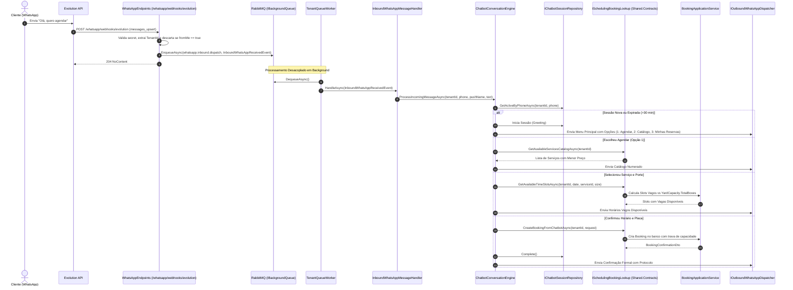
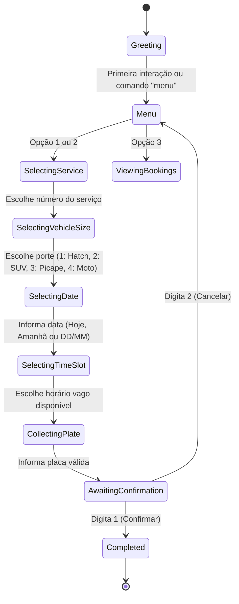

# Agendamento Conversacional via WhatsApp e Agenda Operacional — Subfase 4.3

## 1. Visão Geral & Objetivo

Permitir que clientes de lava-jatos e estética automotiva consultem o catálogo de serviços, verifiquem horários vagos e reservem horários pelo WhatsApp da loja de forma 100% autônoma através de um chatbot conversacional com máquina de estados. O sistema garante a prevenção de conflitos de capacidade física (`TotalBoxes`), gerencia sessões com timeout de 30 minutos e exibe as reservas em tempo real para a equipe na tela de **Agenda & Reservas**, com ação de check-in para abertura direta de Ordem de Serviço na recepção.

---

## 2. Diagrama de Sequência & Ingestão Assíncrona

---

## 3. Máquina de Estados da Conversa (FSM)

---

## 4. Especificações Executáveis (BDD)

### Cenário 1: Cliente agenda serviço com sucesso via WhatsApp
- **Dado** que o estabelecimento possui 2 boxes cadastrados na capacidade operacional,
- **E** o cliente envia uma mensagem de saudação pelo WhatsApp para a loja,
- **Quando** o cliente seleciona a opção de agendamento, escolhe o serviço "Lavagem Completa", o porte "Hatch / Sedan", a data de amanhã às 14:00 e informa a placa "ABC-1234",
- **E** confirma o agendamento digitando "1",
- **Então** o sistema cria uma reserva no status `Confirmed` com protocolo gerado,
- **E** envia mensagem de confirmação para o WhatsApp do cliente com o protocolo e endereço da loja,
- **E** a reserva passa a ser exibida na tela de Agenda & Reservas da equipe operacional.

### Cenário 2: Prevenção de conflito de capacidade física (Overbooking)
- **Dado** que o pátio possui capacidade de 1 box físico cadastrado,
- **E** já existe uma reserva ativa confirmada para o horário das 10:00 da manhã,
- **Quando** um segundo cliente tenta confirmar um agendamento para o mesmo horário das 10:00,
- **Então** o sistema rejeita a operação com erro de capacidade excedida (`booking.capacity.exceeded`),
- **E** o chatbot informa educadamente que a vaga acabou de ser preenchida e convida o cliente a selecionar outro horário vago.

### Cenário 3: Operador inicia atendimento a partir da reserva
- **Dado** que existe um agendamento confirmado na agenda para o veículo "ABC-1D23" do cliente "Carlos",
- **Quando** o cliente chega à loja e o operador clica no botão "Iniciar Atendimento" no card da reserva,
- **Então** o sistema redireciona para a tela de Recepção com a placa e o telefone pré-preenchidos,
- **E** a busca automática é disparada para agilizar a criação da Ordem de Serviço.

---

## 5. Endpoints REST & Contratos

| Método | Rota | Autorização | Finalidade |
| :--- | :--- | :--- | :--- |
| `POST` | `/whatsapp/webhooks/evolution` | Anônimo (valida Secret) | Ingestão de mensagens recebidas (`messages_upsert`) |
| `GET` | `/scheduling/bookings` | `Receptionist` | Lista agendamentos do dia por data, status e busca |
| `GET` | `/scheduling/bookings/{id}` | `Receptionist` | Consulta detalhes de um agendamento |
| `POST` | `/scheduling/bookings` | `Receptionist` | Criação manual de reserva pela equipe |
| `POST` | `/scheduling/bookings/{id}/cancel` | `Receptionist` | Cancelamento de reserva com justificativa |
| `GET` | `/scheduling/slots` | `Receptionist` | Consulta horários vagos e capacidade de boxes |
