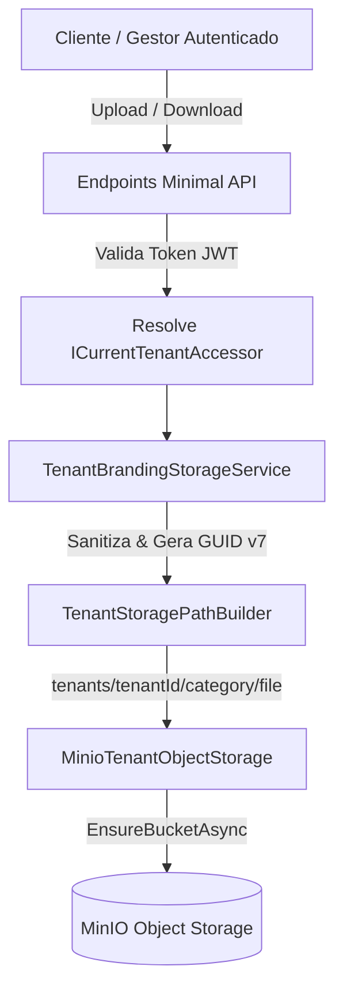
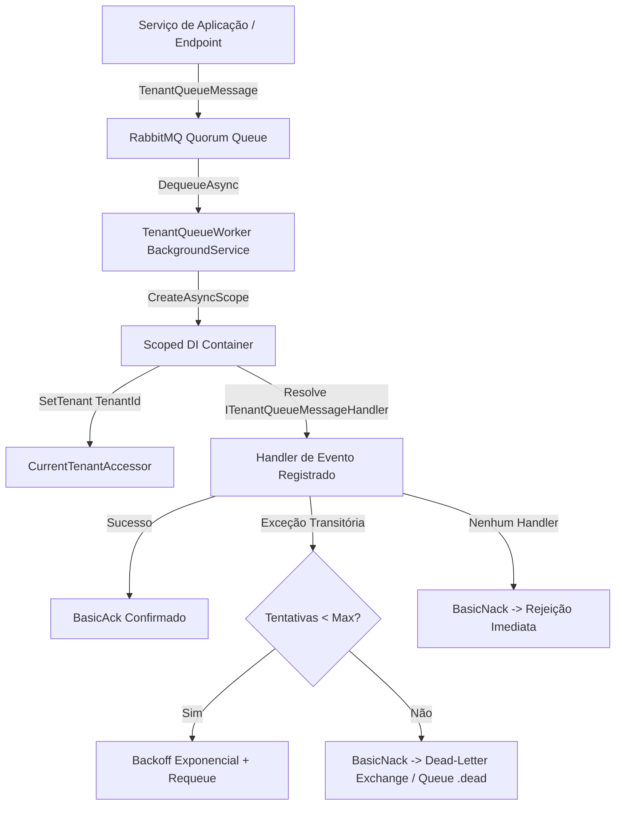

# Arquivos e Processamento Assíncrono — Fase 1.4

## Objetivo
Garantir o armazenamento seguro e privado de objetos com isolamento rígido por tenant (MinIO/S3), e o processamento desacoplado e confiável de tarefas assíncronas através de filas duráveis (RabbitMQ), garantindo o estabelecimento de escopo e contexto de tenant antes da invocação de handlers de domínio.

---

## 1. Arquitetura e Fluxo de Storage de Objetos (MinIO)

O storage de objetos opera sob o contrato `ITenantObjectStorage`, garantindo que os módulos de aplicação dependam apenas de abstrações. Todo caminho de objeto gerado é prefixado obrigatoriamente pelo identificador único do tenant: `tenants/{tenantId}/{category}/{fileName}`.

### Regras de Storage
- **Namespace por Tenant:** Todos os arquivos são prefixados com `tenants/{tenantId}/{category}/{fileName}`. Tentativas de path traversal (`../`) são rejeitadas.
- **Isolamento Cruzado:** Consultas de leitura (`GetAsync`) executadas por Tenant B para caminhos pertencentes ao Tenant A retornam `null` / 404 Not Found.
- **Tipos Permitidos:** Extensões de mídia validadas com Content-Type estrito (`image/png`, `image/jpeg`, `image/webp`, `image/svg+xml`, `application/pdf`).
- **Nomes Seguros:** Nomes de arquivos gerados utilizam UUID versão 7 sequencial com sanitização de extensão.

---

## 2. Topologia e Ciclo de Vida da Fila Assíncrona (RabbitMQ)

A mensageria implementa filas `quorum` persistentes gerenciadas por `RabbitMqBackgroundQueue` e consumidas por `TenantQueueWorker`.

### Regras de Mensageria
- **Durabilidade:** Mensagens publicadas com `DeliveryMode = Persistent` e `MessageId` (UUID v7).
- **Isolamento de Escopo:** Para cada mensagem retirada da fila, o `TenantQueueWorker` cria um novo `IServiceScope`, atribui `CurrentTenantAccessor.SetTenant(message.TenantId)` e injeta o contexto do tenant antes de qualquer execução de handler.
- **Dead-Letter e Retentativas:** Limite de entregas (`x-delivery-limit`), backoff exponencial configurável e encaminhamento compulsório para `.dead` em caso de esgotamento de retentativas.
- **Handler de Negócio Ativo:** `TenantBrandingAuditQueueHandler` registrado para eventos `tenant.branding.updated`, auditando modificações de marca sob o tenant contextual.

---

## 3. Especificações Executáveis (BDD / Cenários de Teste)

### Cenário 1: Armazenamento e Recuperação de Objeto com Tipagem Correta
- **Dado** que o Tenant A solicita o upload de uma imagem válida `avatar.png`
- **Quando** o serviço `MinioTenantObjectStorage` processa a gravação
- **Então** o objeto é salvo no MinIO sob `tenants/{tenantA}/avatars/avatar.png`
- **E** a recuperação posterior retorna o stream íntegro e o Content-Type `image/png`.

### Cenário 2: Garantia de Isolamento Multi-Tenant no Storage
- **Dado** que o Tenant A gravou um documento confidencial `contract.pdf`
- **Quando** o Tenant B tenta ler o documento com a mesma categoria e nome de arquivo
- **Então** a consulta retorna `null`
- **E** nenhum dado ou metadado do Tenant A vaza para o Tenant B.

### Cenário 3: Processamento Assíncrono com Estabelecimento de Escopo de Tenant
- **Dado** que uma mensagem `TenantQueueMessage` foi enfileirada para o Tenant A
- **Quando** o `TenantQueueWorker` retira a mensagem da fila RabbitMQ
- **Então** ele cria um escopo onde `ICurrentTenantAccessor.TenantId` é igual ao Tenant A
- **E** invoca o `ITenantQueueMessageHandler` correspondente ao tipo do evento
- **E** confirma a entrega (`ack`) na fila com sucesso.

### Cenário 4: Encaminhamento para Dead-Letter Queue após Limite de Falhas
- **Dado** que uma mensagem falha repetidamente durante a execução
- **Quando** o número de tentativas atinge o `MaxDeliveryAttempts`
- **Então** o worker rejeita a mensagem sem requeue
- **E** o RabbitMQ roteia a mensagem para a fila de descarte (`.dead`).

---

## 4. Cobertura de Testes e Gates Validados

- **Testes Unitários:** `CarWashSaaS.UnitTests.Shared.TenantStorageAndQueueTests` cobre builders, mocks e validações de contexto.
- **Testes de Integração MinIO:** `CarWashSaaS.IntegrationTests.MinioTenantObjectStorageIntegrationTests` valida criação de bucket, gravação, leitura e isolamento com container real MinIO via Testcontainers.
- **Testes de Integração RabbitMQ:** `CarWashSaaS.IntegrationTests.RabbitMqBackgroundQueueIntegrationTests` valida persistência, retentativas e DLQ com container real RabbitMQ 4 via Testcontainers.
- **Testes de Integração do Worker E2E:** `CarWashSaaS.IntegrationTests.TenantQueueWorkerIntegrationTests` valida o ciclo completo de background processing, escopo de tenant e execução de `TenantBrandingAuditQueueHandler`.
