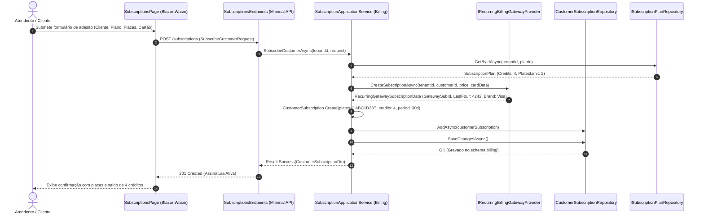
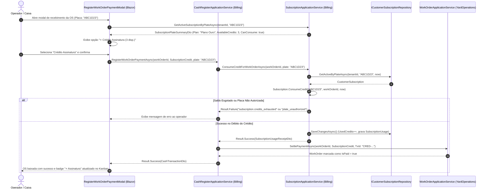
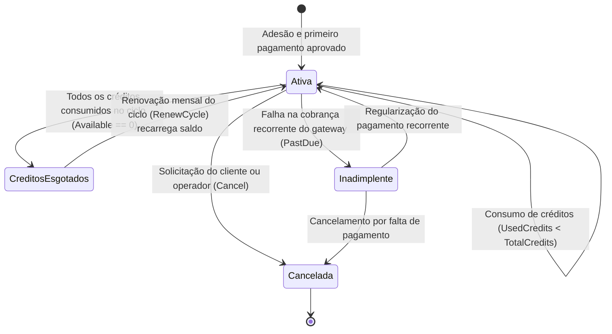

# Assinaturas e Créditos Recorrentes — Subfase 5.5

## 1. Visão Geral & Objetivo

A subfase **5.5** do Lavaway SaaS implementa o modelo de assinaturas mensais e pacotes recorrentes de lavagens por placa de veículo cadastrada. O sistema visa assegurar receita previsível (MRR) para o lava-jato ou estética automotiva, oferecendo conveniência aos clientes finais e governança financeira estrita:
- **Planos Mensais Flexíveis:** Definição de planos com periodicidade mensal, limites de placas autorizadas por assinatura e quantidade fixa de créditos de serviço inclusos no ciclo.
- **Cobrança Recorrente no Cartão:** Integração com gateway via porta `IRecurringBillingGatewayProvider`, capturando token e identificador de assinatura, renovando ciclos e créditos de forma idempotente.
- **Controle por Placa de Veículo:** Cada assinatura mantém uma lista explícita de placas autorizadas (`SubscriptionVehiclePlate`). O consumo do crédito exige a correspondência exata da placa atendida na Ordem de Serviço.
- **Garantia de Não Ultrapassagem de Saldo:** O domínio garante que `UsedCredits <= TotalCredits`. Quando o saldo atinge zero no ciclo atual, novas tentativas de consumo são bloqueadas instantaneamente.
- **Idempotência Operacional:** A mesma Ordem de Serviço não pode ser liquidada duas vezes com créditos da mesma assinatura.
- **Isolamento Multi-tenant Estrito:** Planos, assinaturas, veículos e extratos operam segregados por `TenantId` em todas as camadas.

---

## 2. Diagrama de Sequência Mermaid: Adesão e Cobrança Recorrente



---

## 3. Diagrama de Sequência Mermaid: Consumo de Crédito por Placa na OS



---

## 4. Diagrama de Estados do Ciclo de Vida da Assinatura



---

## 5. Especificações Executáveis (BDD / Gherkin)

```gherkin
Funcionalidade: Gestão de Planos de Assinatura e Créditos Recorrentes por Placa
  Como proprietário de um lava-jato
  Quero disponibilizar planos mensais com créditos por placa de veículo
  Para garantir faturamento recorrente previsível e fidelizar clientes

  Cenário: Adesão de cliente com placas autorizadas respeitando o limite do plano
    Dado que existe um plano "Clube Duo" com limite de 2 placas e 4 créditos mensais
    Quando o cliente "Mariana" assina o plano informando as placas "BRA2E19" e "XYZ9876"
    Então a assinatura é criada com status "Ativa"
    E o saldo inicial de créditos disponíveis é 4
    E ambas as placas constam como autorizadas para uso

  Cenário: Bloqueio ao tentar vincular mais placas do que o limite do plano
    Dado que o plano "Clube Individual" permite no máximo 1 placa
    Quando o operador tenta vincular 2 placas na contratação
    Então o sistema rejeita a operação com erro "subscription.plate_limit_reached"

  Cenário: Consumo com sucesso de crédito de serviço para veículo autorizado
    Dado que a assinatura possui 2 créditos disponíveis para a placa "BRA2E19"
    Quando uma Ordem de Serviço para o veículo "BRA2E19" é baixada com "Crédito de Assinatura"
    Então 1 crédito é debitado da assinatura
    E o saldo restante de créditos passa a ser 1
    E um registro de utilização com o Id da OS é adicionado ao histórico contábil

  Cenário: Rejeição de consumo para veículo com placa não autorizada
    Dado que a assinatura está ativa mas apenas autoriza a placa "BRA2E19"
    Quando o cliente tenta utilizar o crédito para o veículo de placa "OUT9999"
    Então o sistema recusa o consumo com o erro "subscription.plate_unauthorized"
    E nenhum crédito é debitado

  Cenário: Garantia de entrega: consumo bloqueado quando créditos estão esgotados
    Dado que uma assinatura mensal já teve todos os seus 4 créditos utilizados no ciclo
    Quando uma tentativa de novo consumo é solicitada para a placa autorizada
    Então o sistema recusa a baixa com o erro "subscription.credits_exhausted"
    E o saldo de créditos permanece em 0 sem ultrapassar o limite disponível

  Cenário: Renovação do ciclo mensal recarrega os créditos
    Dado que a assinatura teve os créditos esgotados no ciclo anterior
    Quando o gateway confirma o pagamento da renovação mensal
    Então a vigência da assinatura é estendida por mais 30 dias
    E a contagem de créditos utilizados é reiniciada em 0
    E o saldo de créditos volta a ser o total do plano contratado
```
