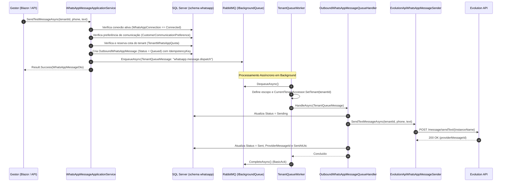
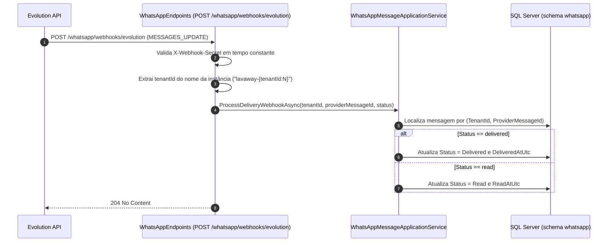

# Base de Integração e Entrega Confiável do WhatsApp — Subfase 4.1

## Objetivo

Garantir uma camada de mensageria assíncrona, confiável e desacoplada para envio de notificações via WhatsApp, com persistência durável no RabbitMQ, garantia estrita de idempotência por tenant, governança anti-ban (rate limiting por minuto e cota diária), registro de consentimento/preferências do cliente (Opt-in / Opt-out) e monitoramento de falhas em tempo real.

---

## 1. Arquitetura e Fluxo de Envio Assíncrono

---

## 2. Ingestão de Webhooks de Entrega (`MESSAGES_UPDATE`)

---

## 3. Regras de Negócio e Governança

1. **Isolamento Multi-Tenant Estrito:**
   - Todas as entidades no schema `whatsapp` (`OutboundWhatsAppMessage`, `TenantWhatsAppQuota`, `CustomerCommunicationPreference`, `WhatsAppDeliveryAttempt`) implementam `IMustHaveTenant`.
   - Global Query Filters do EF Core e `ValidateTenantWrites` no `SaveChangesAsync` impedem vazamento de dados entre estabelecimentos.
   - O webhook resolve compulsoriamente o `tenantId` a partir da instância autenticada (`lavaway-{tenantId:N}`).

2. **Idempotência de Envio:**
   - Cada mensagem possui uma `IdempotencyKey` única por tenant.
   - Tentativas repetidas com a mesma chave retornam a mensagem existente sem nova inserção nem envio duplicado ao cliente.

3. **Governança Anti-Ban (Rate Limiting e Quota):**
   - Agregado `TenantWhatsAppQuota` estabelece limite por minuto (padrão 20 msg/min para proteção contra rajadas) e cota diária (padrão 500 msg/dia).
   - Tentativas que excedem a cota são rejeitadas com erro tipado `whatsapp.quota_exceeded`.

4. **Consentimento LGPD (Opt-In / Opt-Out):**
   - Agregado `CustomerCommunicationPreference` armazena o consentimento por número de telefone.
   - Destinatários que realizaram opt-out têm mensagens bloqueadas com erro `whatsapp.recipient.opted_out`.

5. **Padrão Result Sem Exceções de Fluxo:**
   - Todos os serviços de domínio e aplicação utilizam `Result<T>` com catálogo de erros estruturado:
     - `whatsapp.tenant.required`
     - `whatsapp.not_connected`
     - `whatsapp.recipient.invalid`
     - `whatsapp.recipient.opted_out`
     - `whatsapp.quota_exceeded`
     - `whatsapp.body.invalid`

---

## 4. Especificações Executáveis (BDD / Cenários de Teste)

### Cenário 1: Envio de mensagem de teste com canal conectado e cota disponível
- **Dado** que o estabelecimento possui canal do WhatsApp pareado no estado `Connected`
- **E** a cota de envio do dia e o limite de rajada por minuto estão dentro dos limites
- **Quando** o administrador solicita o envio de uma mensagem de teste para o número `(11) 98765-4321`
- **Então** a mensagem é persistida no banco com status `Queued`
- **E** enfileirada no RabbitMQ sob o evento `whatsapp.message.dispatch`
- **E** a cota do tenant é incrementada de forma atômica.

### Cenário 2: Bloqueio de envio para cliente com Opt-Out
- **Dado** que o destinatário `(11) 98765-4321` solicitou previamente a suspensão de mensagens (`IsOptedIn = false`)
- **Quando** o sistema tenta despachar uma mensagem para este número
- **Então** o envio é recusado retornando `whatsapp.recipient.opted_out`
- **E** nenhuma mensagem é enfileirada na fila nem enviada ao provedor externo.

### Cenário 3: Proteção contra rajadas de envio (Anti-Ban)
- **Dado** que o limite de mensagens por minuto do tenant atingiu seu teto (ex: 20/min)
- **Quando** um novo envio é solicitado no mesmo minuto
- **Então** a requisição falha com o código `whatsapp.quota_exceeded.minute`
- **E** o número de envios no provedor externo é bloqueado para proteger a integridade da linha.

### Cenário 4: Atualização assíncrona de status via webhook
- **Dado** que uma mensagem foi enviada ao provedor com o identificador `EVOLUTION-123`
- **Quando** a Evolution API envia um callback `MESSAGES_UPDATE` com status `DELIVERY_ACK`
- **Então** o status da mensagem no banco é atualizado para `Delivered` com o timestamp correspondente.

---

## 5. Critérios de Aceite Atendidos

- [x] Adaptador de envio de mensagens HTTP tipado via Evolution API (`EvolutionApiWhatsAppMessageSender`).
- [x] Processamento assíncrono via RabbitMQ durável e `OutboundWhatsAppMessageQueueHandler` (`ITenantQueueMessageHandler`).
- [x] Garantia de idempotência via `IdempotencyKey` única por tenant.
- [x] Governança de envio com controle de quotas diárias e por minuto (`TenantWhatsAppQuota`).
- [x] Gestão de consentimento e opt-out de destinatários (`CustomerCommunicationPreference`).
- [x] Minimal APIs autenticadas para envio de teste (`POST /whatsapp/messages/test`), listagem (`GET /whatsapp/messages`), detalhes e quotas (`GET /whatsapp/quota`).
- [x] Ingestão de webhooks de status de entrega (`MESSAGES_UPDATE` / `SEND_MESSAGE`).
- [x] Interface Blazor com componentes modulares: `WhatsAppTestMessageCard`, `WhatsAppQuotaMeter` e `WhatsAppMessageHistoryTable`.
- [x] 100% de aprovação na suíte de 272 testes (unitários, limites de arquitetura NetArchTest e componentes bUnit).
