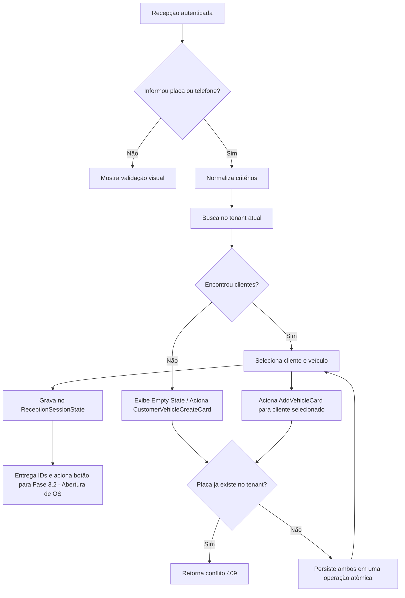

# Cadastro e busca de clientes/veículos — Fase 3.1

## Objetivo e estado

O fluxo de recepção pesquisa clientes e veículos por placa e/ou telefone, reutiliza os cadastros encontrados e permite criar um cliente com seu primeiro veículo ou adicionar veículo a um cliente existente. A UI mantém a seleção desacoplada através do `ReceptionSessionState` para a futura abertura de OS (Fase 3.2).

Implementação completa de ponta a ponta no backend e no frontend Blazor WebAssembly: busca tenant-scoped por placa/telefone, cadastro atômico cliente+veículo, inclusão de veículo, isolamento em componentes reutilizáveis (`CustomerMatchRow`, `CustomerVehicleCreateCard`, `AddVehicleCard`), gerenciamento de estado de sessão e botão de transição para abertura de OS. Todos os 209 testes da solution passam com 100% de sucesso.

## Fluxo

## Regras

- `Customer` e `Vehicle` permanecem agregados do módulo `YardOperations`; ambos carregam `TenantId` e usam `Guid`.
- Nome é obrigatório e limitado a 200 caracteres. Telefone preserva o valor informado para exibição e persiste `NormalizedPhone`, formado por dígitos ASCII. Quando o DDI brasileiro `55` vem com 12 ou 13 dígitos totais, ele é removido para equiparar formatos local e internacional. O domínio exige ao menos um dígito e limita o valor apresentado a 32 caracteres; não valida um plano completo E.164.
- Telefone não é único. Busca por telefone pode retornar vários clientes e a recepção deve escolher explicitamente o proprietário.
- Placa é normalizada para sete caracteres alfanuméricos em maiúsculas e é única por tenant. Reassociar uma placa existente é proibido; duplicidade detectada antes do save ou concorrente no índice retorna `Result` de conflito.
- Busca exige placa ou telefone. Cada campo informado usa correspondência exata após normalização; quando os dois são informados, ambos devem corresponder. O limite padrão é 20 e o máximo é 50.
- A busca, leitura por ID e vínculo de veículo usam o tenant obtido do JWT validado. Payload, query string e cabeçalho não escolhem o tenant. Customer/vehicle de outro tenant é invisível; tentativa de vincular veículo ao cliente de outro tenant retorna `NotFound`.
- Cliente e primeiro veículo são persistidos no mesmo `SaveChangesAsync`, dentro da transação implícita do EF Core para múltiplas alterações. Novos vínculos de veículo também passam pela validação tenant do `YardOperationsDbContext`.
- Consulta exige perfil Administrator, Receptionist ou Operator (`ViewCustomers`). Cadastro e inclusão de veículo exigem Administrator ou Receptionist (`CreateWorkOrders`).
- Gerenciamento de Estado: `ReceptionSessionState` em `CarWashSaaS.Client.Core` centraliza a seleção de cliente e veículo ativo, desacoplando o fluxo da recepção da tela de check-in / ordem de serviço.

## API

- `GET /customers/search?plate=ABC-1D23&phone=...&limit=20`: busca exata combinada; `plate` e `phone` são opcionais individualmente, mas ao menos um é obrigatório.
- `GET /customers/{customerId}`: retorna cliente e veículos do tenant autenticado ou 404.
- `POST /customers`: cria cliente e primeiro veículo atomicamente; body contém `name`, `phone`, `plate` e `size` (`HatchSedan`, `Suv`, `PickupVan` ou `Motorcycle`). Responde 201 e `Location`; validação 400, placa duplicada 409.
- `POST /customers/{customerId}/vehicles`: adiciona veículo ao cliente no tenant atual; responde 201, 404 se o cliente não existe nesse tenant e 409 se a placa já estiver cadastrada.

Os contratos HTTP residem em `Shared.Contracts`; as portas do Application não expõem `IQueryable`. A implementação de pesquisa filtra pelo tenant e usa projeções somente de leitura.

## Componentes Blazor

- `ReceptionPage.razor` (`CarWashSaaS.Client.Web`): página mestre-detalhe com formulário de busca, cards de feedback e orquestração do atendimento.
- `CustomerMatchRow.razor` (`CarWashSaaS.Client.Components`): renderiza cada correspondência retornada com inicial estilizada, dados do proprietário, contagem de veículos e estado de seleção.
- `CustomerVehicleCreateCard.razor` (`CarWashSaaS.Client.Components`): painel/card isolado para criação atômica de cliente e primeiro veículo com campos validados e estados de loading.
- `AddVehicleCard.razor` (`CarWashSaaS.Client.Components`): painel/card isolado para adição de novo veículo a um cliente existente.
- `ReceptionSessionState.cs` (`CarWashSaaS.Client.Core`): state container injetável com eventos reativos para transferir a seleção de forma limpa para a abertura de OS.

## Persistência e testes

- `Customers.NormalizedPhone` recebe backfill na migration `AddCustomerNormalizedPhone`; o índice `(TenantId, NormalizedPhone)` não é único. O índice único `(TenantId, Plate)` permanece inalterado.
- As migrations `AddStoreProfile` (Tenants) e `AddYardSetupEntities` (YardOperations) completam o modelo atual. `has-pending-model-changes` não aponta diferenças para os contextos Tenants e YardOperations.
- Testes unitários cobrem placa/telefone normalizados, telefone compartilhado, pesquisa dos parâmetros normalizados, gravação única dos dois agregados e duplicidade de placa (`CustomerAndVehicleTests`, `CustomerVehicleApplicationServiceTests`).
- Testes de integração SQL Server com Testcontainers (`CustomerVehicleIntegrationTests`) cobrem busca combinada e garantem isolamento estrito entre Tenant A e Tenant B.
- Testes de arquitetura NetArchTest (`ModuleBoundaryTests`) garantem isolamento de dependências e fronteiras hexagonais.
- Testes de componentes com bUnit (`ReceptionComponentTests` em `CarWashSaaS.ComponentTests`) cobrem `CustomerMatchRow`, `CustomerVehicleCreateCard`, `AddVehicleCard` e o `ReceptionSessionState`.
- `dotnet test CarWashSaaS.sln` executa 209 testes: 209 passaram, 0 falharam, build 100% limpo sem erros.