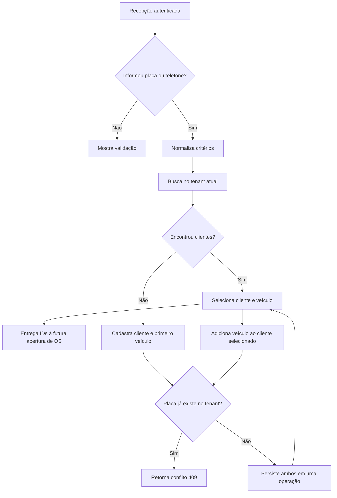

# Cadastro e busca de clientes/veículos — Fase 3.1

## Objetivo e estado

O fluxo de recepção pesquisa clientes e veículos por placa e/ou telefone, reutiliza os cadastros encontrados e permite criar um cliente com seu primeiro veículo ou adicionar veículo a um cliente existente. A UI mantém a seleção para a futura abertura de OS, sem criar OS nesta subfase.

Implementação inicial no backend e na UI Blazor WebAssembly concluída. Os testes SQL Server via Testcontainers passaram neste ambiente. O smoke test autenticado ainda depende da configuração do gateway OIDC/JWT; por isso, a subfase permanece aberta.

## Fluxo

## Regras

- `Customer` e `Vehicle` permanecem agregados do módulo `YardOperations`; ambos carregam `TenantId` e usam `Guid`.
- Nome é obrigatório e limitado a 200 caracteres. Telefone preserva o valor informado para exibição e persiste `NormalizedPhone`, formado por dígitos ASCII. Quando o DDI brasileiro `55` vem com 12 ou 13 dígitos totais, ele é removido para equiparar formatos local e internacional. O domínio exige ao menos um dígito e limita o valor apresentado a 32 caracteres; não valida um plano completo E.164.
- Telefone não é único. Busca por telefone pode retornar vários clientes e a recepção deve escolher explicitamente o proprietário.
- Placa é normalizada para sete caracteres alfanuméricos em maiúsculas e é única por tenant. Reassociar uma placa existente é proibido; duplicidade detectada antes do save ou concorrente no índice retorna `Result` de conflito.
- Busca exige placa ou telefone. Cada campo informado usa correspondência exata após normalização; quando os dois são informados, ambos devem corresponder. O limite padrão é 20 e o máximo é 50.
- A busca, leitura por ID e vínculo de veículo usam o tenant obtido do JWT validado. Payload, query string e cabeçalho não escolhem o tenant. Customer/vehicle de outro tenant é invisível; tentativa de vincular veículo ao cliente de outro tenant retorna `NotFound`.
- Cliente e primeiro veículo são persistidos no mesmo `SaveChangesAsync`, dentro da transação implícita do EF Core para múltiplas alterações. Novos vínculos de veículo também passam pela validação tenant do `YardOperationsDbContext`.
- Consulta exige perfil Administrator, Receptionist ou Operator (`ViewCustomers`). Cadastro e inclusão de veículo exigem Administrator ou Receptionist (`CreateWorkOrders`).

## API

- `GET /customers/search?plate=ABC-1D23&phone=...&limit=20`: busca exata combinada; `plate` e `phone` são opcionais individualmente, mas ao menos um é obrigatório.
- `GET /customers/{customerId}`: retorna cliente e veículos do tenant autenticado ou 404.
- `POST /customers`: cria cliente e primeiro veículo atomicamente; body contém `name`, `phone`, `plate` e `size` (`HatchSedan`, `Suv`, `PickupVan` ou `Motorcycle`). Responde 201 e `Location`; validação 400, placa duplicada 409.
- `POST /customers/{customerId}/vehicles`: adiciona veículo ao cliente no tenant atual; responde 201, 404 se o cliente não existe nesse tenant e 409 se a placa já estiver cadastrada.

Os contratos HTTP residem em `Shared.Contracts`; as portas do Application não expõem `IQueryable`. A implementação de pesquisa filtra pelo tenant e usa projeções somente de leitura.

## Persistência e testes

- `Customers.NormalizedPhone` recebe backfill na migration `AddCustomerNormalizedPhone`; o índice `(TenantId, NormalizedPhone)` não é único. O índice único `(TenantId, Plate)` permanece inalterado.
- As migrations `AddStoreProfile` (Tenants) e `AddYardSetupEntities` (YardOperations) foram geradas para alinhar as migrations existentes aos modelos já implementados. A segunda completa a persistência de capacidade/equipe da subfase 2.4, antes ausente da migration inicial. `has-pending-model-changes` não aponta diferenças para os contextos Tenants e YardOperations.
- Testes unitários cobrem placa/telefone normalizados, telefone compartilhado, pesquisa dos parâmetros normalizados, gravação única dos dois agregados e duplicidade de placa.
- Os dois testes de integração SQL Server para busca compartilhada/combinada e Tenant A/B foram executados com Testcontainers e passaram. `ModuleModelTests` também verifica o índice tenant-scoped sem exigir banco.
- `CustomerVehicleApiClientTests` cobre a URL de busca, desserialização dos DTOs e propagação do conflito HTTP 409. Testes de componente com bUnit ainda não foram adicionados. O smoke test com OIDC precisa de `ApiBaseUrl`, `Authentication:Authority`, `ClientId` e `ApiScope` conforme o gateway; a API precisa de `Cors:AllowedOrigins` para os hosts publicados.
- `dotnet test CarWashSaaS.sln` executou 76 testes: 74 passaram e 2 falharam fora deste fluxo. `WhatsAppConnectionTenantIntegrationTests` encontra `whatsapp.WhatsAppConnections` ausente porque o `EnsureCreated` do contexto WhatsApp não cria seu schema após outros contextos criarem tabelas no mesmo banco; `StoreProfileTenantIntegrationTests` encontra conflito de tracking durante update. `dotnet build CarWashSaaS.sln` passou sem warnings.