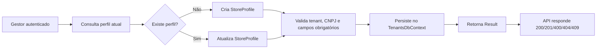
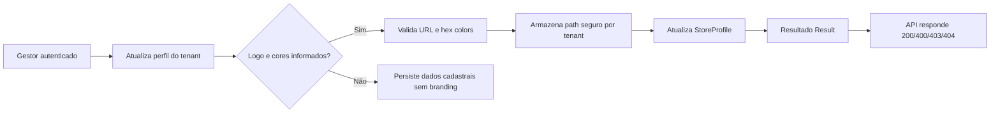

# Cadastro e perfil do estabelecimento — Fase 2.1

## Objetivo
Permitir que o gestor do tenant cadastre e mantenha o perfil do estabelecimento, validando dados cadastrais, regras de negócio e isolamento multitenant antes da operação do pátio.

## Fluxo operacional

## Regras implementadas

- `StoreProfile` é um agregado do módulo `Tenants`.
- `TenantId` é obrigatório e protegido por filtro global de tenant.
- Validação de CNPJ e campos obrigatórios é feita no domínio.
- Create e Update usam retorno `Result<T>`.
- `IStoreProfileRepository` persiste as alterações via `SaveChangesAsync` para evitar gravações invisíveis.
- Endpoints expostos na API usam autorização do perfil administrador.
- A integração valida que Tenant B não acessa o perfil de Tenant A.

## Cobertura atual

- Testes unitários de domínio e criação/atualização: concluídos.
- Testes de integração multi-tenant do perfil: concluídos.
- Build da solução e suíte relevante: verdes.

## Identidade visual — subfase 2.2

A identidade visual da loja faz parte do mesmo agregado do perfil do estabelecimento e deve complementar o cadastro cadastral sem quebrar o isolamento por tenant.

### Regras da versão implementada

- `LogoUrl` aceita URLs HTTP/HTTPS válidas ou caminhos internos de storage, como `/storage/tenants/{tenantId}/branding/{fileName}`.
- `BrandPrimaryColor` e `BrandSecondaryColor` aceitam somente valores hexadecimais em formato `#RRGGBB`.
- O upload de logomarca é realizado por `POST /tenants/profile/logo` e o arquivo é salvo sob `Storage/tenants/{tenantId}/branding`.
- O storage do arquivo segue a convenção `tenants/{tenantId}/branding/{fileName}`.
- O caminho e os dados são protegidos pelo mesmo filtro global de tenant do módulo `Tenants`.
- O fluxo usa `Result<T>` e mantém `StatusCode` consistente para 200/201/400/403/404/409.

## Entregáveis desta subfase

- Agregado `StoreProfile`
- `CreateStoreProfileCommand` e `UpdateStoreProfileCommand`
- `StoreProfileApplicationService`
- repositório e mapeamento no módulo `Tenants`
- endpoints `GET /tenants/profile`, `POST /tenants/profile`, `PUT /tenants/profile` e `POST /tenants/profile/logo`
- policy de autorização de administrador
- validação e isolamento por tenant
- suporte completo a `LogoUrl`, `BrandPrimaryColor` e `BrandSecondaryColor`
- armazenamento de-logo com path isolado por tenant e acesso estático do arquivo
