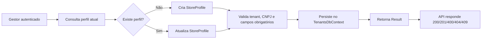

# Cadastro e perfil do estabelecimento — Fase 2.1

## Objetivo
Permitir que o gestor do tenant cadastre e mantenha o perfil do estabelecimento, validando dados cadastrais, regras de negócio e isolamento multitenant antes da operação do pátio.

## Fluxo operacional

## Regras implementadas

- `StoreProfile` é um agregado do módulo `Tenants`.
- `TenantId` é obrigatório e protegido por filtro global de tenant.
- Validação de CNPJ e campos obrigatórios é feita no domínio.
- Create e Update usam retorno `Result<T>`.
- `IStoreProfileRepository` persiste as alterações via `SaveChangesAsync` para evitar gravações invisíveis.
- Endpoints expostos na API usam autorização do perfil administrador.
- A integração valida que Tenant B não acessa o perfil de Tenant A.

## Cobertura atual

- Testes unitários de domínio e criação/atualização: concluídos.
- Testes de integração multi-tenant do perfil: concluídos.
- Build da solução e suíte relevante: verdes.

## Entregáveis desta subfase

- Agregado `StoreProfile`
- `CreateStoreProfileCommand` e `UpdateStoreProfileCommand`
- `StoreProfileApplicationService`
- repositório e mapeamento no módulo `Tenants`
- endpoints `GET /tenants/profile` e `PUT /tenants/profile`
- política de autorização de administrador
- validação e islolamento por tenant
