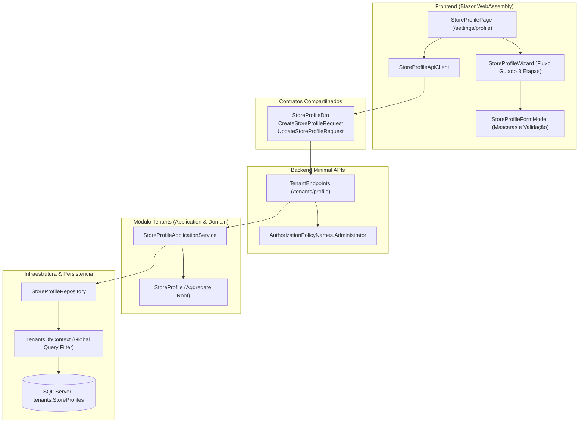

# Cadastro e perfil do estabelecimento — Fase 2.1

## Objetivo
Permitir que o gestor do tenant cadastre e mantenha o perfil do estabelecimento de ponta a ponta (Backend e Frontend Blazor), validando dados cadastrais, regras de negócio e isolamento multitenant antes da operação do pátio.

## Arquitetura End-to-End

## Fluxo Guiado (Onboarding e Edição)

```mermaid
flowchart LR
    A[Gestor acessa /settings/profile] --> B[GetProfileAsync]
    B --> C{Perfil existe?}
    C -->|Não - 404| D[Inicia Wizard Onboarding]
    C -->|Sim - 200| E[Exibe Card de Perfil Ativo]
    E --> F[Opção: Editar Dados Cadastrais]
    F --> D
    D --> S1[Etapa 1: Identificação\nRazão Social, Nome Fantasia, CNPJ]
    S1 --> S2[Etapa 2: Contato & Endereço\nTelefone, CEP, Logradouro, Cidade, UF]
    S2 --> S3[Etapa 3: Revisão & Salvar]
    S3 --> G[Submissão Create/Update]
    G --> H[Feedback visual e transição para modo ativo]
```

## Regras implementadas

- **Isolamento Multi-tenant:** `StoreProfile` implementa `IMustHaveTenant` e o `TenantsDbContext` aplica Global Query Filter por `TenantId`.
- **Identificadores UUID:** Chaves primárias com UUID sequencial (`Guid.CreateVersion7()`).
- **Validação de Negócio e CNPJ:** Algoritmo oficial de dígitos verificadores e rejeição de sequências repetidas executado no domínio e pré-validado no frontend.
- **Padrão Result:** Operações de domínio e aplicação retornam `Result<T>` sem uso de exceções para fluxo de controle.
- **Contratos Compartilhados:** `StoreProfileDto`, `CreateStoreProfileRequest` e `UpdateStoreProfileRequest` em `CarWashSaaS.Shared.Contracts` eliminam o vazamento de entidades de domínio para o frontend.
- **Cliente HTTP Tipado:** `StoreProfileApiClient` em `CarWashSaaS.Client.Core` encapsula chamadas REST, serialização com case-insensitivity e mapeamento de mensagens amigáveis.
- **UI Responsiva & Fluxo Guiado:** Componente `StoreProfileWizard.razor` permite salvar/retomar etapas, formatação automática de CNPJ e CEP, e validação por etapa.
- **Segurança RBAC:** Endpoints e rotas protegidos compulsoriamente pela role `Administrator`.

## Cobertura de Testes

- **Testes Unitários:** 97 testes verdes cobrindo domínio `StoreProfile`, validação de invariantes, serialização e chamadas do client HTTP e form model.
- **Testes de Integração Multi-Tenant:** `StoreProfileTenantIntegrationTests` executado com Testcontainers e SQL Server real, comprovando que o Tenant B não acessa nem altera o perfil do Tenant A.
- **Testes de Arquitetura:** `NetArchTest` validando fronteiras de módulos, regras de `IMustHaveTenant`, tipos `Guid` e retorno `Result`.
- **Testes de Componentes (bUnit):** `CarWashSaaS.ComponentTests` cobrindo renderização, erros em tempo real de validação, navegação de etapas e submissão do formulário.
- **Gates de Qualidade:** Script `./scripts/verify-quality.sh` aprovado com 100% de sucesso.
