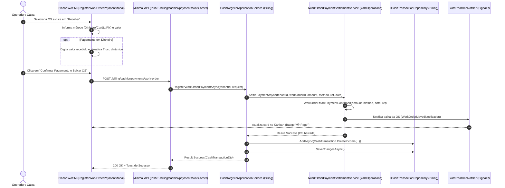
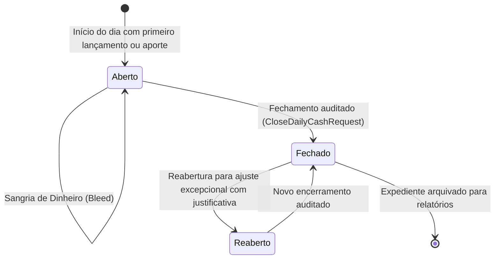

# Caixa, Fechamento Diário e Comissões — Subfase 5.3

## 1. Visão Geral & Objetivo

A subfase **5.3** do Lavaway SaaS implementa o controle operacional de caixa e o cálculo automatizado de comissões para lava-jatos e centros de estética automotiva. O sistema permite dar baixa imediata em ordens de serviço por múltiplos métodos (**Pix**, **Dinheiro** com troco calculado, **Cartão de Crédito** e **Cartão de Débito**), efetuar sangrias e aportes, emitir o fechamento diário do caixa com conferência cega/assistida de gaveta e gerar relatórios detalhados de comissões por colaborador com base nas regras configuradas no estabelecimento.

---

## 2. Diagrama de Sequência Mermaid: Baixa de Pagamento Presencial



---

## 3. Diagrama de Estados do Caixa Diário



---

## 4. Especificações Executáveis (BDD / Gherkin)

```gherkin
Funcionalidade: Caixa e Fechamento Diário
  Como gestor ou operador de caixa
  Quero registrar receitas por Pix, dinheiro e cartão, e realizar o fechamento diário
  Para manter o controle financeiro rigoroso do estabelecimento sem discrepâncias

  Cenário: Baixa de OS em dinheiro com cálculo de troco
    Dado que uma Ordem de Serviço possui valor total de R$ 120,00
    Quando o operador registra o pagamento em Dinheiro informando R$ 150,00 recebidos
    Então o sistema deve calcular o troco de R$ 30,00
    E a Ordem de Serviço deve ser marcada como paga
    E uma transação de receita de R$ 120,00 deve ser adicionada ao caixa

  Cenário: Sangria em dinheiro na gaveta
    Dado que o caixa do dia possui entradas em espécie
    Quando o gestor registra uma sangria de R$ 50,00 para "Compra de insumos"
    Então uma transação do tipo Bleed deve ser registrada
    E o saldo esperado em gaveta deve ser decrementado em R$ 50,00

  Cenário: Fechamento diário com conferência de gaveta
    Dado que o expediente do dia possui receitas e sangrias registradas
    Quando o gestor submete o fechamento diário com o valor físico contado
    Então o sistema deve consolidar os totais por Pix, Dinheiro e Cartões
    E registrar a diferença de caixa apurada
    E o status do caixa do dia deve ser atualizado para "Closed"
```

---

## 5. Especificações Executáveis: Apuração de Comissões

```gherkin
Funcionalidade: Cálculo de Comissões
  Como gestor do lava-jato
  Quero consultar o relatório de comissões por colaborador e período
  Para pagar a equipe de forma justa conforme os serviços efetivamente realizados

  Cenário: Cálculo de comissão com regra cadastrada
    Dado que o colaborador "Roberto" possui cargo "Detailer"
    E existe uma regra de comissão de 20% para "Polimento Cristalizado" e cargo "Detailer"
    Quando Roberto conclui uma OS contendo um serviço de "Polimento Cristalizado" de R$ 500,00
    Então a comissão calculada para o serviço deve ser de R$ 100,00
    E o relatório do período deve apresentar Roberto com R$ 100,00 de comissão acumulada

  Cenário: Serviço sem regra de comissão configurada
    Dado que o colaborador executa um serviço sem regra de comissão para seu cargo
    Quando o relatório de comissões for gerado
    Então a comissão para esse serviço específico deve ser computada como R$ 0,00 (0%)
```
