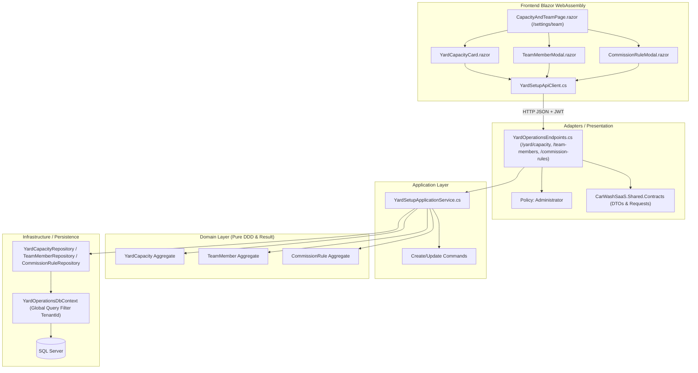

# 2.4 — Capacidade e Equipe

## 1. Visão Geral & Objetivo

Permitir que o gestor do estabelecimento configure a capacidade física de atendimento simultâneo do pátio (boxes/vagas), cadastre os membros da equipe operacional (com cargos e e-mails de identificação) e defina as regras de comissionamento percentual sobre os serviços executados.

---

## 2. Diagrama de Fluxo Operacional & Arquitetura



---

## 3. Entidades de Domínio & Invariantes

Todas as entidades implementam `IMustHaveTenant` e utilizam identificadores `Guid` sequenciais gerados via `Guid.CreateVersion7()`. As mutações de estado e fábricas retornam obrigatoriamente `Result<T>`:

### 3.1 `YardCapacity`
* **Invariantes:**
  * `TenantId` obrigatório (`yard_capacity.tenant.required`).
  * `TotalBoxes > 0` (`yard_capacity.total_boxes.invalid`).
  * `Description` com limite de 200 caracteres (`yard_capacity.description.invalid`).
* **Operações:**
  * `Create(tenantId, totalBoxes, description)`
  * `Update(totalBoxes, description)`

### 3.2 `TeamMember`
* **Invariantes:**
  * `TenantId` obrigatório (`team_member.tenant.required`).
  * `FullName` não nulo, entre 2 e 200 caracteres (`team_member.name.invalid`).
  * `Role` não nulo, entre 2 e 80 caracteres (`team_member.role.invalid`).
  * `Email` opcional, se preenchido deve conter `@` e até 200 caracteres (`team_member.email.invalid`).
  * E-mail único por tenant (`team_member.email.duplicate`).
* **Operações:**
  * `Create(tenantId, fullName, role, email)`
  * `Update(fullName, role, email)`
  * `Deactivate()` e `Activate()` (controle de status ativo/inativo).

### 3.3 `CommissionRule`
* **Invariantes:**
  * `TenantId` obrigatório (`commission_rule.tenant.required`).
  * `ServiceName` obrigatório (`commission_rule.service_name.invalid`).
  * `RoleName` obrigatório (`commission_rule.role_name.invalid`).
  * `Percentage` entre 0.0% e 100.0% (`commission_rule.percentage.invalid`).
  * Unicidade da combinação `ServiceName + RoleName` por tenant (`commission_rule.duplicate`).
* **Operações:**
  * `Create(tenantId, serviceName, roleName, percentage)`
  * `UpdatePercentage(percentage)`

---

## 4. Contratos Compartilhados (`Shared.Contracts`) & Endpoints REST

| Método | Rota | Autorização | Request | Response | Status Codes |
| :--- | :--- | :--- | :--- | :--- | :--- |
| `GET` | `/yard/capacity` | Authenticated | — | `YardCapacityDto` | 200, 403, 404 |
| `POST` | `/yard/capacity` | Administrator | `CreateYardCapacityRequest` | `YardCapacityDto` | 201, 400, 403, 409 |
| `PUT` | `/yard/capacity` | Administrator | `UpdateYardCapacityRequest` | `YardCapacityDto` | 200, 400, 403, 404 |
| `GET` | `/team-members` | Authenticated | — | `List<TeamMemberDto>` | 200, 403 |
| `GET` | `/team-members/{id}` | Authenticated | — | `TeamMemberDto` | 200, 403, 404 |
| `POST` | `/team-members` | Administrator | `CreateTeamMemberRequest` | `TeamMemberDto` | 201, 400, 403, 409 |
| `PUT` | `/team-members/{id}` | Administrator | `UpdateTeamMemberRequest` | `TeamMemberDto` | 200, 400, 403, 404, 409 |
| `PATCH` | `/team-members/{id}/toggle-status` | Administrator | — | `TeamMemberDto` | 200, 403, 404 |
| `GET` | `/commission-rules` | Authenticated | — | `List<CommissionRuleDto>` | 200, 403 |
| `POST` | `/commission-rules` | Administrator | `CreateCommissionRuleRequest` | `CommissionRuleDto` | 201, 400, 403, 409 |
| `PUT` | `/commission-rules/{id}` | Administrator | `UpdateCommissionRuleRequest` | `CommissionRuleDto` | 200, 400, 403, 404 |
| `DELETE` | `/commission-rules/{id}` | Administrator | — | — | 204, 403, 404 |

---

## 5. Catálogo de Códigos de Erro de Negócio

| Código | Descrição | HTTP Status |
| :--- | :--- | :--- |
| `yard_capacity.tenant.required` | Identificador do estabelecimento ausente no contexto | 400 Bad Request |
| `yard_capacity.total_boxes.invalid` | Total de boxes deve ser maior que zero | 400 Bad Request |
| `yard_capacity.description.invalid` | Descrição excede o limite de 200 caracteres | 400 Bad Request |
| `yard_capacity.duplicate` | Já existe uma capacidade configurada para este estabelecimento | 409 Conflict |
| `yard_capacity.not_found` | Configuração de capacidade não encontrada para o estabelecimento | 404 Not Found |
| `team_member.name.invalid` | Nome completo é obrigatório e deve ter entre 2 e 200 caracteres | 400 Bad Request |
| `team_member.role.invalid` | Cargo/função é obrigatório e deve ter até 80 caracteres | 400 Bad Request |
| `team_member.email.invalid` | E-mail inválido ou acima de 200 caracteres | 400 Bad Request |
| `team_member.email.duplicate` | Já existe um colaborador cadastrado com este e-mail no estabelecimento | 409 Conflict |
| `team_member.not_found` | Colaborador não encontrado para este estabelecimento | 404 Not Found |
| `commission_rule.service_name.invalid` | Nome do serviço é obrigatório | 400 Bad Request |
| `commission_rule.role_name.invalid` | Cargo do colaborador é obrigatório | 400 Bad Request |
| `commission_rule.percentage.invalid` | Percentual de comissão deve estar entre 0% e 100% | 400 Bad Request |
| `commission_rule.duplicate` | Já existe uma regra de comissão para a combinação deste serviço e cargo | 409 Conflict |
| `commission_rule.not_found` | Regra de comissão não encontrada | 404 Not Found |

---

## 6. Especificações Executáveis (BDD / Gherkin)

```gherkin
Funcionalidade: Configuração de Capacidade do Pátio
  Como gestor de um lava-jato
  Quero configurar a quantidade de boxes do pátio
  Para que o fluxo de entrada e Kanban respeitem o limite operacional

  Cenário: Configurar capacidade simultânea com sucesso
    Dado que estou autenticado como administrador do estabelecimento "Lava-Jato Alpha"
    Quando eu definir o total de boxes como 6 com a descrição "Pátio Principal"
    Então a capacidade é salva com 6 boxes ativos
    E fica disponível para consulta operacional

  Cenário: Impedir capacidade com quantidade zero ou negativa
    Dado que estou autenticado como administrador
    Quando eu tentar salvar uma capacidade com 0 boxes
    Então a operação falha com o código de validação "yard_capacity.total_boxes.invalid"

Funcionalidade: Gestão de Colaboradores e Comissões
  Como gestor do estabelecimento
  Quero cadastrar minha equipe e atribuir regras de comissão
  Para apurar a remuneração proporcional por serviço realizado

  Cenário: Cadastrar e desativar colaborador
    Dado que cadastrei o colaborador "Carlos Alberto" com cargo "Lavador"
    Quando eu alternar o status do colaborador para inativo
    Então o colaborador permanece registrado no histórico mas com IsActive falso

  Cenário: Impedir regras de comissão duplicadas para o mesmo cargo e serviço
    Dado que já existe uma regra de 10% para "Lavagem Completa" e cargo "Lavador"
    Quando eu tentar criar outra regra para "Lavagem Completa" e "Lavador"
    Então a operação é rejeitada com conflito "commission_rule.duplicate"
```

---

## 7. Interface Web Blazor & Experiência do Usuário

A interface foi implementada com componentes modulares e estilização CSS isolada:
1. **`YardCapacityCard.razor`**: Card visual que exibe métricas de boxes, grade visual de boxes interativa e botão de alteração inline.
2. **`TeamMemberModal.razor`**: Modal com chips de seleção rápida de funções automotivas (Lavador, Secador, Polidor, Detailer, Encarregado, Gerente) e validação em tempo real.
3. **`CommissionRuleModal.razor`**: Modal com integração direta ao catálogo de serviços existentes e presets rápidos de comissão (5%, 10%, 15%, 20%, 25%, 30%).
4. **`CapacityAndTeamPage.razor` (`/settings/team`)**: Página administrativa centralizando a gestão de boxes, tabela responsiva de equipe com avatar e toggle de status, e matriz de comissões com exclusão e edição.
5. **`NavMenu.razor`**: Link de navegação rápida `04 Capacidade & Equipe` protegido por `AuthorizeView Roles="Administrator"`.

---

## 8. Testes Automatizados & Qualidade

* **Testes de Domínio:** [`YardCapacityAndTeamTests.cs`](file:///home/rony/LPR/lavaway/tests/Backend/UnitTests/CarWashSaaS.UnitTests/YardOperations/YardCapacityAndTeamTests.cs) cobrindo criação, atualização, limites de valores e ativação/desativação.
* **Testes de Casos de Uso:** [`YardSetupApplicationServiceTests.cs`](file:///home/rony/LPR/lavaway/tests/Backend/UnitTests/CarWashSaaS.UnitTests/YardOperations/YardSetupApplicationServiceTests.cs) cobrindo todos os fluxos de sucesso, duplicação e `NotFound`.
* **Testes de Arquitetura:** [`ModuleBoundaryTests.cs`](file:///home/rony/LPR/lavaway/tests/Backend/ArchitectureTests/CarWashSaaS.ArchitectureTests/ModuleBoundaryTests.cs) validando ausência de acoplamento entre domínios e dependências externas.
* **Testes de Componentes (bUnit):** [`YardCapacityAndTeamComponentTests.cs`](file:///home/rony/LPR/lavaway/tests/Frontend/ComponentTests/CarWashSaaS.ComponentTests/YardCapacityAndTeamComponentTests.cs) testando renderização, inputs, botões e callbacks.
* **Testes de Integração Multi-Tenant SQL Server:** [`YardSetupTenantIntegrationTests.cs`](file:///home/rony/LPR/lavaway/tests/Backend/IntegrationTests/CarWashSaaS.IntegrationTests/YardSetupTenantIntegrationTests.cs) validando o isolamento estrito contra vazamento de dados entre Tenant A e Tenant B.
