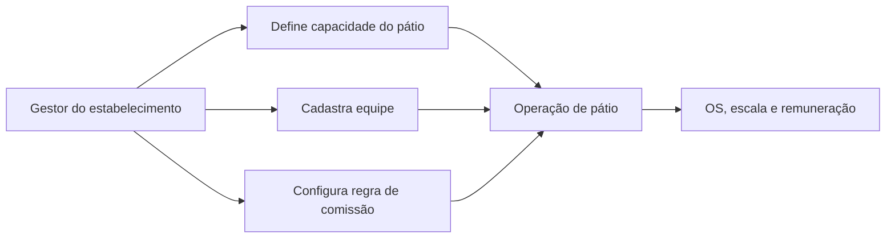

# 2.4 — Capacidade e equipe

## Visão do fluxo

## Regras de negócio

- Cada tenant possui no máximo uma configuração de `YardCapacity` ativa.
- A capacidade exige `TotalBoxes > 0` e descrição com limite de 200 caracteres.
- Cada membro da equipe tem `FullName`, `Role` e `Email` validados.
- Regras de comissão são únicas por combinação de `serviceName + roleName` dentro do tenant.
- Todo registro do módulo implementa `IMustHaveTenant` e é isolado via filtro global do EF Core.

## Entidades principais

- `YardCapacity`
- `TeamMember`
- `CommissionRule`

## Observações de implementação

- A camada de domínio mantém as regras de validação e evita acoplamento com controllers ou banco.
- O `YardSetupApplicationService` orquestra criação e listagem sem expor `IQueryable`.
- Os repositórios do módulo operam sob o tenant atual e as gravações são validadas em `SaveChangesAsync`.
- Os dados de um tenant não são visíveis nem modificáveis por outro tenant.
