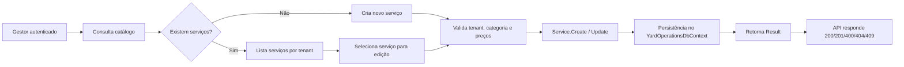

# Catálogo de serviços e preços — Fase 2.3

## Objetivo
Permitir que o gestor cadastre, consulte e atualize os serviços oferecidos pelo estabelecimento, com preço e duração estimada por porte de veículo.

## Fluxo operacional

## Regras da implementação

- `Service` é o agregado principal do módulo `YardOperations`.
- Cada serviço possui uma categoria e pelo menos um preço por porte de veículo.
- `ServicePrice` guarda `VehicleSize`, `Amount` e `EstimatedDurationMinutes`.
- A regra de negócio proíbe mais de um preço para o mesmo `VehicleSize` no mesmo serviço.
- O `TenantId` do serviço é obrigatório e protegido por filtro global do módulo.
- O `Result<T>` encapsula falhas de validação, not found e conflitos.

## Entregáveis desta subfase

- `Service` e `ServicePrice` no domínio
- `CreateServiceCommand` e `UpdateServiceCommand`
- `ServiceCatalogApplicationService`
- `IServiceRepository` e `ServiceRepository`
- endpoints `GET /services`, `GET /services/{id}`, `POST /services` e `PUT /services/{id}`
- autorização de administrador e isolamento por tenant
- testes unitários cobrindo criação e rejeição de preços duplicados
