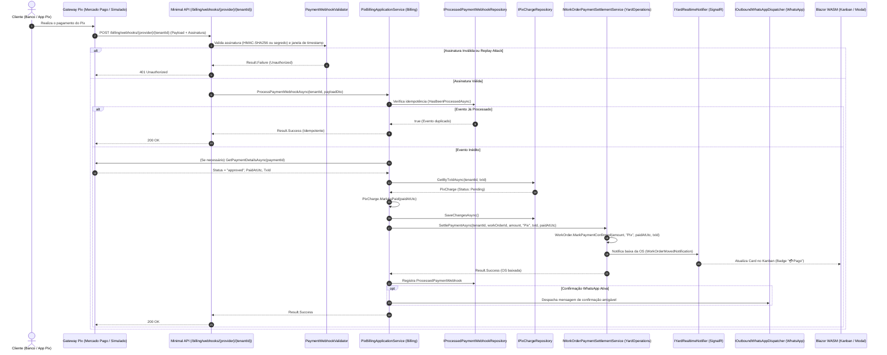
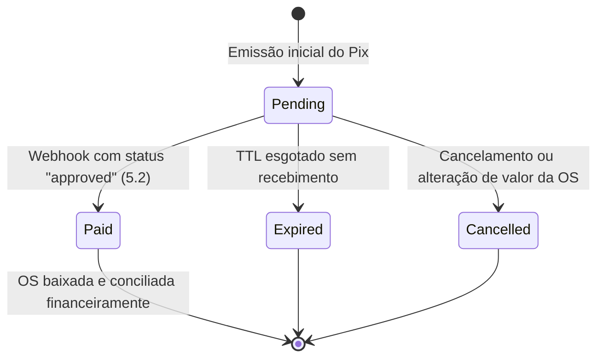

# Confirmação e Conciliação de Pagamento Pix — Subfase 5.2

## 1. Visão Geral & Objetivo

A subfase **5.2** do Lavaway SaaS implementa a camada de confirmação, idempotência e conciliação financeira de cobranças Pix via webhooks. Quando o cliente conclui o pagamento do QR Code Pix em seu aplicativo bancário, o gateway parceiro (Mercado Pago em produção ou Provedor Simulado em desenvolvimento/testes) despacha uma notificação assinada via webhook. O sistema valida a autenticidade criptográfica do evento, garante o processamento estritamente idempotente (sem duplicidades), atualiza a cobrança para `Paid`, efetua a baixa da Ordem de Serviço (OS) no módulo `YardOperations` e notifica o cliente via WhatsApp, refletindo instantaneamente no Kanban e na interface do usuário.

---

## 2. Diagrama de Sequência Mermaid



---

## 3. Máquina de Estados da Conciliação



---

## 4. Especificações Executáveis (BDD / Gherkin)

```gherkin
Funcionalidade: Confirmação e Conciliação de Pagamento Pix
  Como gestor ou recepcionista do lava-jato
  Quero que pagamentos Pix confirmados pelo gateway baixem a Ordem de Serviço automaticamente
  Para que a conciliação ocorra em tempo real sem erros manuais ou duplicidades

  Cenário: Confirmação válida de pagamento aprovado
    Dado que existe uma cobrança Pix pendente no valor de R$ 120,00 vinculada a uma OS
    Quando o gateway envia um webhook com status "approved" e assinatura válida
    Então a cobrança Pix deve ser marcada como "Paid"
    E a Ordem de Serviço deve ser marcada como paga (IsPaid = true)
    E o histórico da OS deve registrar a baixa financeira com o TxId
    E uma mensagem de confirmação deve ser despachada para o WhatsApp do cliente

  Cenário: Processamento estritamente idempotente de webhooks repetidos
    Dado que um webhook de pagamento já foi processado com sucesso para a transação
    Quando o gateway reenviar o mesmo webhook (mesmo EventId)
    Então o sistema deve responder com HTTP 200 OK
    E a Ordem de Serviço não deve ter seu histórico duplicado
    E nenhuma nova mensagem duplicada deve ser enviada ao cliente

  Cenário: Rejeição de webhook com assinatura HMAC inválida
    Dado que uma requisição de webhook chega sem o cabeçalho de assinatura correto
    Quando o validador inspeciona os cabeçalhos criptográficos
    Então o webhook deve ser rejeitado com HTTP 401 Unauthorized
    E nenhum dado financeiro ou de ordem de serviço deve ser alterado

  Cenário: Rejeição de webhook fora da janela de tolerância (Replay Attack)
    Dado que um webhook chega com um timestamp de 10 minutos atrás
    Quando o validador compara o timestamp com o horário UTC atual
    Então o webhook deve ser rejeitado com erro de timestamp expirado
```

---

## 5. Estrutura Hexagonal dos Novos Componentes

```text
src/Backend/Modules/Billing/
├── CarWashSaaS.Billing.Domain/
│   ├── PixCharge.cs                        # Agregado com MarkAsPaid idempotente
│   └── ProcessedPaymentWebhook.cs          # Entidade de idempotência com IMustHaveTenant
├── CarWashSaaS.Billing.Application/
│   ├── IPaymentWebhookValidator.cs         # Porta de entrada para validação HMAC e segredo
│   ├── IProcessedPaymentWebhookRepository.cs# Porta de saída para histórico de idempotência
│   └── PixBillingApplicationService.cs     # Caso de uso ProcessPaymentWebhookAsync
└── CarWashSaaS.Billing.Infrastructure/
    ├── BillingDbContext.cs                 # DbSet<ProcessedPaymentWebhook> no schema "billing"
    ├── Configurations/
    │   └── ProcessedPaymentWebhookConfiguration.cs # Índice único (TenantId, Provider, EventId)
    ├── Gateways/
    │   ├── MercadoPagoPixGatewayProvider.cs# Implementação de GetPaymentDetailsAsync
    │   └── SimulatedPixGatewayProvider.cs  # Provedor determinístico local/testes
    ├── Repositories/
    │   └── ProcessedPaymentWebhookRepository.cs
    └── Webhooks/
        └── PaymentWebhookValidator.cs      # Validação HMAC-SHA256 e tolerância a replay
```
