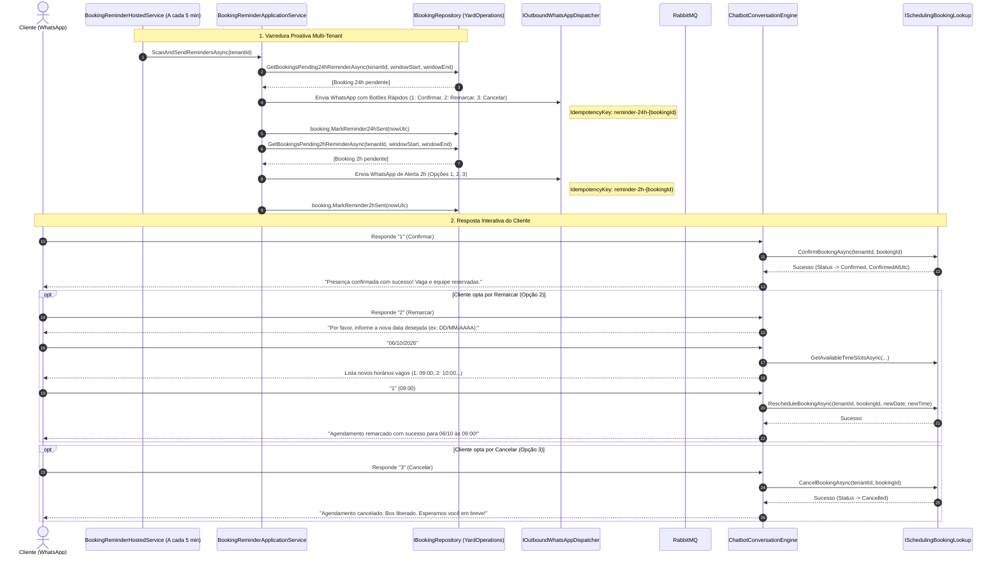
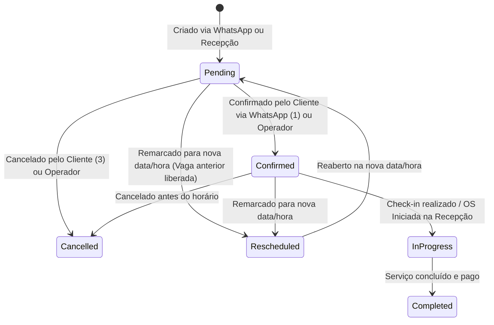

# Confirmação e Prevenção de Faltas via WhatsApp — Subfase 4.4

## 1. Visão Geral & Objetivo

Reduzir drasticamente o no-show (faltas) de clientes e otimizar a taxa de ocupação dos boxes físicos de lavagem e estética automotiva no Lavaway SaaS.
O sistema automatiza o envio de lembretes ativos **24 horas** e **2 horas** antes do horário agendado, permitindo que o cliente confirme, remarque ou cancele diretamente pelo WhatsApp. Em caso de cancelamento ou remarcação, a vaga é liberada instantaneamente no pátio sem qualquer intervenção manual, e a equipe operacional tem visibilidade em tempo real do status das confirmações na tela de **Agenda & Reservas**.

---

## 2. Diagrama de Sequência & Fluxo dos Lembretes Automatizados



---

## 3. Máquina de Estados da Reserva (`BookingStatus`) e Transições de Lembrete



---

## 4. Indicadores Visuais na Agenda & Reservas (Frontend Blazor)

O componente `BookingCard.razor` exibe selos em tempo real da situação de prevenção de faltas:

| Selo / Badge | Visual | Significado |
|---|---|---|
| **✅ Confirmado** | Fundo verde esmeralda com carimbo UTC | O cliente confirmou a presença proativamente via WhatsApp ou balcão |
| **🔔 24h** | Fundo azul com ícone de sino | Lembrete de 24h disparado com sucesso |
| **⏳ 2h** | Fundo âmbar com ícone de ampulheta | Lembrete urgente de 2h disparado com sucesso |
| **Ação "Confirmar"** | Botão primário com ícone de check | Permite à recepção confirmar manualmente clientes que telefonaram |
| **Ação "Remarcar"** | Botão secundário com modal de data/hora | Altera horário validando capacidade dos boxes |
| **Ação "Reenviar Lembrete"** | Botão com ícone de sino | Disparo pontual e sob demanda via WhatsApp |

---

## 5. Especificações Executáveis BDD (Gherkin)

```gherkin
Funcionalidade: Confirmação e Prevenção de Faltas via WhatsApp
  Como proprietário do lava-jato
  Quero que o sistema lembre meus clientes com 24h e 2h de antecedência
  Para evitar que boxes fiquem ociosos por faltas (no-show)

  Cenário: Disparo automático de lembrete 24h
    Dado que existe uma reserva ativa com data para amanhã às 14:00
    E o lembrete de 24 horas ainda não foi enviado
    Quando o serviço de segundo plano executar a varredura
    Então uma mensagem de WhatsApp é enviada ao cliente com opções de confirmação
    E o campo Reminder24hSentAt é preenchido com a data/hora do disparo
    E uma chave de idempotência "reminder-24h-{id}" é registrada

  Cenário: Cliente confirma presença respondendo 1 no WhatsApp
    Dado que o cliente recebeu um lembrete no WhatsApp
    Quando o cliente responde "1" ou "Confirmar"
    Então o status da reserva é alterado para "Confirmed"
    E o campo ConfirmedAtUtc é registrado
    E uma mensagem de agradecimento é enviada confirmando a vaga

  Cenário: Cliente cancela e libera vaga imediatamente
    Dado que o cliente recebeu o lembrete
    Quando o cliente responde "3" ou "Cancelar"
    Então o status da reserva é alterado para "Cancelled"
    E o box correspondente fica imediatamente disponível para novos agendamentos

  Cenário: Cliente remarca e box anterior é liberado
    Dado que o cliente possui reserva para hoje às 10:00
    Quando o cliente solicita remarcar para amanhã às 15:00
    E o horário de amanhã às 15:00 possui capacidade vaga
    Então a reserva é atualizada para a nova data e hora
    E a vaga anterior de hoje às 10:00 é liberada imediatamente
```

---

## 6. Validação Automatizada de Cobertura

- **Domínio (`BookingTests.cs`):** Validação unitária dos métodos `Confirm()`, `Reschedule()`, `MarkReminder24hSent()` e `MarkReminder2hSent()`.
- **Serviço de Lembretes (`BookingReminderApplicationServiceTests.cs`):** Validação dos filtros de janela de 24h e 2h, despacho WhatsApp e idempotência.
- **Serviço de Agendamento (`BookingApplicationServiceTests.cs`):** Validação de `ConfirmBookingAsync`, `CancelBookingAsync` e `RescheduleBookingAsync` com checagem concorrente de capacidade.
- **FSM Conversacional (`ChatbotConversationEngineTests.cs`):** Validação dos fluxos interativos de resposta ao lembrete (1 para Confirmar, 2 para Remarcar, 3 para Cancelar).
- **Testes de Arquitetura (`ArchitectureTests.cs`):** Garantia estrita de isolamento modular e desacoplamento hexagonal.
