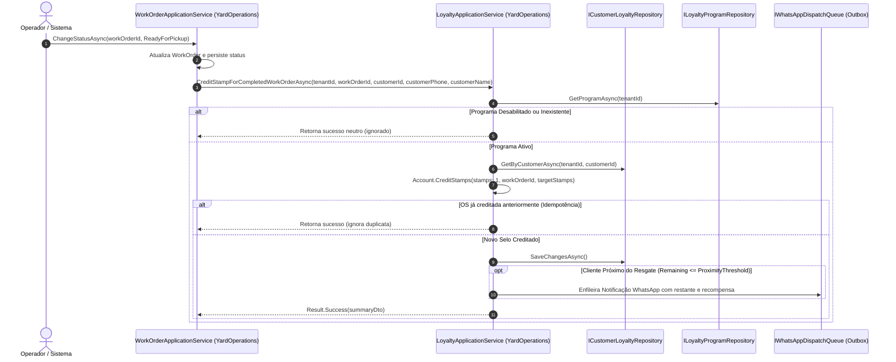
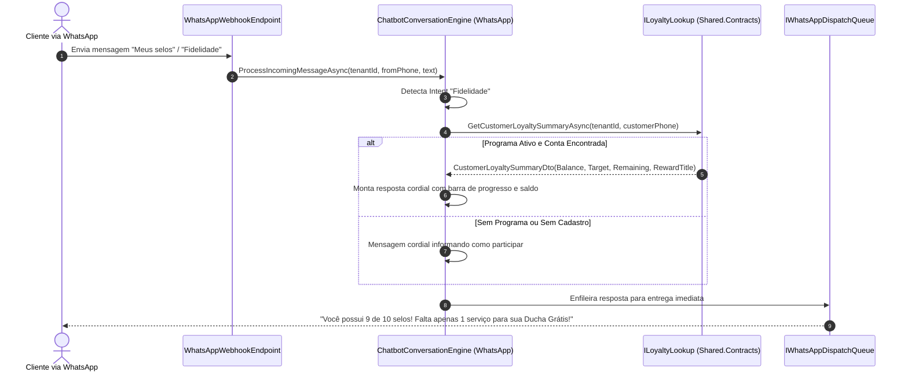
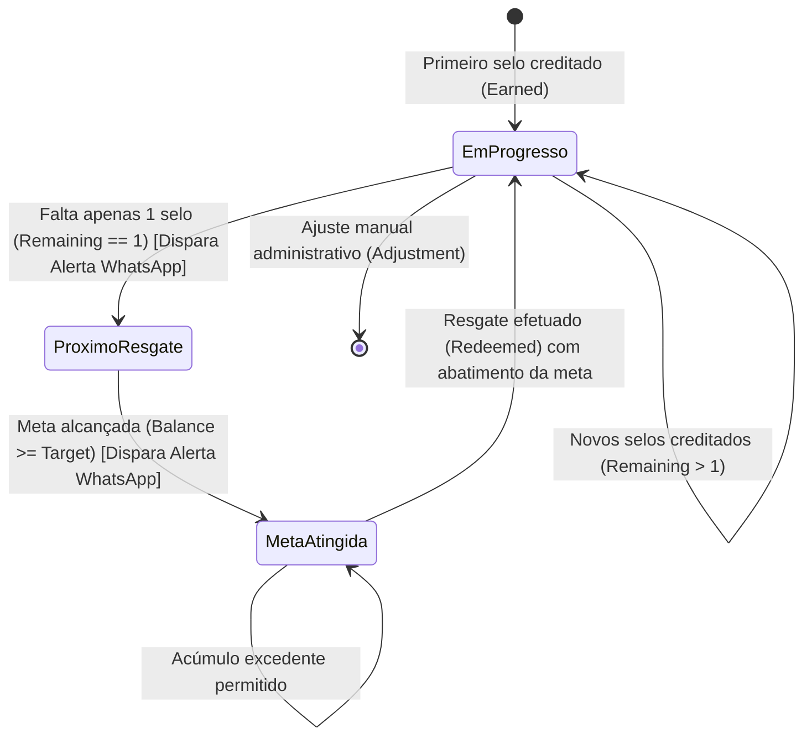

# Programa de Fidelidade e Selos — Subfase 5.4

## 1. Visão Geral & Objetivo

A subfase **5.4** do Lavaway SaaS implementa a mecânica de fidelização de clientes baseada em acúmulo de selos/pontos por serviços elegíveis concluídos. O sistema visa maximizar o Lifetime Value (LTV) e a retenção do cliente através de:
- **Acúmulo Automático e Idempotente:** Cada Ordem de Serviço concluída ou paga gera automaticamente 1 selo/ponto para o cliente daquele tenant, protegido por índice único composto e sem possibilidade de duplicidade.
- **Notificação Ativa de Proximidade:** Quando o cliente atinge o limiar configurado (destaque para **1 serviço restante** ou meta atingida), o sistema agenda uma notificação cordial via WhatsApp alertando-o da proximidade do resgate.
- **Consulta Omni-channel:** O cliente pode consultar seu saldo, meta e recompensas a qualquer momento via chatbot WhatsApp (palavras-chave como `FIDELIDADE`, `SELOS`, `PONTOS`) ou visualizá-lo com o atendente na interface web Blazor.
- **Resgate Auditável com Histórico:** Abatimento de pontos com validação rigorosa de saldo, gerando transações contábeis rastreáveis (Earned, Redeemed, Adjustment).
- **Isolamento Multi-tenant Estrito:** Políticas, saldos e regras operam estritamente segregadas por `TenantId` em todas as camadas (Domínio, Repositórios, APIs e Blazor).

---

## 2. Diagrama de Sequência Mermaid: Conclusão de OS e Acúmulo Idempotente de Selos



---

## 3. Diagrama de Sequência Mermaid: Consulta Conversacional via WhatsApp



---

## 4. Diagrama de Estados do Saldo de Fidelidade



---

## 5. Especificações Executáveis (BDD / Gherkin)

```gherkin
Funcionalidade: Acúmulo de Selos e Fidelidade de Clientes
  Como proprietário de lava-jato
  Quero premiar clientes recorrentes com selos a cada serviço concluído
  Para incentivar novas visitas e aumentar a retenção

  Cenário: Acúmulo automático de selo após conclusão de Ordem de Serviço
    Dado que o programa de fidelidade do tenant está ativo com meta de 10 selos
    E o cliente "Mariana" possui atualmente 4 selos acumulados
    Quando a Ordem de Serviço de Mariana for finalizada com status "ReadyForPickup"
    Então o saldo de selos de Mariana deve ser atualizado para 5
    E uma transação do tipo "Earned" vinculada à OS deve ser registrada

  Cenário: Garantia de idempotência no acúmulo de selos
    Dado que a Ordem de Serviço #101 já concedeu 1 selo para o cliente "Mariana"
    Quando o operador tentar processar novamente o crédito da mesma OS #101
    Então o saldo de Mariana deve permanecer em 5 selos
    E nenhuma transação adicional deve ser gerada

  Cenário: Notificação ativa de proximidade via WhatsApp quando falta apenas 1 selo
    Dado que a meta do programa é de 10 selos e o limiar de proximidade é de 1 serviço
    E o cliente "Carlos" possui 8 selos acumulados
    Quando Carlos conclui uma nova Ordem de Serviço alcançando 9 selos
    Então o sistema deve identificar que resta exatamente 1 serviço para a recompensa
    E deve enfileirar uma mensagem no WhatsApp: "Falta apenas 1 serviço para você resgatar sua recompensa!"

  Cenário: Notificação de meta de recompensa atingida
    Dado que o cliente "Carlos" possui 9 selos acumulados
    Quando Carlos conclui a 10ª Ordem de Serviço
    Então o saldo deve atingir 10 selos
    E o sistema deve enfileirar uma notificação parabenizando o cliente pelo direito ao resgate

  Cenário: Resgate de recompensa com abatimento de saldo
    Dado que o cliente possui 10 selos e a recompensa custa 10 selos
    Quando o operador registra o resgate da recompensa "Higienização de Ar Grátis"
    Então o saldo do cliente deve ser decrementado para 0 selos
    E o total de resgates realizados pelo cliente deve ser incrementado para 1
    E uma transação do tipo "Redeemed" com observações deve ser gravada no ledger

  Cenário: Consulta de fidelidade via WhatsApp
    Dado que o cliente envia a mensagem "Qual meu saldo de selos?"
    Quando o motor de conversação processar a mensagem
    Então o bot deve consultar o saldo de fidelidade do cliente
    E responder cordial e instantaneamente com a pontuação atual, meta e recompensa disponível
```
