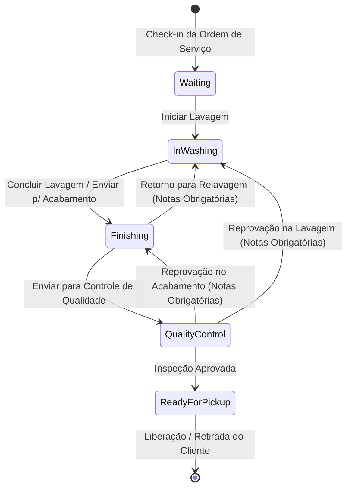
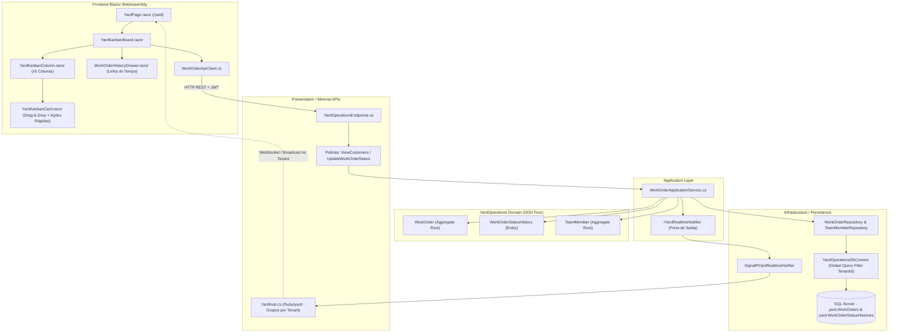

# Fluxo Operacional e Kanban — Fase 3.4

## 1. Visão Geral & Objetivo

A fase 3.4 consolida a gestão física e operacional do lava-jato no dia a dia. A partir da abertura da ordem de serviço (Fase 3.2) e da vistoria digital de entrada (Fase 3.3), os veículos entram automaticamente no quadro Kanban no estado inicial **Aguardando** (*Waiting*).

A equipe operacional acompanha os veículos distribuídos em 5 etapas padronizadas, realiza transições de status com validações estritas de negócio, atribui operadores responsáveis, registra justificativas para eventuais refações e mantém uma trilha auditável imutável de todas as movimentações.

---

## 2. Diagrama de Estados & Arquitetura

### 2.1 Máquina de Estados Operacional (WorkOrder)



### 2.2 Arquitetura Hexagonal & Sincronização em Tempo Real



---

## 3. Regras de Negócio e Invariantes

1. **Estados Padronizados (`WorkOrderStatus`):**
   * `Waiting` (*Aguardando*): Status inicial de toda OS recém-aberta.
   * `InWashing` (*Em Lavagem*): Veículo em processo de pré-lavagem, lavagem de carroceria ou chassi.
   * `Finishing` (*Secagem / Acabamento*): Veículo no box de secagem, aspiração, detalhamento ou acabamento de pneus/vidros.
   * `QualityControl` (*Controle de Qualidade*): Inspeção final de conformidade do serviço antes da entrega ao cliente.
   * `ReadyForPickup` (*Pronto para Retirada*): Veículo aprovado, aguardando o comparecimento do proprietário para retirada e pagamento. Estado terminal operacional.
2. **Validação de Transições de Estado:**
   * O sistema impede saltos de etapas não permitidos (ex.: de `Waiting` direto para `ReadyForPickup`).
   * Não é permitida a transição para o mesmo status (`work_order.same_status`).
   * Uma vez no status `ReadyForPickup`, o veículo não pode ser reaberto (`work_order.already_ready_for_pickup`).
3. **Refação com Justificativa Compulsória:**
   * Retornos de etapas (`QualityControl` $\rightarrow$ `Finishing`, `QualityControl` $\rightarrow$ `InWashing`, `Finishing` $\rightarrow$ `InWashing`) exigem obrigatoriamente preenchimento de justificativa/motivo (`work_order.rework_notes_required`).
4. **Atribuição de Operador Responsável:**
   * A OS pode ter um operador atribuído (`AssignedOperatorId` e snapshot `AssignedOperatorName`).
   * Apenas colaboradores com status ativo (`IsActive = true`) cadastrados no estabelecimento (`TeamMember`) podem ser vinculados (`team_member.inactive`).
5. **Histórico Imutável e Auditoria:**
   * Toda criação de OS e cada transição de status gera compulsoriamente um registro em `yard.WorkOrderStatusHistories` contendo `Id`, `TenantId`, `WorkOrderId`, `FromStatus`, `ToStatus`, `ChangedAtUtc`, `ChangedByOperatorId`, `ChangedByOperatorName` e `Notes`.
6. **Capacidade Física de Pátio:**
   * O topo do Kanban consolida em tempo real o número de veículos ocupando boxes físicos (em lavagem, acabamento e qualidade) versus a capacidade cadastrada na Fase 2.4 (`YardCapacity.TotalBoxes`).

---

## 4. Contratos Compartilhados (`Shared.Contracts`) & Endpoints REST

| Método | Rota | Autorização | Request | Response | Status Codes |
| :--- | :--- | :--- | :--- | :--- | :--- |
| `GET` | `/yard/kanban` | `ViewCustomers` | — | `YardKanbanBoardDto` | 200, 403 |
| `PATCH` | `/work-orders/{id}/status` | `UpdateWorkOrderStatus` | `ChangeWorkOrderStatusRequest` | `WorkOrderDto` | 200, 400, 403, 404, 409 |
| `PATCH` | `/work-orders/{id}/operator` | `UpdateWorkOrderStatus` | `AssignOperatorRequest` | `WorkOrderDto` | 200, 400, 403, 404 |
| `GET` | `/work-orders/{id}/history` | `ViewCustomers` | — | `List<WorkOrderStatusHistoryDto>` | 200, 403, 404 |
| `WS` | `/hubs/yard` | Authenticated | — | SignalR Events (`WorkOrderMoved`, `OperatorAssigned`) | 101, 401 |

---

## 5. Catálogo de Códigos de Erro de Negócio

| Código | Descrição | HTTP Status |
| :--- | :--- | :--- |
| `work_order.not_found` | Ordem de serviço não encontrada para este estabelecimento | 404 Not Found |
| `work_order.target_status.invalid` | Nome de status informado não é reconhecido | 400 Bad Request |
| `work_order.same_status` | A ordem de serviço já se encontra no status solicitado | 400 Bad Request |
| `work_order.invalid_status_transition` | Transição de status proibida pelas regras do fluxo operacional | 400 Bad Request |
| `work_order.rework_notes_required` | É obrigatório registrar o motivo para retornar a etapa da OS | 400 Bad Request |
| `work_order.already_ready_for_pickup` | A OS já está pronta para retirada e não pode ser alterada | 409 Conflict |
| `team_member.not_found` | Colaborador/operador informado não existe | 404 Not Found |
| `team_member.inactive` | Colaborador inativo não pode receber atribuição de serviço | 400 Bad Request |

---

## 6. Especificações Executáveis (BDD / Gherkin)

```gherkin
Funcionalidade: Fluxo Operacional e Kanban do Pátio
  Como operador ou encarregado de pátio
  Quero acompanhar os veículos em colunas operacionais e mover seus status
  Para garantir a ordem de execução dos serviços e histórico auditável

  Cenário: Avanço natural de etapas do veículo no pátio
    Dado que a ordem de serviço da placa "ABC-1D23" está no status "Aguardando"
    Quando o operador "Carlos" iniciar a lavagem do veículo
    Então a OS avança para "Em Lavagem"
    E "Carlos" passa a constar como operador atribuído
    E o histórico registra a transição de "Aguardando" para "Em Lavagem"

  Cenário: Reprovação no controle de qualidade com justificativa
    Dado que a OS está no status "Controle de Qualidade"
    Quando o encarregado retornar o veículo para "Secagem / Acabamento" com a nota "Manchas no vidro vigia"
    Então o status da OS passa a ser "Secagem / Acabamento"
    E a nota fica registrada no histórico da movimentação

  Cenário: Bloqueio de salto indevido de etapas
    Dado que a OS está no status "Aguardando"
    Quando houver uma tentativa de pular diretamente para "Pronto para Retirada"
    Então a operação falha com "work_order.invalid_status_transition"
    E a OS permanece no status "Aguardando"

  Cenário: Isolamento multi-tenant do quadro Kanban
    Dado que o Estabelecimento A possui 3 veículos em lavagem
    Quando o usuário do Estabelecimento B consultar o quadro do pátio
    Então nenhum veículo do Estabelecimento A é retornado no quadro
    E tentativas de alteração cruzada de OS retornam 404 Not Found
```

---

## 7. Componentes de Interface Blazor

* **`YardKanbanCard.razor`**: Card responsivo com placa Mercosul estilizada, nome do cliente, badges de porte e serviços, tempo decorrido, alerta visual de SLA (relógio vermelho em caso de atraso), badge com avatar de operador e botões rápidos de ação (`>` avançar e `<` retornar).
* **`YardKanbanColumn.razor`**: Coluna temática com glow de status (Âmbar, Ciano, Roxo, Esmeralda e Verde Neon), contador em tempo real e receptores nativos de Drag & Drop (`ondragover` e `ondrop`).
* **`YardKanbanBoard.razor`**: Orquestrador com medidor de capacidade física de boxes em uso, campo de busca instantânea por placa/cliente, filtro por operador, modais de refação e atribuição rápida.
* **`WorkOrderHistoryDrawer.razor`**: Gaveta lateral de auditoria exibindo a linha do tempo completa da OS com horários locais, operadores e observações registradas.
* **`YardPage.razor` (`/yard`)**: Tela principal do pátio com atualização periódica e sincronização contínua.
