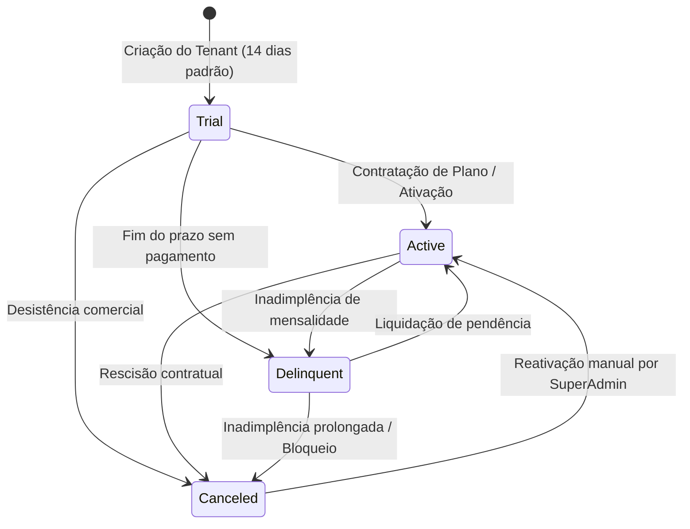
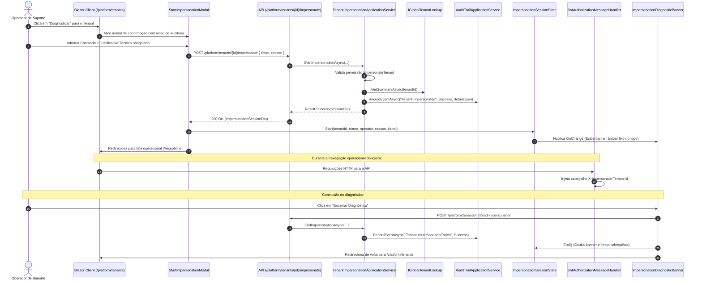
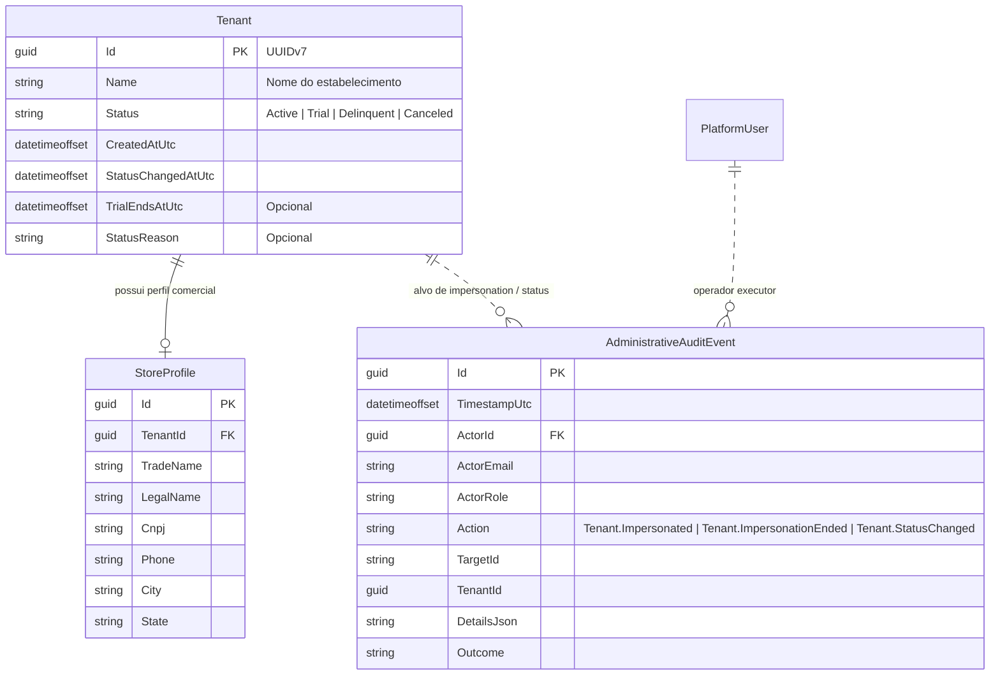

# Gestão Global de Tenants e Impersonation Auditável — Subfase 6.2

Este documento descreve a arquitetura, modelos, diagramas de sequência e especificações executáveis implementados para gestão de estabelecimentos e diagnóstico assistido por impersonation no Backoffice do SaaS.

---

## 1. Máquina de Estados do Estabelecimento (`TenantStatus`)



---

## 2. Fluxo de Sessão de Diagnóstico (Impersonation) e Auditoria



---

## 3. Modelo de Entidades e Relacionamento



---

## 4. Especificações Executáveis (BDD / Gherkin)

### Cenário 1: Listagem global de estabelecimentos com filtro por status
```gherkin
Dado que o operador autenticado possui o papel "PlatformSupport"
E existem estabelecimentos cadastrados nos status "Trial", "Active" e "Delinquent"
Quando o operador acessa "/platform/tenants" filtrando por "Trial"
Então apenas os estabelecimentos em período de testes são retornados
E os KPIs no topo indicam a contagem precisa de cada estado comercial
```

### Cenário 2: Abertura de sessão de diagnóstico auditada com sucesso
```gherkin
Dado que o operador de suporte "suporte@lavaway.com" seleciona o tenant "Lavaway Centro"
E informa o chamado "CHAMADO-1029" e a justificativa "Divergência no fechamento de caixa"
Quando o operador confirma o início do diagnóstico
Então uma sessão de impersonation é criada com êxito
E um evento imutável com ação "Tenant.Impersonated" é gravado na trilha de auditoria
E o banner "MODO DIAGNÓSTICO ATIVO" é exibido no topo da interface
E todas as requisições subsequentes transportam o cabeçalho "X-Impersonate-Tenant-Id"
```

### Cenário 3: Tentativa de impersonation sem justificativa técnica
```gherkin
Dado que o operador tenta iniciar o diagnóstico sem preencher a justificativa técnica
Quando clica em "Acessar Contexto do Tenant"
Então a ação é bloqueada com erro de validação
E nenhuma alteração de sessão ou registro indevido ocorre
```

### Cenário 4: Bloqueio de impersonation para operadores sem permissão
```gherkin
Dado que um operador com papel "PlatformAuditor" tenta invocar o endpoint de impersonate
Quando a requisição é processada
Então o sistema retorna HTTP 403 Forbidden
E um evento de auditoria com desfecho "Failure" é registrado reportando a tentativa não autorizada
```

### Cenário 5: Tentativa de uso do cabeçalho por usuário comum de loja
```gherkin
Dado que um lojista comum do tenant "Tenant A" injeta o cabeçalho "X-Impersonate-Tenant-Id" apontando para "Tenant B"
Quando a requisição é interceptada pelo TenantResolverMiddleware
Então o cabeçalho de impersonate é sumariamente ignorado
E a requisição é executada estritamente no contexto de "Tenant A"
```

### Cenário 6: Encerramento explícito do diagnóstico
```gherkin
Dado que uma sessão de diagnóstico está ativa para o tenant "Lavaway Centro"
Quando o operador clica em "Encerrar Diagnóstico" no banner persistente
Então o backend registra o evento "Tenant.ImpersonationEnded" com êxito
E o banner de diagnóstico é removido da tela
E os cabeçalhos de impersonation são limpos do cliente HTTP
E o operador é redirecionado para a página de gestão global de tenants
```
