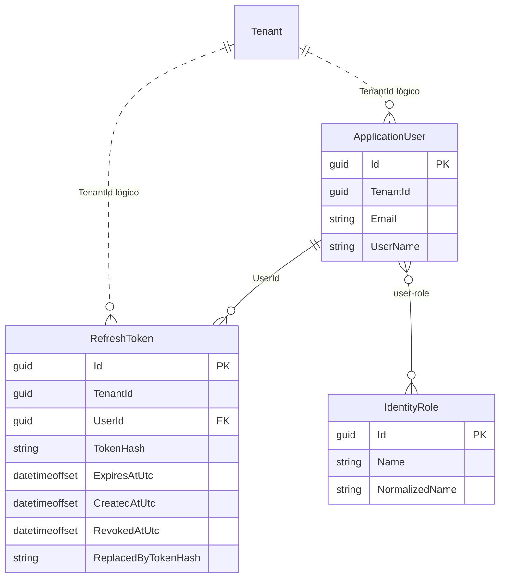
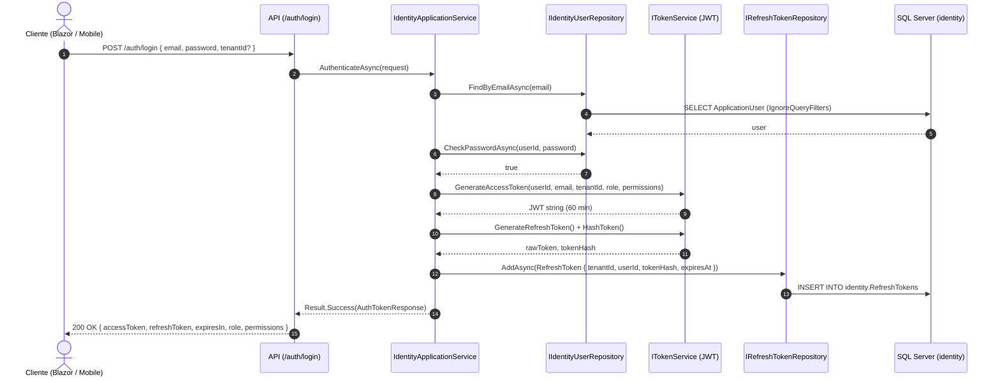
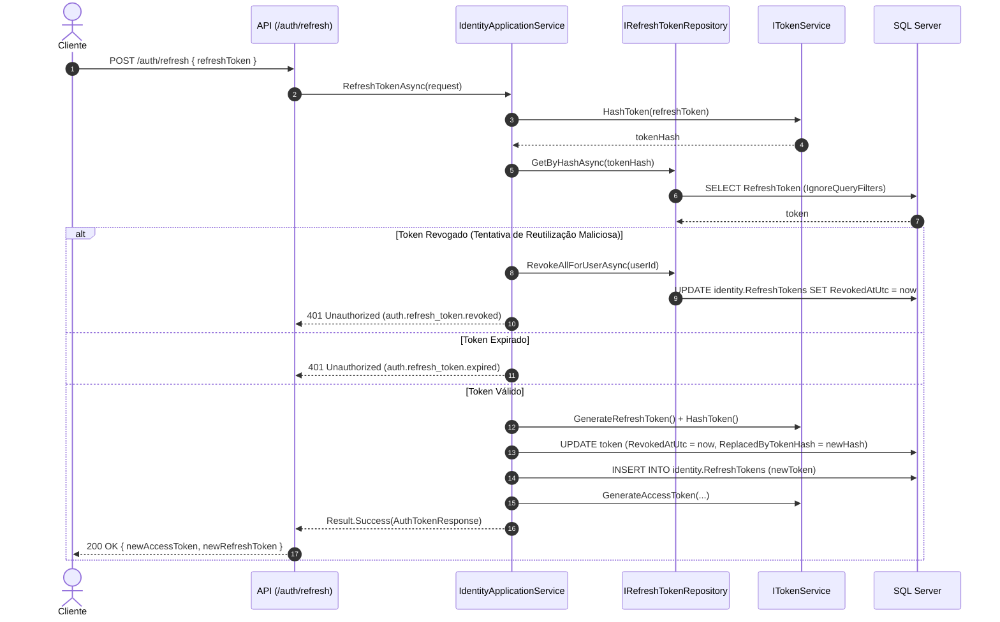

# Identidade, Sessão e Permissões — Subfase 1.3

Este documento descreve a arquitetura, modelos e fluxos executáveis implementados para autenticação, autorização por perfil e gestão segura de sessões com tokens JWT e refresh tokens.

---

## 1. Modelo de Domínio e Dados do Módulo Identity

O módulo `CarWashSaaS.Identity` opera no schema `identity` no SQL Server compartilhado, assegurando isolamento multi-tenant via `IMustHaveTenant` e Global Query Filters do EF Core.

### Regras de Domínio e Invariantes

- **`ShopRole`:** `Administrator`, `Receptionist`, `Operator`.
- **`ShopPermission`:** `ConfigureStore`, `ManageUsers`, `ManageWorkOrders`, `CreateWorkOrders`, `UpdateWorkOrderStatus`, `ViewCustomers`, `ViewReports`.
- **`ShopRolePermissions`:** Matriz pura em domínio mapeando papéis a permissões.
- **`RefreshToken`:**
  - Chave primária `Guid` (UUID v7).
  - Implementa `IMustHaveTenant` para garantir isolamento por estabelecimento.
  - Armazena hash SHA-256 do token criptográfico gerado.
  - Suporta expiração, revogação e encadeamento (`ReplacedByTokenHash`).

---

## 2. Fluxo de Autenticação e Emissão de Tokens

O endpoint `/auth/login` valida credenciais sem propagar exceções (padrão `Result<T>`), gera o par Access Token (JWT) e Refresh Token criptográfico com rotação.

---

## 3. Fluxo de Renovação de Sessão (Token Rotation)

Para mitigar sequestro de sessão e vazamento de tokens duradouros, a cada chamada ao `/auth/refresh` o token anterior é revogado e um novo par é gerado.

---

## 4. Endpoints REST da Camada de Apresentação

| Método | Rota | Autenticação | Política / Autorização | Descrição |
| :--- | :--- | :--- | :--- | :--- |
| `POST` | `/auth/login` | Anônimo | Nenhuma | Autentica usuário e emite JWT + Refresh Token |
| `POST` | `/auth/refresh` | Anônimo | Nenhuma | Rotação de sessão: consome refresh token antigo e emite novo par |
| `POST` | `/auth/revoke` | Anônimo | Nenhuma | Invalida/revoga refresh token de forma idempotente |
| `GET` | `/auth/me` | Bearer JWT | Fallback (Authenticated) | Retorna identificadores, tenant resolvido, role e permissões |
| `POST` | `/identity/users` | Bearer JWT | `AdministratorPolicy` | Cria novo colaborador associado ao tenant autenticado |
| `GET` | `/identity/users` | Bearer JWT | `AdministratorPolicy` | Lista colaboradores do tenant autenticado |

---

## 5. Integração com Frontend Blazor

No projeto [CarWashSaaS.Client.Web](file:///home/rony/LPR/lavaway/src/Frontend/CarWashSaaS.Client.Web):
1. **`ITokenStorage` / `InMemoryTokenStorage`:** abstrai o armazenamento volátil e persistente dos tokens.
2. **`JwtAuthenticationStateProvider`:** decodifica o JWT no cliente, extrai as claims (`sub`, `email`, `role`, `permission`, `tenant_id`) e alimenta o sistema de autorização nativo do Blazor (`<AuthorizeView>`, `<CascadingAuthenticationState>`).
3. **`JwtAuthorizationMessageHandler`:** injeta compulsoriamente o cabeçalho `Authorization: Bearer <token>` em todas as requisições HTTP para a API.
4. **`AuthApiClient`:** cliente fortemente tipado em [CarWashSaaS.Client.Core](file:///home/rony/LPR/lavaway/src/Frontend/CarWashSaaS.Client.Core) com métodos `LoginAsync`, `RefreshTokenAsync`, `RevokeTokenAsync`, `CreateUserAsync` e `ListUsersAsync` utilizando exclusivamente o padrão `Result<T>`.

---

## 6. Governança e Testes Automatizados

- **Testes Unitários de Domínio:** [RefreshTokenTests.cs](file:///home/rony/LPR/lavaway/tests/Backend/UnitTests/CarWashSaaS.UnitTests/Identity/RefreshTokenTests.cs) (validação, criação com UUID v7, invariantes de revogação e expiração).
- **Testes Unitários de Aplicação:** [IdentityApplicationServiceTests.cs](file:///home/rony/LPR/lavaway/tests/Backend/UnitTests/CarWashSaaS.UnitTests/Identity/IdentityApplicationServiceTests.cs) (login, validação de senha, rotação de refresh token, detecção de reutilização, revogação e criação de usuários).
- **Testes de Arquitetura:** [ModuleBoundaryTests.cs](file:///home/rony/LPR/lavaway/tests/Backend/ArchitectureTests/CarWashSaaS.ArchitectureTests/ModuleBoundaryTests.cs) (garantia de que `RefreshToken` possui `IMustHaveTenant`, identificador `Guid` e obedece às fronteiras hexagonais).
- **Testes de Isolamento Multi-Tenant:** [TenantIsolationIntegrationTests.cs](file:///home/rony/LPR/lavaway/tests/Backend/IntegrationTests/CarWashSaaS.IntegrationTests/TenantIsolationIntegrationTests.cs) e [ModuleModelTests.cs](file:///home/rony/LPR/lavaway/tests/Backend/IntegrationTests/CarWashSaaS.IntegrationTests/ModuleModelTests.cs) (filtro global por tenant ativo no EF Core).
