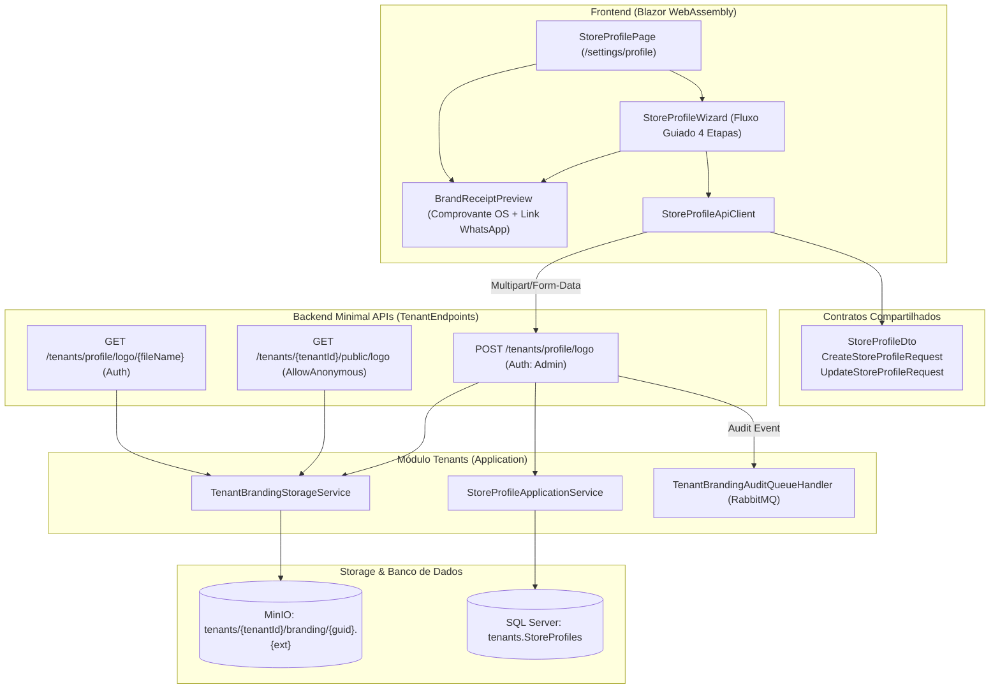
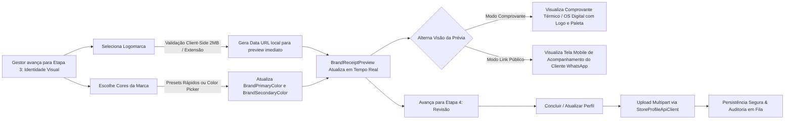

# Identidade Visual e Prévia de Comprovante/Link — Fase 2.2

## Objetivo
Permitir que o gestor do estabelecimento configure a identidade visual da sua unidade (upload seguro de logomarca, definição das cores primária e secundária da marca) e visualize em tempo real a aplicação dessa identidade no comprovante digital térmico de ordem de serviço e na página pública de acompanhamento do veículo via WhatsApp.

---

## 1. Arquitetura End-to-End

---

## 2. Fluxo Guiado de Identidade Visual e Prévia Reativa

---

## 3. Regras de Negócio e Segurança

- **Isolamento Rígido de Tenant:** Cada logomarca é gravada no MinIO sob `tenants/{tenantId}/branding/{safeGuid}.{ext}`, com chave UUID v7 sanitizada para impedir *path traversal*.
- **Endpoint Público Controlado (`GET /tenants/{tenantId}/public/logo`):** Permite que comprovantes impressos e links públicos de rastreamento no WhatsApp carreguem a logomarca do estabelecimento sem necessidade de token JWT de operador, resolvendo exclusivamente a logo oficial configurada no perfil do tenant informado.
- **Validação de Formatos e Dimensões:**
  - Extensões aceitas: `.png`, `.jpg`, `.jpeg`, `.webp`, `.svg`.
  - Limite de tamanho: 2 MB com validação prévia no cliente (Blazor) e reforço compulsório no domínio/storage da API.
- **Validação de Cores Hexadecimais:** Formato estrito `#RRGGBB` normalizado em maiúsculo no domínio (`StoreProfile`), garantindo integridade visual.
- **Auditoria Assíncrona:** A cada alteração de identidade visual via upload, uma mensagem de auditoria é publicada na fila RabbitMQ e processada sob escopo restrito do tenant pelo `TenantBrandingAuditQueueHandler`.

---

## 4. Especificações Executáveis (BDD / Cenários de Teste)

### Cenário 1: Atualização em Tempo Real da Prévia ao Modificar Cores
- **Dado** que o gestor está na Etapa 3 do cadastro de perfil do estabelecimento
- **Quando** ele seleciona a cor primária `#DC2626` (Racing Red) e secundária `#EF4444`
- **Então** o componente `BrandReceiptPreview` aplica imediatamente as variáveis `--brand-primary: #DC2626` e `--brand-secondary: #EF4444` no cabeçalho do comprovante e no status de rastreamento.

### Cenário 2: Exibição de Fallback Elegante sem Logomarca
- **Dado** que o estabelecimento ainda não fez o upload de logomarca
- **Quando** o comprovante de atendimento é renderizado
- **Então** um emblema estilizado com a inicial do Nome Fantasia do estabelecimento é exibido com o gradiente da paleta da marca.

### Cenário 3: Validação Client-Side de Arquivo de Logo Inválido
- **Dado** que o gestor seleciona um arquivo executável `.exe` ou superior a 2 MB
- **Quando** o evento de seleção de arquivo é acionado
- **Então** o wizard exibe mensagem de erro amigável
- **E** impede o envio incorreto para o servidor.

### Cenário 4: Acesso Público à Logo do Tenant para Comprovantes
- **Dado** que o Tenant A possui logo configurada
- **Quando** uma requisição não autenticada consulta `GET /tenants/{tenantA}/public/logo`
- **Então** o arquivo de imagem da logo do Tenant A é retornado com o Content-Type correto
- **E** nenhuma informação confidencial ou dados do Tenant B são expostos.

---

## 5. Rastreabilidade e Cobertura de Testes

| Camada | Arquivo de Teste | Itens Cobertos |
| :--- | :--- | :--- |
| **Componentes (bUnit)** | `BrandReceiptPreviewTests.cs` | Renderização de fallback, logo por URL, injeção de CSS vars e alternância entre visão de comprovante e link público. |
| **Componentes (bUnit)** | `StoreProfileWizardTests.cs` | Fluxo completo de 4 etapas, validação client-side e renderização de controles de identidade visual. |
| **Testes Unitários** | `StoreProfileFormModelTests.cs` | Validação de formatos hexadecimais de cores primária e secundária. |
| **Testes Unitários** | `StoreProfileApiClientTests.cs` | Envio de formulário multipart `POST /tenants/profile/logo` e leitura de retorno. |
| **Integração SQL Server** | `StoreProfileTenantIntegrationTests.cs` | Persistência de `LogoUrl`, `BrandPrimaryColor` e `BrandSecondaryColor` com isolamento estrito por tenant. |
| **Integração Storage/Fila** | `MinioTenantObjectStorageIntegrationTests.cs` | Gravação e recuperação isolada no MinIO sob `tenants/{tenantId}/branding/`. |
