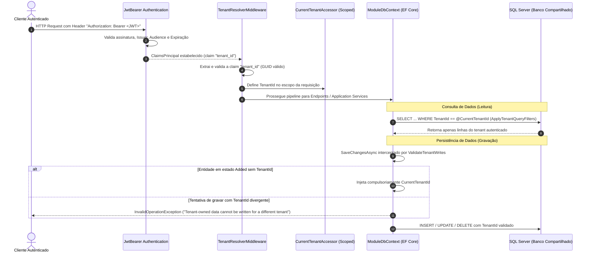

# Isolamento Multi-Tenant — Fase 1.2

Este documento detalha o mecanismo de isolamento lógico de múltiplos estabelecimentos (tenants) sob um único banco SQL Server, conforme estabelecido no [roadmap.md](../../roadmap.md), [agents.md](../../agents.md) e na [ADR-0001](../architecture/ADR-0001-isolamento-tenant-ef-core.md).

---

## 1. Princípios Inegociáveis de Multi-Tenancy

1. **Vazamento Zero de Dados:** A violação ou vazamento de dados entre estabelecimentos é tratada como vulnerabilidade crítica gravíssima.
2. **Resolução Compulsória por Token JWT:** O identificador `TenantId` é resolvido exclusivamente a partir da claim `tenant_id` presente no JWT assinado e validado. Headers, query parameters ou valores enviados pelo cliente no corpo da requisição **nunca** definem o tenant ativo.
3. **Contrato de Identificação (`IMustHaveTenant`):** Todo registro proprietário de um estabelecimento implementa a interface `IMustHaveTenant` e armazena seu `TenantId` em formato `Guid`.
4. **Filtros Globais de Consulta:** Todas as consultas via EF Core em entidades que implementem `IMustHaveTenant` recebem automaticamente um Global Query Filter que restringe o resultado ao `TenantId` resolvido.
5. **Gravação Segura e Bloqueio de Escrita Cruzada:** O pipeline de persistência intercepta `SaveChangesAsync` e injeta compulsoriamente o `TenantId` nas novas entidades ou bloqueia a operação caso haja tentativa de gravar com `TenantId` diferente do contexto ativo.

---

## 2. Ciclo de Vida da Requisição & Isolamento de Tenant

---

## 3. Componentes Centrais de Implementação

- **[IMustHaveTenant](../../src/Shared/CarWashSaaS.Shared.Contracts/IMustHaveTenant.cs):** Contrato compartilhado implementado pelas entidades proprietárias de cada módulo.
- **[TenantResolverMiddleware](../../src/Backend/CarWashSaaS.Api/Middleware/TenantResolverMiddleware.cs):** Interceptador no pipeline HTTP que lê a claim `tenant_id`, valida o UUID e popula o `CurrentTenantAccessor`.
- **[CurrentTenantAccessor](../../src/Backend/CarWashSaaS.Api/Services/CurrentTenantAccessor.cs):** Serviço com ciclo de vida `Scoped` que provê acesso ao `TenantId` da requisição atual.
- **[TenantIsolationExtensions](../../src/Shared/CarWashSaaS.Shared.Configuration/TenantIsolationExtensions.cs):**
  - `ApplyTenantQueryFilters`: Aplica filtros `e.TenantId == _currentTenantAccessor.TenantId` em todas as entidades registradas no `ModelBuilder`.
  - `ValidateTenantWrites`: Valida as alterações rastreadas pelo `ChangeTracker` antes do envio ao banco de dados.

---

## 4. Cobertura de Testes Automatizados

O isolamento multi-tenant é coberto por testes de integração automatizados em ambiente real via Testcontainers (`tests/Backend/IntegrationTests`):
- `TenantIsolationIntegrationTests`: Garante que o Tenant B não consiga ler, atualizar ou excluir dados criados pelo Tenant A.
- `ModuleModelTests`: Valida programaticamente a aplicação dos Global Query Filters e o comportamento de `ValidateTenantWrites`.
- `TenantResolverMiddlewareTests`: Valida rejeição de requisições com tokens sem claim de tenant, malformadas ou com GUID nulo.
