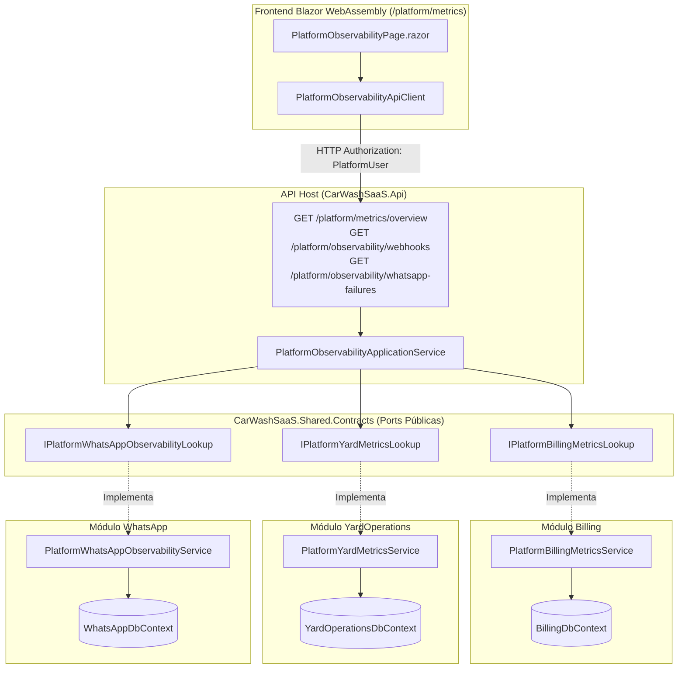
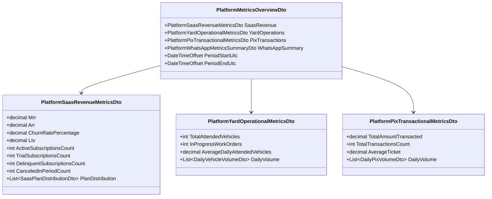
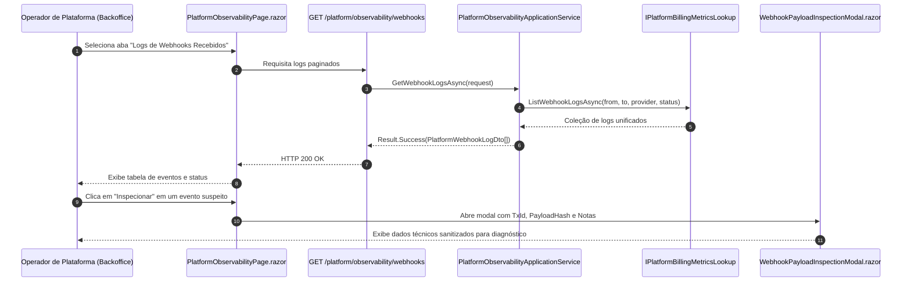

# Métricas e Observabilidade Global da Plataforma — Subfase 6.5

Este documento consolida a arquitetura, modelos de dados, fluxo de integração desacoplada, contratos, fórmulas matemáticas e especificações executáveis implementados para observabilidade contínua, telemetria de negócio e investigação operacional no Backoffice do Lavaway.

---

## 1. Arquitetura Hexagonal de Agregação e Observabilidade

---

## 2. Metodologia de Cálculo das Métricas de Negócio

### Fórmulas Matemáticas
1. **MRR (Monthly Recurring Revenue):**
   $$\text{MRR} = \sum_{\text{status} \in \{\text{Active}, \text{GracePeriod}\}} \text{MonthlyPrice}$$
2. **ARR (Annual Recurring Revenue):**
   $$\text{ARR} = \text{MRR} \times 12$$
3. **Churn Rate (%):**
   $$\text{Churn Rate} = \frac{\text{Cancelamentos no Período}}{\text{Ativos} + \text{Cancelamentos no Período}} \times 100$$
4. **LTV (Lifetime Value):**
   $$\text{ARPU} = \frac{\text{MRR}}{\text{Ativos}} \quad\implies\quad \text{LTV} = \frac{\text{ARPU}}{\text{Churn Rate (em decimal)}}$$
   *(Fallback para Churn = 0%: média histórica de faturas pagas por tenant)*
5. **Veículos Atendidos:**
   Contagem de ordens de serviço (`WorkOrder`) com `PickedUpAtUtc` dentro do intervalo especificado.
6. **Volume Pix:**
   Soma e contagem de cobranças Pix (`PixCharge`) liquidadas com status `Paid` dentro do intervalo especificado.

---

## 3. Fluxo de Investigação de Incidentes Operacionais

---

## 4. Endpoints REST da Plataforma

| Método | Endpoint | Política de Autorização | Descrição |
| :--- | :--- | :--- | :--- |
| `GET` | `/platform/metrics/overview` | `PlatformUserPolicy` | Consolida MRR, ARR, Churn, LTV, veículos e Pix na janela temporal. |
| `GET` | `/platform/observability/webhooks` | `PlatformUserPolicy` | Lista logs de webhooks recebidos dos provedores externos com paginação. |
| `GET` | `/platform/observability/whatsapp-failures` | `PlatformUserPolicy` | Lista histórico de mensagens de WhatsApp com falha, motivo e tentativas. |

---

## 5. Especificações Executáveis (Suíte de Testes)

- **UnitTests:** `PlatformBillingMetricsServiceTests`, `PlatformYardMetricsServiceTests` e `PlatformWhatsAppObservabilityServiceTests` validam cálculos matemáticos, tratamentos de casos de borda e mascaramento LGPD de telefones.
- **ArchitectureTests:** `ModuleBoundaryTests` garante que não há acoplamento direto entre os bancos de dados dos módulos e que toda a comunicação de observabilidade respeita as portas hexagonais em `CarWashSaaS.Shared.Contracts`.
- **IntegrationTests:** `PlatformObservabilityIntegrationTests` valida o isolamento de dados por tenant e a agregação global de dados no SQL Server via Testcontainers.
- **ComponentTests:** `PlatformObservabilityComponentTests` e `RouteAuthorizationTests` validam renderização de modais e proteção de rotas com controle de perfis administrativos.
