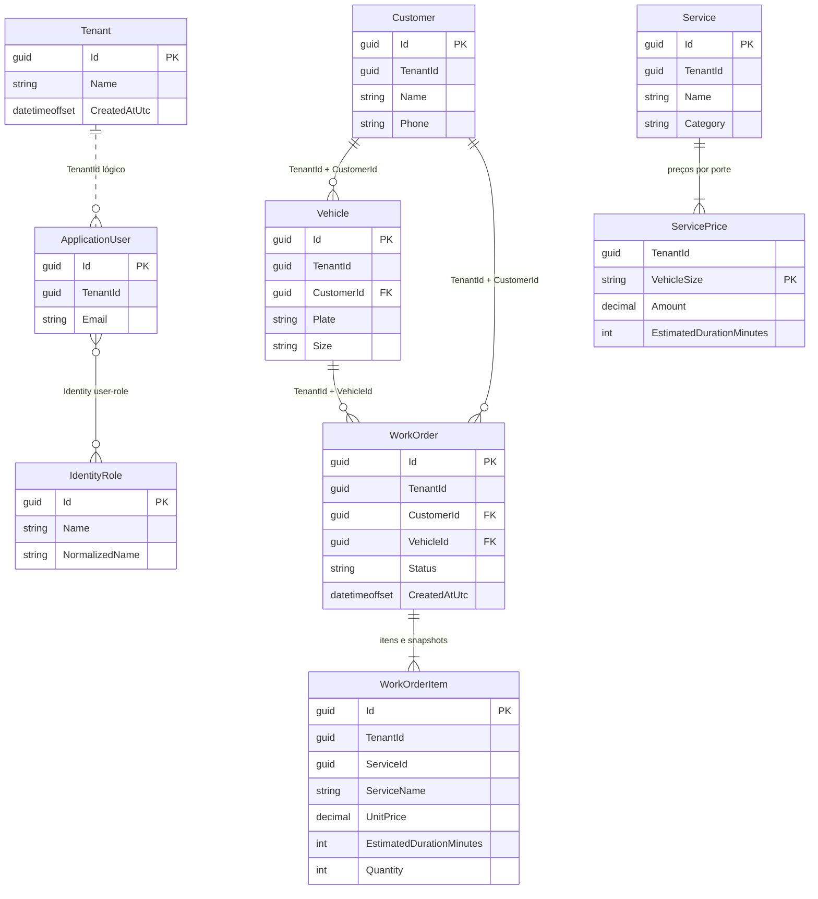

# Modelo de Domínio e Dados — Fase 1.1

Este documento descreve o esquema inicial criado para Tenants, Identity e YardOperations. Os contextos compartilham o banco SQL Server, mas cada módulo controla suas próprias tabelas e migrations.



## Limites e integridade

- `Tenant` é um agregado global da plataforma; não recebe `TenantId`.
- Clientes, veículos, serviços, preços, ordens e itens de OS carregam `TenantId`.
- Identity usa chaves `Guid`; usuários têm vínculo com um único tenant. Os papéis Administrator, Receptionist e Operator são globais e usam as tabelas padrão do ASP.NET Core Identity.
- Placas são normalizadas para sete caracteres alfanuméricos em maiúsculas e únicas por tenant.
- Chaves alternativas compostas por `(TenantId, Id)` e FKs compostas impedem que veículo ou OS aponte para cliente/veículo de outro tenant.
- Preços e itens da OS são dependentes dos agregados; itens da OS preservam nome, preço e duração como snapshots.
- O esquema separa os módulos nos schemas SQL `tenants`, `identity` e `yard`. Cada context mantém sua própria tabela de histórico de migrations.

## Isolamento

Esta migration estabelece colunas, índices e relações tenant-scoped, mas **não conclui o isolamento de consultas**. Antes de expor operações de dados, a subfase 1.2 deve aplicar Global Query Filters e validar/injetar `TenantId` nas gravações. A estratégia e a resolução do tenant em autenticação estão registradas em [ADR-0001](../architecture/ADR-0001-isolamento-tenant-ef-core.md). SQL Server Row-Level Security fica fora da primeira entrega.

## Aplicação local

Defina a variável `ConnectionStrings__CarWashSaaS` com a connection string do SQL Server local e aplique cada contexto:

```sh
dotnet ef database update --project src/Backend/Modules/Tenants/CarWashSaaS.Tenants.Infrastructure --startup-project src/Backend/CarWashSaaS.Api --context TenantsDbContext
dotnet ef database update --project src/Backend/Modules/Identity/CarWashSaaS.Identity.Infrastructure --startup-project src/Backend/CarWashSaaS.Api --context IdentityModuleDbContext
dotnet ef database update --project src/Backend/Modules/YardOperations/CarWashSaaS.YardOperations.Infrastructure --startup-project src/Backend/CarWashSaaS.Api --context YardOperationsDbContext
```
