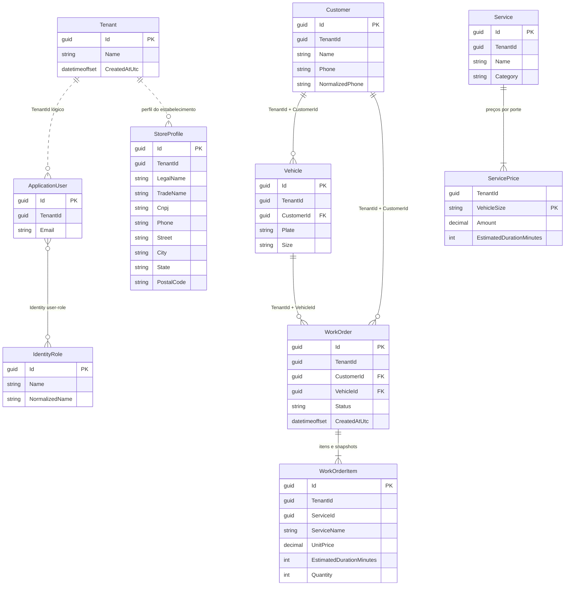
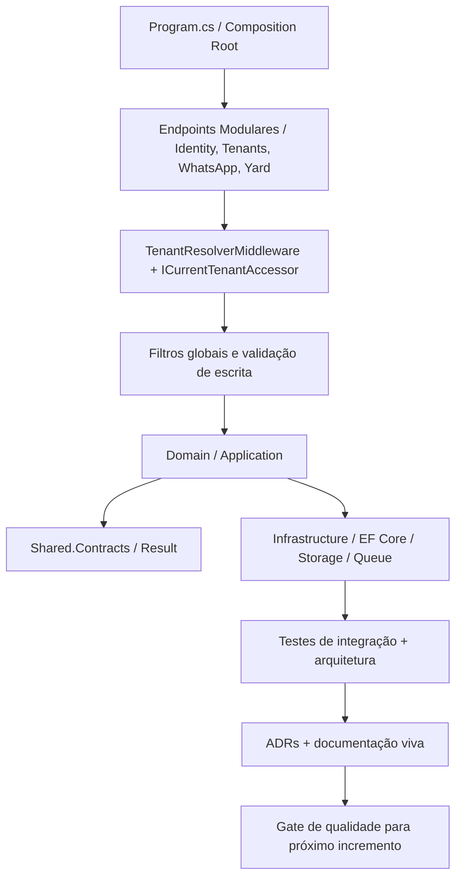
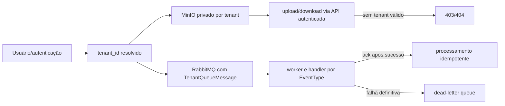
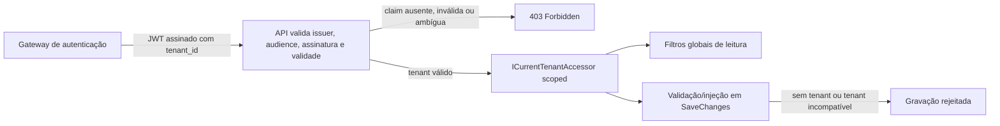
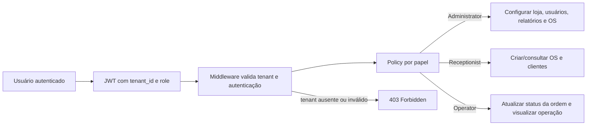

# Modelo de Domínio e Dados — Fase 1.1

Este documento descreve o esquema inicial criado para Tenants, Identity e YardOperations. Os contextos compartilham o banco SQL Server, mas cada módulo controla suas próprias tabelas e migrations.



## Limites e integridade

- `Tenant` é um agregado global da plataforma; não recebe `TenantId`.
- Clientes, veículos, serviços, preços, ordens e itens de OS carregam `TenantId`.
- Identity usa chaves `Guid`; usuários têm vínculo com um único tenant. Os papéis Administrator, Receptionist e Operator são globais e usam as tabelas padrão do ASP.NET Core Identity.
- A subfase 1.3 acrescenta um modelo explícito de permissões por papel: `ShopPermission` expressa ações como configurar loja, gerenciar usuários, criar OS, atualizar status e visualizar relatórios; `ShopRolePermissions.GetPermissions()` centraliza o mapeamento por role.
- Placas são normalizadas para sete caracteres alfanuméricos em maiúsculas e únicas por tenant.
- Telefones de clientes preservam o valor de exibição e usam `NormalizedPhone` indexado por tenant para busca exata; telefones podem ser compartilhados. O DDI brasileiro `55` é removido quando o número contém 12 ou 13 dígitos totais.
- Chaves alternativas compostas por `(TenantId, Id)` e FKs compostas impedem que veículo ou OS aponte para cliente/veículo de outro tenant.
- Preços e itens da OS são dependentes dos agregados; itens da OS preservam nome, preço e duração como snapshots.
- O esquema separa os módulos nos schemas SQL `tenants`, `identity` e `yard`. Cada context mantém sua própria tabela de histórico de migrations.

## Qualidade e arquitetura da solução (subfase 1.5)

A subfase 1.5 formaliza a governança da base já validada. O objetivo é garantir que a arquitetura permaneça estável mesmo após o crescimento dos módulos e das integrações.



### Guardas da subfase

- `Domain` e `Application` continuam livres de dependência direta com `DbContext`, HTTP, front-end e infraestrutura externa.
- `Infrastructure` implementa as interfaces de repositórios, fila e persitência usando os contratos da shared layer.
- `Result<T>` e `Error` permanecem como forma obrigatória de retorno para validações e regras de negócio.
- `TenantId` é obrigatório para entidades operacionais; a gravação é invalidada quando a entidade não possui tenant ou o tenant diverge do escopo atual.
- Autenticação e autorização continuam sendo tratadas no pipeline, com `Authentication:Authority` e `Authentication:Audience` obrigatórios na inicialização.
- Testes de integração devem confirmar que Tenant B não lê nem altera dados de Tenant A; documentação e código devem refletir esse comportamento.

### Isolamento

A base de isolamento foi concluída no código: a solução aplica filtros globais e validação de gravação em `TenantIsolationExtensions`, além de resolver o tenant via middleware e accessor scoped. A estratégia e a resolução em autenticação continuam registradas em [ADR-0001](../architecture/ADR-0001-isolamento-tenant-ef-core.md). SQL Server Row-Level Security continua fora da primeira entrega, mas a camada funcional e a API já respeitam a regra de tenant por request.

### Storage e fila por tenant

A subfase 1.4 possui um adapter MinIO para objetos privados e um adapter RabbitMQ para entregas persistentes. `TenantStoragePathBuilder` mantém o namespace de objetos em `tenants/{tenantId}/{category}/{fileName}`. A API resolve o tenant autenticado antes de gravar ou ler a logo do estabelecimento; o cliente não escolhe o prefixo do objeto.

`TenantQueueMessage` contém `MessageId`, `TenantId`, `EventType` e `Payload`. A publicação usa mensagem persistente. A fila principal é quorum; o worker confirma somente após o handler terminar, aplica retentativa com backoff exponencial e envia falhas definitivas para a dead-letter queue. Cada entrega roda em um escopo próprio e define o tenant no accessor antes de localizar o handler. Handlers devem ser idempotentes porque a garantia de entrega é pelo menos uma vez. Ainda não há handlers de negócio registrados.



Os adapters estão registrados na composição da API e as configurações são fornecidas pelo ambiente. Os testes unitários e builds focados passaram. Os testes RabbitMQ/SQL Server usam Testcontainers, mas não foram executados nesta validação porque o daemon Docker não estava acessível; o fluxo real de MinIO e o consumo de um handler de negócio também seguem como gates pendentes.

### Resolução e ciclo de request

O gateway de autenticação emite um JWT assinado com exatamente um claim `tenant_id` contendo um UUID não vazio. A API valida assinatura, emissor, audience e expiração antes de disponibilizar o tenant no accessor scoped. Headers e valores enviados pelo cliente não podem substituir esse claim.



`Authentication:Authority` e `Authentication:Audience` devem ser configurados por ambiente; a API falha na inicialização se estiverem ausentes. Entidades novas recebem o tenant corrente quando o identificador estiver vazio. Entidades alteradas ou removidas com tenant divergente são rejeitadas. `Tenants` e roles globais do Identity permanecem fora dos filtros; owned types são protegidos pelo filtro do agregado proprietário.

Os testes de integração aplicam as migrations em um SQL Server efêmero e verificam que Tenant B não consulta nem altera registros de Tenant A, inclusive usuários do Identity. Nenhuma migration adicional é necessária para essa camada de isolamento.

### Autorização por perfil

A base da identidade passou a incluir permissões e policies de acesso por papel, com o domínio definindo a matriz de autorização e a API registrando as policies a partir dos roles do ASP.NET Identity.



A matriz de permissão segue a estrutura:

- `Administrator`: `ConfigureStore`, `ManageUsers`, `ManageWorkOrders`, `CreateWorkOrders`, `UpdateWorkOrderStatus`, `ViewCustomers`, `ViewReports`
- `Receptionist`: `CreateWorkOrders`, `UpdateWorkOrderStatus`, `ViewCustomers`, `ViewReports`
- `Operator`: `UpdateWorkOrderStatus`, `ViewCustomers`, `ViewReports`

O fluxo completo de login e refresh token continua como etapa seguinte da subfase 1.3, mas a base de autorização por perfil já está definida em domínio e na API.

## Aplicação local

Defina a variável `ConnectionStrings__CarWashSaaS` no `.env` com a connection string do SQL Server local e aplique cada contexto via script automatizado:

```sh
./scripts/apply-migrations.sh
```

Ou execute manualmente para cada contexto:

```sh
dotnet ef database update --project src/Backend/Modules/Tenants/CarWashSaaS.Tenants.Infrastructure --startup-project src/Backend/CarWashSaaS.Api --context TenantsDbContext
dotnet ef database update --project src/Backend/Modules/Identity/CarWashSaaS.Identity.Infrastructure --startup-project src/Backend/CarWashSaaS.Api --context IdentityModuleDbContext
dotnet ef database update --project src/Backend/Modules/YardOperations/CarWashSaaS.YardOperations.Infrastructure --startup-project src/Backend/CarWashSaaS.Api --context YardOperationsDbContext
```

Scripts SQL idempotentes gerados e versionados também estão disponíveis para execução direta via ferramentas de banco de dados (ex.: CI/CD, DBA):
- `scripts/sql/01_tenants_idempotent.sql` (schema `tenants`)
- `scripts/sql/02_identity_idempotent.sql` (schema `identity`)
- `scripts/sql/03_yard_operations_idempotent.sql` (schema `yard`)

