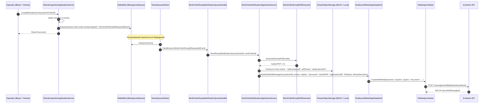
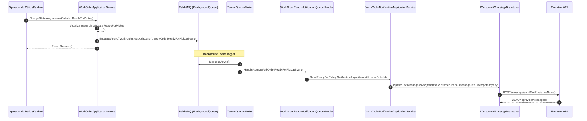
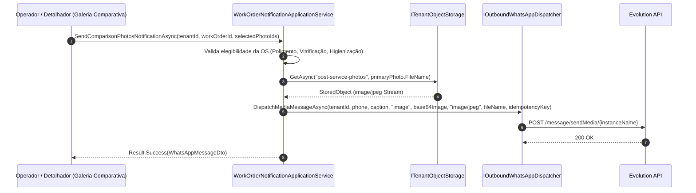

# Notificações da Ordem de Serviço e Comprovante de Entrada em PDF — Subfase 4.2

## Objetivo

Garantir o ciclo completo de comunicação automatizada com o cliente da estética automotiva via WhatsApp e documentos digitais:
1. Geração e envio do comprovante de entrada em PDF com dados da OS, itens contratados, checklist de inspeção e avarias mapeadas na vistoria.
2. Disparo de aviso imediato quando o veículo atinge a etapa *Pronto para Retirada*, contendo dados do veículo, total a pagar e endereço do estabelecimento.
3. Envio da galeria comparativa "Antes e Depois" com fotos pós-serviço (polimento, vitrificação, higienização) diretamente no WhatsApp do cliente.
4. Rastreabilidade com idempotência por tenant, histórico de notificações e sincronização no Kanban e modal de recepção.

---

## 1. Arquitetura e Fluxo de Envio do Comprovante de Entrada (PDF)

---

## 2. Fluxo de Aviso: Veículo Pronto para Retirada

---

## 3. Fluxo de Envio do Comparativo Antes e Depois

---

## 4. Estrutura do Documento PDF 1.4

O gerador `WorkOrderReceiptPdfGenerator` foi desenvolvido em C# puro sem dependências externas de bibliotecas nativas de terceiros, garantindo 100% de compatibilidade em ambientes Linux, Docker e containers Alpine:
- **Metadados:** Sintaxe padrão PDF 1.4 (`%PDF-1.4`), tabela de referências cruzadas (`xref`) e catálogo do documento.
- **Cabeçalho:** Nome fantasia, telefone e endereço do estabelecimento recuperados de forma desacoplada via `ITenantStoreProfileLookup`.
- **Dados do Atendimento:** Número da OS, data/hora de entrada, previsão estimada de entrega, identificação do cliente e veículo (Placa padrão Mercosul e porte).
- **Discriminação de Serviços:** Tabela com nome do serviço, quantidade, valor unitário e valor total.
- **Vistoria e Avarias:** Leitura do odômetro, nível de combustível, status dos itens de checklist inspecionados (Conforme, Não Conforme, etc.) e avarias registradas com tipo, severidade e descrição.
- **Rodapé:** Protocolo criptográfico / hash de conferência e assinatura de tecnologia Lavaway SaaS.

---

## 5. Critérios BDD / Cenários de Teste

### Cenário 1: Envio do Comprovante em PDF após Check-in e Vistoria
- **Dado** que uma ordem de serviço foi aberta com serviços contratados e vistoria digital com checklist preenchido,
- **Quando** o operador solicita o envio do comprovante via WhatsApp ou a vistoria é concluída,
- **Então** o sistema gera o arquivo PDF 1.4 em memória, armazena no bucket `work-orders/{id}/receipt.pdf` e despacha como mídia `document` no WhatsApp do cliente com chave de idempotência `receipt-{workOrderId}`.

### Cenário 2: Notificação automática de Veículo Pronto para Retirada
- **Dado** que um veículo estava na etapa de Qualidade ou Acabamento,
- **Quando** o operador move o veículo no Kanban para a coluna *Pronto para Retirada*,
- **Então** o evento `WorkOrderReadyForPickupEvent` é publicado na fila durável, processado pelo worker assíncrono e entregue via mensagem formatada no WhatsApp do cliente com os dados do veículo, total e local de retirada.

### Cenário 3: Envio de Foto Comparativa Antes e Depois
- **Dado** que uma ordem de serviço possui serviço elegível (ex: Polimento Técnico) e pelo menos uma foto pós-serviço registrada,
- **Quando** o operador aciona a opção "Enviar Antes/Depois no WhatsApp",
- **Então** o sistema lê a foto pós-serviço do storage, converte para base64 e despacha como mensagem de mídia `image` com legenda contextualizada para o cliente.

### Cenário 4: Bloqueio de Envio de Fotos para Serviços Não Elegíveis
- **Dado** que uma OS possui apenas serviços simples (ex: Ducha Rápida),
- **Quando** é solicitada a notificação comparativa,
- **Então** o sistema retorna `Result.Failure("work_order.not_eligible_for_photos")` impedindo spam ou envios indevidos.
