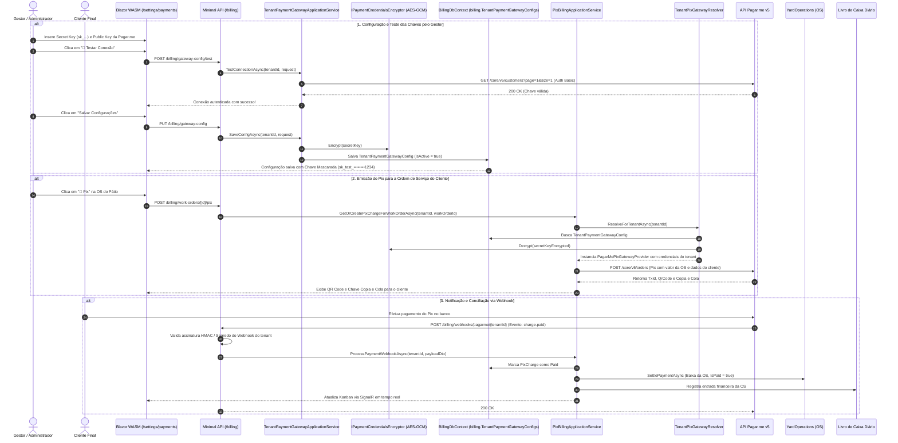

# Configuração Descentralizada de Gateways e Pagar.me por Tenant — Subfase 5.4

## 1. Visão Geral & Objetivo

A subfase **5.4** do Lavaway SaaS implementa a capacidade de cada **estabelecimento (tenant)** configurar e gerenciar seu próprio gateway de pagamento para emissão de Pix e recebimento financeiro das Ordens de Serviço (OS). 

Com o suporte nativo à **Pagar.me (Stone Co.)**, o estabelecimento insere suas credenciais de API v5 diretamente no painel administrativo (`/settings/payments`), permitindo que os pagamentos Pix dos seus clientes sejam liquidados diretamente em sua conta bancária sem qualquer intermediação de custódia pela plataforma SaaS.

---

## 2. Diagrama de Sequência Mermaid



---

## 3. Segurança e Criptografia em Repouso

* **Criptografia Autenticada:** O serviço `PaymentCredentialsEncryptor` utiliza `AesGcm` (256 bits) com nonce único de 12 bytes gerado criptograficamente e tag de autenticação de 16 bytes para cada credencial.
* **Mascaramento:** As chaves secretas são ofuscadas (`sk_test_••••••••1234`) no retorno da API, assegurando que nenhum operador ou usuário consiga ler o segredo completo após a gravação.
* **Isolamento Multi-tenant Estrito:** A entidade `TenantPaymentGatewayConfig` implementa `IMustHaveTenant`, prevenindo qualquer vazamento cross-tenant.

---

## 4. Especificações Executáveis (BDD / Gherkin)

```gherkin
Funcionalidade: Configuração de Gateway Pagar.me por Estabelecimento
  Como administrador do lava-jato
  Quero configurar minhas chaves de API da Pagar.me
  Para que as cobranças Pix sejam recebidas diretamente na minha conta bancária

  Cenário: Configuração bem-sucedida de credenciais da Pagar.me
    Dado que sou um administrador logado no estabelecimento
    Quando informo a Chave Secreta "sk_test_minhachavesecreta12345"
    E salvo as configurações de pagamento
    Então a chave deve ser gravada criptografada no banco
    E a interface deve exibir a chave mascarada como "sk_test_••••••••2345"
    E o status de emissão de cobranças deve ficar ativo

  Cenário: Teste de conexão com chaves inválidas
    Dado que informo uma chave inexistente na Pagar.me
    Quando clico em "Testar Conexão"
    Então o sistema deve consultar a API da Pagar.me
    E retornar aviso de falha de autenticação (401 Unauthorized)

  Cenário: Emissão de Pix utilizando as credenciais específicas do tenant
    Dado que o Tenant A possui credenciais Pagar.me configuradas
    E o Tenant B utiliza o Provedor Simulado
    Quando uma OS é faturada no Tenant A
    Então a cobrança deve ser criada através da API Pagar.me com a chave do Tenant A
    E quando uma OS é faturada no Tenant B
    Então o provedor simulado deve ser utilizado sem afetar o Tenant A

  Cenário: Processamento de Webhook assinado da Pagar.me
    Dado que a Pagar.me envia uma notificação de "charge.paid" com assinatura HMAC válida
    Quando o webhook atinge o endpoint do Tenant correspondente
    Então o pagamento deve ser identificado
    E a Ordem de Serviço deve ser marcada como paga
    E o caixa do dia deve registrar a entrada
```

---

## 5. Cobertura de Testes Automatizados

A funcionalidade conta com 100% de aprovação na suíte de testes:
* **Testes de Arquitetura (`ModuleBoundaryTests`):** Validação de limites concêntricos, `IMustHaveTenant` e chaves GUID na nova entidade de configuração.
* **Testes Unitários:** Validação de domínio (`TenantPaymentGatewayConfigDomainTests`), regras de aplicação e criptografia (`TenantPaymentGatewayApplicationServiceTests`), validação criptográfica de webhooks (`PaymentWebhookValidatorPagarMeTests`).
* **Testes de Integração (`BillingPixTenantIntegrationTests`):** Isolamento real com SQL Server e Testcontainers para garantir proteção de dados entre múltiplos estabelecimentos.
* **Testes de Componentes Blazor (`PaymentSettingsComponentTests`, `RouteAuthorizationTests`):** Renderização, formulário interativo, cópia para área de transferência e controle estrito de rotas com autorização.
