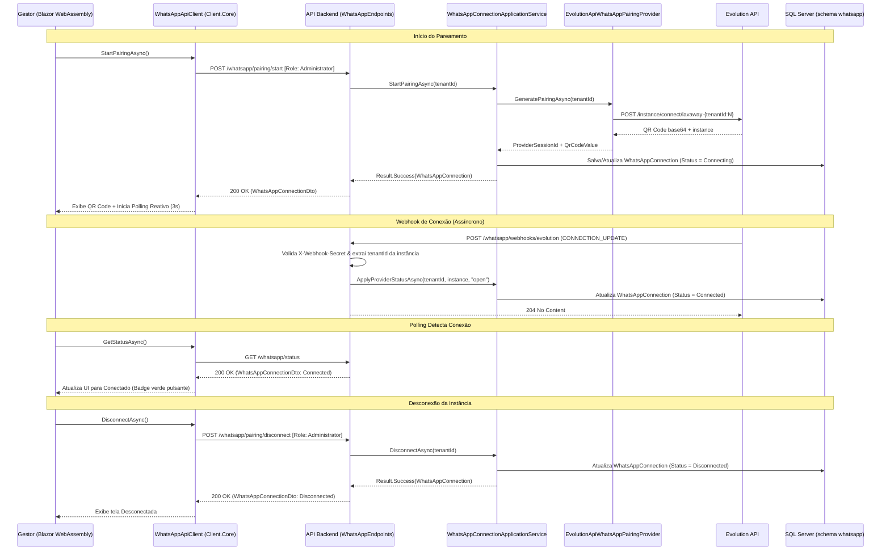

# Pareamento do WhatsApp - Subfase 2.5

## Objetivo

Permitir que o gestor do estabelecimento inicialize, visualize, atualize e desconecte o canal do WhatsApp com QR Code dinâmico gerado por provider externo (Evolution API), mantendo o estado do pareamento em tempo real com proteção rigorosa do isolamento multi-tenant.

## Fluxo Principal de Pareamento e Ciclo de Vida

## Regras de Negócio e Arquitetura

1. **Multi-Tenancy e Isolamento Rigoroso**:
   - Todo registro proprietário implementa `IMustHaveTenant`.
   - As consultas aplicam Global Query Filters por `TenantId` no `WhatsAppDbContext`.
   - O `SaveChangesAsync` valida compulsoriamente a gravação com o tenant do contexto autenticado.
   - O callback de webhook anônimo deriva o `tenantId` unicamente do formato prefixado da instância (`lavaway-{tenantId:N}`), garantindo isolamento total.

2. **Padrão Result (`Result<T>`) Sem Exceções**:
   - Todas as operações de aplicação e domínio retornam `Result<T>` com erros expressivos (`whatsapp.tenant.required`, `whatsapp.not_found`, `whatsapp.provider_session.mismatch`, etc.).

3. **Contratos Compartilhados (`CarWashSaaS.Shared.Contracts`)**:
   - Eliminação de tipos anônimos na API: comunicação tipada via `WhatsAppConnectionDto` e constantes padronizadas em `WhatsAppStatusConstants` (`"disconnected"`, `"connecting"`, `"connected"`).

4. **Ciclo de Vida Completo**:
   - `StartPairingAsync`: Cria nova conexão ou atualiza sessão pendente. Se já estiver conectada, retorna o estado ativo sem recriar instância.
   - `RefreshPairingAsync`: Atualiza o QR Code expirado preservando o isolamento do tenant.
   - `DisconnectAsync`: Desvincula a instância atual marcando-a como `Disconnected`.
   - Webhook `CONNECTION_UPDATE`: Atualiza para `Connected` quando o provider reportar `"open"` ou `"connected"`; atualiza para `Disconnected` quando `"close"`, `"closed"` ou `"disconnected"`. Eventos de instâncias antigas são ignorados para prevenir race conditions.

5. **Interface do Usuário Blazor WebAssembly**:
   - Cliente HTTP tipado `WhatsAppApiClient` registrado na DI da aplicação.
   - Componente modular `WhatsAppPairingCard` com design premium automotivo, badges de status com micro-animação (pulso luminoso), renderizador de QR Code dinâmico com fallback elegante e instruções guiadas passo a passo.
   - Página administrativa `WhatsAppSettingsPage` sob `/settings/whatsapp` com polling reativo a cada 3 segundos enquanto estiver no estado `Connecting` e cancelamento gracioso no `Dispose`.
   - Rota `05 WhatsApp` no menu lateral principal (`NavMenu.razor`), restrita a usuários com perfil `Administrator`.

## Configuração do Webhook

Configure `WhatsApp:EvolutionApi:WebhookSecret` por variável de ambiente (`WhatsApp__EvolutionApi__WebhookSecret`) e configure a Evolution API para enviar `CONNECTION_UPDATE` a `POST /whatsapp/webhooks/evolution`. No callback direto, o segredo segue na query string porque a configuração de webhook da Evolution não define headers arbitrários; use HTTPS e evite registrar a URL completa nos logs. Se um proxy encaminhar o callback, ele pode enviar o segredo em `X-Webhook-Secret`. O nome da instância segue `{InstanceNamePrefix}-{tenantId:N}`.

O ambiente local utiliza Evolution API `v2.3.7`, com PostgreSQL e Redis dedicados; apenas os metadados das instâncias são persistidos nesses serviços. O volume de arquivos `evolution-instances` também deve ser mantido em atualizações. O adaptador usa os formatos v2 para criação de instâncias, webhooks e envio de mensagens.

## Critérios de Aceite Atendidos de Ponta a Ponta

- [x] Contratos compartilhados tipados em `CarWashSaaS.Shared.Contracts`.
- [x] API com endpoints autenticados de status, início de pareamento, atualização de QR Code e desconexão.
- [x] Webhook `CONNECTION_UPDATE` idempotente com validação segura de segredo compartilhado.
- [x] Cliente fortemente tipado `WhatsAppApiClient` em `CarWashSaaS.Client.Core`.
- [x] Componente Blazor `WhatsAppPairingCard` cobrindo os três estados (`Disconnected`, `Connecting`, `Connected`).
- [x] Página dedicada `/settings/whatsapp` e item `05 WhatsApp` no `NavMenu` restrito a administradores.
- [x] Cobertura completa por testes unitários, testes de arquitetura (NetArchTest), testes de integração multi-tenant SQL Server e testes de componentes bUnit.
