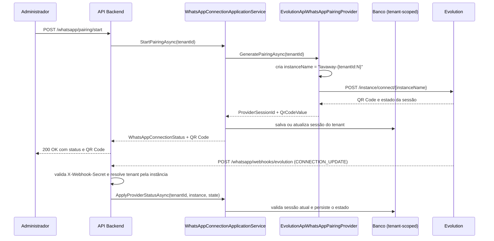

# Pareamento do WhatsApp - Subfase 2.5

## Objetivo

Permitir que cada tenant inicialize um canal do WhatsApp com QR Code gerado por provider externo, mantendo o estado do pareamento e a proteção do isolamento multi-tenant.

## Fluxo principal

## Regras de negócio

- Todo tenant só pode possuir uma sessão ativa por canal do WhatsApp.
- O provider deve receber o `tenantId` do contexto autenticado.
- O `TenantId` é obrigatório em todas as gravações do módulo.
- Se a sessão já estiver conectada, o sistema retorna a sessão atual em vez de gerar nova.
- A atualização de pareamento usa `RefreshSession` para registrar novo QR Code e novo identificador do provedor.
- O webhook `CONNECTION_UPDATE` só altera a sessão cujo `ProviderSessionId` corresponde à instância recebida; eventos antigos são reconhecidos e ignorados.
- O callback é anônimo para JWT, mas exige o header `X-Webhook-Secret`; segredo ausente na API desabilita o endpoint com `503`.
- Estados `open`/`connected` atualizam para `Connected`; `close`/`closed`/`disconnected` atualizam para `Disconnected`; `connecting` mantém o estado atual.

## Configuração do webhook

Configure `WhatsApp:EvolutionApi:WebhookSecret` por variável de ambiente (`WhatsApp__EvolutionApi__WebhookSecret`) e configure a Evolution API para enviar `CONNECTION_UPDATE` a `POST /whatsapp/webhooks/evolution` com o header `X-Webhook-Secret`. O nome da instância deve seguir `{InstanceNamePrefix}-{tenantId:N}`. Não use o valor vazio de `appsettings` em ambiente ativo.

## Critérios de aceite

- A API expõe endpoints de status e pareamento.
- O QR Code gerado é retornado no payload da resposta.
- O estado persiste por tenant e respeita o filtro global de tenant.
- A integração é implementada fora do domínio e pode ser trocada sem mudar a regra de negócio.
