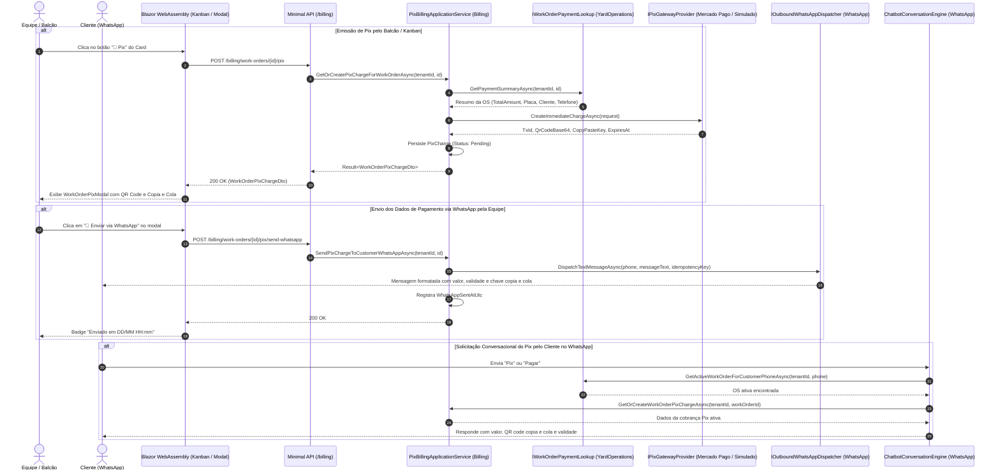
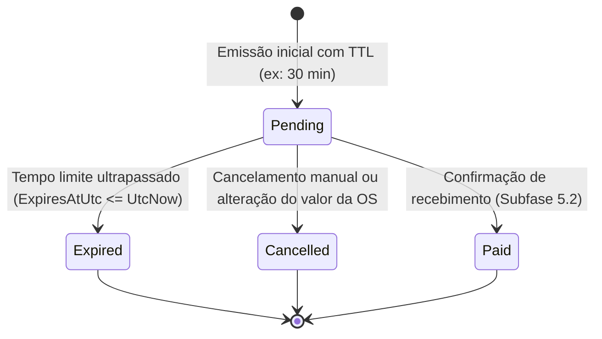

# Cobrança Pix Associada à Ordem de Serviço — Subfase 5.1

## 1. Visão Geral & Objetivo

A subfase **5.1** implementa a geração de cobranças Pix associadas às Ordens de Serviço (OS) do Lavaway SaaS. Através do novo módulo vertical autônomo **`Billing`**, a equipe pode emitir QR Codes dinâmicos e códigos Copia e Cola diretamente no balcão e no Kanban, consultar os dados de pagamento em tempo real, encaminhar as informações de cobrança para o WhatsApp do cliente com um clique, e permitir que o cliente consulte e receba os dados de pagamento conversacionalmente no chatbot.

---

## 2. Diagrama de Sequência Mermaid



---

## 3. Máquina de Estados da Cobrança Pix (`PixCharge`)



---

## 4. Estrutura Hexagonal do Módulo `Billing`

```text
src/Backend/Modules/Billing/
├── CarWashSaaS.Billing.Domain/
│   └── PixCharge.cs                        # Agregado com UUID e IMustHaveTenant
├── CarWashSaaS.Billing.Application/
│   ├── IPixChargeRepository.cs             # Porta de Saída do Repositório (sem IQueryable)
│   ├── IPixGatewayProvider.cs              # Abstração de Gateway Pix (Mercado Pago, Efí, Simulado)
│   └── PixBillingApplicationService.cs     # Caso de uso com Result<T> e IPixBillingLookup
└── CarWashSaaS.Billing.Infrastructure/
    ├── BillingDbContext.cs                 # DbContext com schema "billing"
    ├── Configurations/
    │   └── PixChargeConfiguration.cs       # Mapeamento e índices EF Core
    ├── Gateways/
    │   ├── SimulatedPixGatewayProvider.cs   # Provedor determinístico EMV BCB e SVG QR Code
    │   └── MercadoPagoPixGatewayProvider.cs # Provedor de produção Mercado Pago REST API
    ├── Migrations/
    │   └── 20261005184045_InitialBilling.cs # Migração EF Core com schema "billing"
    └── Repositories/
        └── PixChargeRepository.cs
```

---

## 5. Especificações Executáveis (BDD / Gherkin)

```gherkin
Funcionalidade: Geração e Consulta de Cobrança Pix da Ordem de Serviço
  Como operador ou recepcionista do lava-jato
  Quero gerar e consultar a cobrança Pix vinculada a uma OS
  Para que o cliente realize o pagamento instantâneo com praticidade

  Cenário: Emissão bem-sucedida de cobrança Pix para OS aberta
    Dado que existe uma Ordem de Serviço com valor de R$ 150,00
    Quando a equipe solicita a cobrança Pix da OS
    Então uma cobrança Pix com status "Pending" deve ser criada
    E o identificador da transação (TxId) e o código Copia e Cola devem ser gerados
    E a data de expiração deve ser calculada para 30 minutos no futuro

  Cenário: Reutilização idempotente de cobrança ativa não expirada
    Dado que já existe uma cobrança Pix pendente e válida para a OS no valor de R$ 150,00
    Quando a equipe consulta ou solicita novamente a cobrança Pix
    Então a mesma cobrança existente deve ser retornada sem gerar cobrança duplicada

  Cenário: Envio dos dados de pagamento via WhatsApp para o cliente
    Dado que a cobrança Pix foi emitida com sucesso para o cliente com telefone cadastrado
    Quando a equipe clica em "Enviar via WhatsApp"
    Então uma mensagem contendo o valor, a validade e o código Copia e Cola deve ser despachada
    E o registro da cobrança deve atualizar o carimbo WhatsAppSentAtUtc

  Cenário: Cliente solicita dados Pix via Chatbot no WhatsApp
    Dado que o cliente possui uma OS ativa no pátio
    Quando o cliente envia a mensagem "PIX" ou "PAGAR" no WhatsApp
    Então o chatbot deve identificar a OS ativa do cliente
    E responder imediatamente com as instruções e o código Pix Copia e Cola

  Cenário: Isolamento multi-tenant da cobrança
    Dado que uma cobrança Pix foi criada para o Tenant A
    Quando o Tenant B tentar consultar essa cobrança por Id ou OS
    Então o sistema deve retornar resultado vazio ou Não Encontrado
```

---

## 6. Cobertura de Testes Automatizados

A funcionalidade conta com 100% de aprovação na suíte de testes:
* **Testes de Arquitetura (NetArchTest):** Validação de limites concêntricos, dependências proibidas, contratos `IMustHaveTenant` e UUIDs nos agregados do módulo `Billing`.
* **Testes Unitários:** Testes de domínio (`PixChargeDomainTests`) e regras de aplicação (`PixBillingApplicationServiceTests`).
* **Testes de Integração (Testcontainers SQL Server):** Teste de isolamento multi-tenant real (`BillingPixTenantIntegrationTests`).
* **Testes de Componentes Blazor (bUnit):** Testes de renderização, visualização do QR Code, clique de cópia para área de transferência e despacho WhatsApp (`WorkOrderPixModalTests`).
