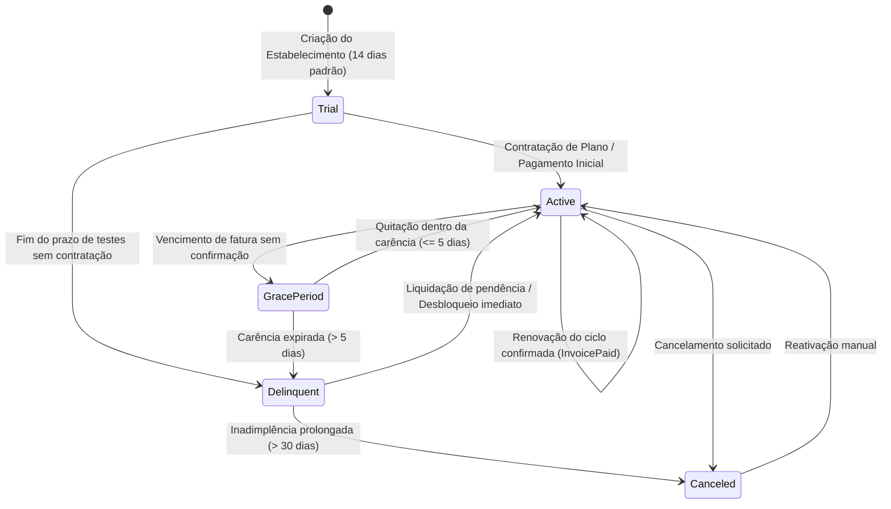
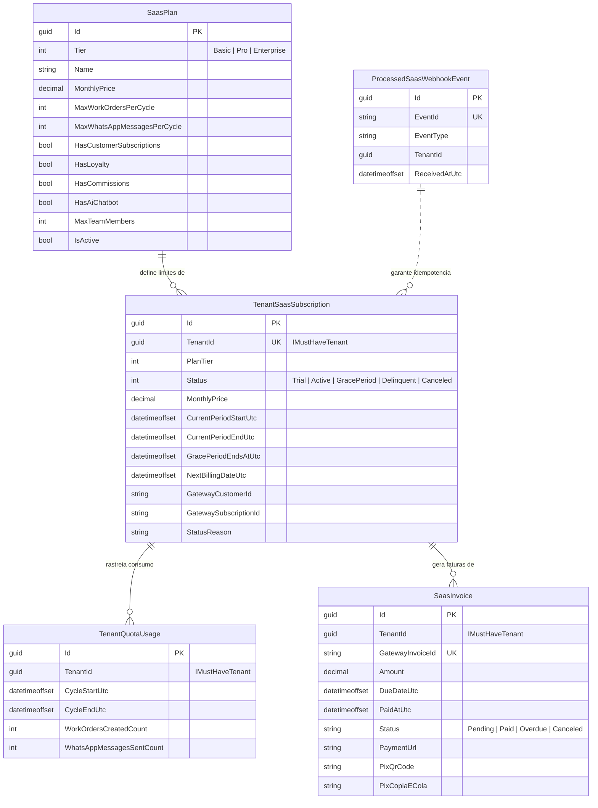

# Planos Comerciais, Billing Recorrente do SaaS e Gestão de Acesso — Subfase 6.3

Este documento descreve a arquitetura, modelos, diagramas de sequência e especificações executáveis implementados para gestão de planos comerciais, cobrança recorrente B2B da plataforma, aplicação de cotas e política de inadimplência.

---

## 1. Máquina de Estados da Assinatura do SaaS (`TenantSubscriptionStatus`)



---

## 2. Fluxo de Processamento de Webhooks, Atualização de Cotas e Auditoria

```mermaid
sequenceDiagram
    autonumber
    participant Gateway as Provedor de Pagamento (Asaas/Stripe/Simulado)
    participant Endpoint as POST /platform/billing/webhooks
    participant WebhookSvc as SaasBillingWebhookApplicationService
    participant SubRepo as ITenantSaasSubscriptionRepository
    participant QuotaRepo as ITenantQuotaUsageRepository
    participant InvoiceRepo as ISaasInvoiceRepository
    participant TenantLookup as IGlobalTenantLookup

    Gateway->>Endpoint: Envia webhook (ex: invoice.paid, signature)
    Endpoint->>WebhookSvc: ProcessWebhookAsync(payload, rawBody, signature)
    WebhookSvc->>WebhookSvc: Valida assinatura criptográfica (HMAC-SHA256)
    WebhookSvc->>WebhookSvc: Verifica idempotência contra reentregas
    
    alt Evento: invoice.paid
        WebhookSvc->>InvoiceRepo: Marca fatura como "Paid"
        WebhookSvc->>SubRepo: Renova ciclo (novo ciclo de 30 dias) -> Status Active
        WebhookSvc->>QuotaRepo: Reseta contadores de OS e WhatsApp para novo ciclo
        WebhookSvc->>TenantLookup: Atualiza status do tenant -> Active
    else Evento: invoice.overdue
        WebhookSvc->>InvoiceRepo: Marca fatura como "Overdue"
        WebhookSvc->>SubRepo: Avalia carência (até 5 dias -> GracePeriod; > 5 dias -> Delinquent)
        opt Status Delinquent
            WebhookSvc->>TenantLookup: Atualiza status do tenant -> Delinquent
        end
    end

    WebhookSvc-->>Endpoint: Result.Success()
    Endpoint-->>Gateway: 200 OK
```

---

## 3. Matriz de Planos Comerciais e Cotas de Operação

| Recurso / Cota | **Básico (Basic)** | **Pro (Pro)** | **Enterprise (Enterprise)** |
| :--- | :--- | :--- | :--- |
| **Valor Mensal** | R$ 149,00 / mês | R$ 299,00 / mês | R$ 599,00 / mês |
| **Cota de Ordens de Serviço** | Até **150 OS** / ciclo | Até **600 OS** / ciclo | **Ilimitado** (0) |
| **Cota de Mensagens WhatsApp**| Até **300 msgs** / ciclo | Até **1.500 msgs** / ciclo | **Ilimitado** (0) |
| **Pátio, Kanban & Vistoria**  | Sim | Sim | Sim |
| **Clube de Assinaturas (5.5)**| Não | Sim | Sim |
| **Fidelidade & Comissões**    | Não | Sim | Sim |
| **Chatbot IA & Agendamentos**| Não | Sim | Sim |
| **Equipe e Operadores**      | Até 3 operadores | Até 10 operadores | Ilimitado |

---

## 4. Diagrama de Entidades (Schema `billing`)



---

## 5. Especificações Executáveis (Living Specs)

### Cenário 1: Bloqueio progressivo por inadimplência
* **Dado** que um estabelecimento ativo tem uma fatura vencida hoje,
* **Quando** o webhook `invoice.overdue` é recebido,
* **Então** a assinatura entra em período de tolerância (`GracePeriod`) por 5 dias, permitindo a continuidade operacional com alerta visual no topo da aplicação.
* **E quando** passam 6 dias sem confirmação do pagamento,
* **Então** a assinatura é suspensa (`Delinquent`), e qualquer tentativa de abertura de nova OS ou envio de WhatsApp é sumariamente bloqueada com código de conflito `tenant.subscription.delinquent`.

### Cenário 2: Reativação autônoma e instantânea
* **Dado** que um estabelecimento está com operação suspensa (`Delinquent`),
* **Quando** o webhook `invoice.paid` é confirmado ou o lojista liquida a fatura via Pix no modal,
* **Então** a fatura é marcada como paga, a assinatura e o status do tenant são imediatamente restaurados para `Active`, as cotas são resetadas para o novo ciclo de 30 dias e a emissão de ordens de serviço é liberada na hora.

### Cenário 3: Respeito inegociável às cotas de plano
* **Dado** um lava-jato no plano `Básico` (limite de 150 OS/mês),
* **Quando** ele atinge 150 ordens de serviço geradas no ciclo atual,
* **Então** a 151ª tentativa de abertura de OS é rejeitada com o erro `tenant.quota.work_orders_exceeded` informando a necessidade de upgrade.
* **E quando** o lojista faz upgrade para o plano `Pro` (600 OS/mês), a nova capacidade passa a valer imediatamente.
