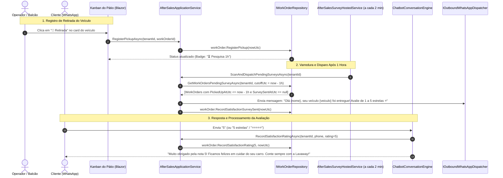
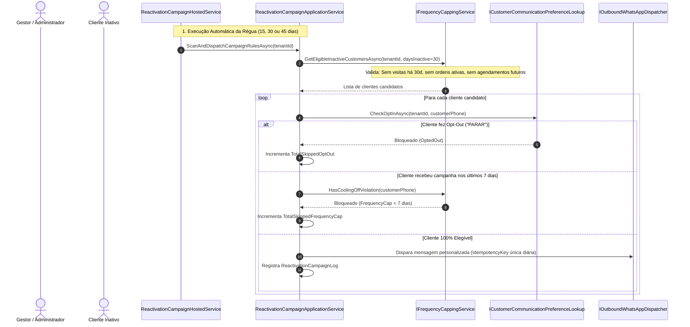
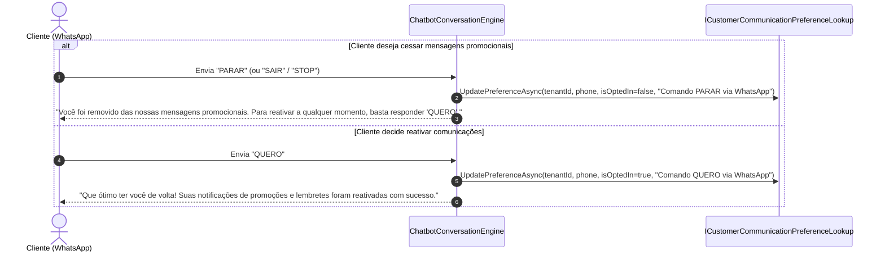
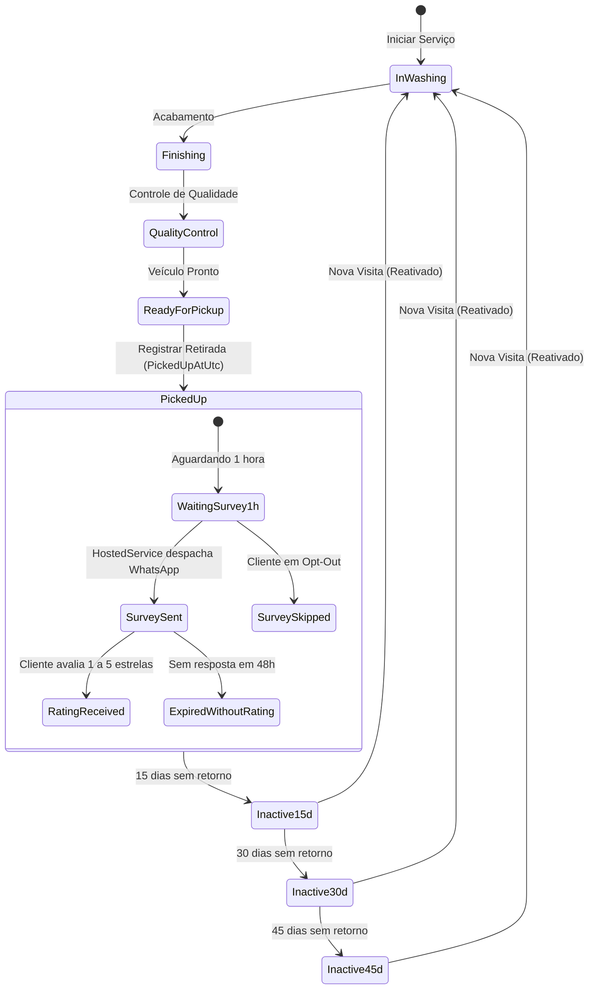

# Pós-Venda, Satisfação e Campanhas de Reativação — Subfase 4.5

## 1. Visão Geral & Objetivo

Maximizar a retenção de clientes, medir com precisão a qualidade dos serviços prestados (CSAT / NPS) e reconquistar veículos inativos no Lavaway SaaS, garantindo total conformidade com políticas anti-spam e regulamentações de privacidade (LGPD).

O sistema automatiza:
1. **Pesquisa de Satisfação em 1 Hora:** Disparo de pesquisa de 1 a 5 estrelas via WhatsApp exatamente 1 hora após a retirada do veículo (`PickedUpAtUtc`).
2. **Campanhas de Reativação Automáticas (15, 30 e 45 dias):** Réguas configuráveis que identificam clientes inativos e disparam convites personalizados para novos agendamentos.
3. **Filtro Anti-Spam (Frequency Capping de 7 dias):** Garante intervalo mínimo de 7 dias entre envios promocionais e exclui automaticamente clientes que já possuem veículos no pátio ou reservas agendadas.
4. **Gestão de Opt-Out & Opt-In (LGPD):** Interceptação imediata de palavras-chave ("PARAR", "SAIR", "STOP") cessando qualquer envio de marketing, com opção de reativação via "QUERO" ou interface web.

---

## 2. Diagramas de Sequência

### 2.1 Pesquisa de Satisfação 1h Pós-Retirada e Coleta de CSAT



### 2.2 Régua de Reativação com Frequency Capping e Opt-Out



### 2.3 Opt-Out ("PARAR") e Opt-In ("QUERO") Conversacional



---

## 3. Diagrama de Estados da Ordem de Serviço & Pós-Venda



---

## 4. Especificações Executáveis (Gherkin)

```gherkin
Funcionalidade: Pós-Venda, Pesquisa de Satisfação e Campanhas de Reativação
  Como gestor de um lava-jato SaaS
  Quero coletar notas de satisfação pós-serviço e reativar clientes ausentes
  Para elevar a retenção (LTV) com respeito integral à LGPD e anti-spam

  Cenário: Disparo automático de pesquisa de satisfação 1 hora após a retirada
    Dado que a ordem de serviço "#WO-901" foi concluída
    E o veículo foi marcado como retirado às 14:00:00 UTC
    Quando o serviço em segundo plano executar às 15:05:00 UTC
    Então uma pesquisa avaliativa de 1 a 5 estrelas deve ser enviada via WhatsApp para o cliente
    E o campo SurveySentAtUtc da ordem de serviço deve ser preenchido
    E o card no Kanban deve exibir o indicador "📩 Enviada"

  Cenário: Cliente responde à pesquisa com nota máxima (5 estrelas)
    Dado que uma pesquisa foi enviada para o telefone "(11) 98888-7777"
    Quando o cliente responder "5" ou "⭐⭐⭐⭐⭐"
    Então o sistema deve registrar a nota 5 na ordem de serviço correspondente
    E o CSAT da loja deve ser recalculado imediatamente
    E o chatbot deve responder agradecendo a confiança

  Cenário: Cliente responde à pesquisa com insatisfação (1 ou 2 estrelas)
    Dado que uma pesquisa foi enviada para o telefone "(11) 98888-7777"
    Quando o cliente responder "1 - o vidro traseiro ficou manchado"
    Então o sistema deve registrar a nota 1 e o feedback na ordem de serviço
    E o chatbot deve responder com pedido de desculpas e garantia de retorno da gerência

  Cenário: Bloqueio de campanha por Frequency Capping (Regra dos 7 dias)
    Dado que o cliente "Mariana Souza" está inativo há 32 dias
    E o cliente recebeu uma mensagem de reativação há 4 dias
    Quando a régua de 30 dias for executada
    Então a mensagem de reativação NÃO deve ser enviada
    E o contador de bloqueios por anti-spam deve ser incrementado

  Cenário: Respeito a Opt-Out imediato via WhatsApp (LGPD)
    Dado que o cliente "(11) 97777-6666" possui opt-in ativo
    Quando o cliente enviar a palavra "PARAR" no WhatsApp
    Então o consentimento para mensagens de marketing deve ser revogado
    E nenhuma régua de 15, 30 ou 45 dias deve enviar mensagens para este telefone
    E o chatbot deve confirmar o opt-out com instruções para reativação ("QUERO")
```
