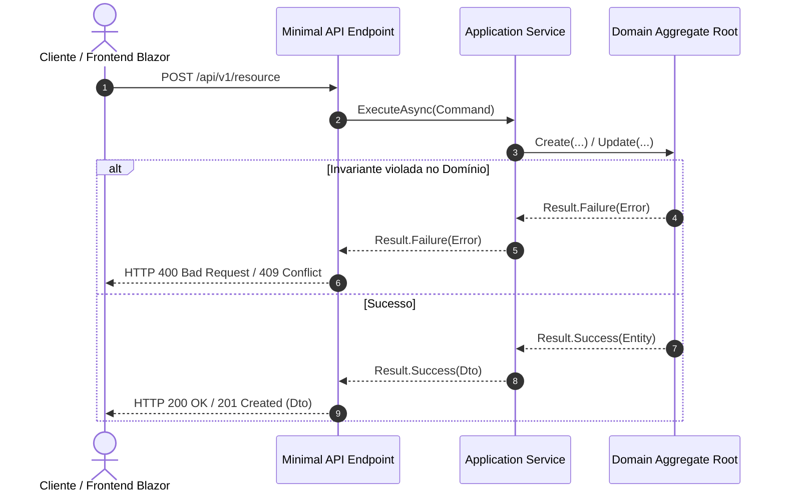

# Qualidade e Arquitetura da Solução — Fase 1.5

Este documento consolida a estrutura arquitetural, os guardrails automatizados de engenharia de software e os critérios de qualidade implementados no SaaS para Lava-Jato e Estética Automotiva, em estrita conformidade com as diretrizes de [agents.md](../../agents.md) e [roadmap.md](../../roadmap.md).

---

## 1. Topologia da Arquitetura: Monolito Modular & Hexagonal

A solução adota uma topologia de **Monolito Modular** distribuída em uma única Solution (`CarWashSaaS.sln`), com forte isolamento entre os módulos verticais e separação estrita em camadas concêntricas segundo a **Arquitetura Hexagonal (Ports & Adapters)**.

```mermaid
flowchart TD
    subgraph Presentation ["Presentation Layer (HTTP Entrypoints)"]
        API["CarWashSaaS.Api (Minimal APIs por Domínio)"]
        Middleware["TenantResolverMiddleware"]
    end

    subgraph Modules ["Módulos Verticais Autônomos"]
        subgraph TenantsMod ["Módulo Tenants"]
            T_App["Tenants.Application"]
            T_Dom["Tenants.Domain (Core Puro)"]
            T_Inf["Tenants.Infrastructure (EF Core / TenantsDbContext)"]
        end

        subgraph IdentityMod ["Módulo Identity"]
            I_App["Identity.Application"]
            I_Dom["Identity.Domain (Core Puro)"]
            I_Inf["Identity.Infrastructure (IdentityModuleDbContext)"]
        end

        subgraph YardMod ["Módulo YardOperations"]
            Y_App["YardOperations.Application"]
            Y_Dom["YardOperations.Domain (Core Puro)"]
            Y_Inf["YardOperations.Infrastructure (YardOperationsDbContext)"]
        end

        subgraph WhatsAppMod ["Módulo WhatsApp"]
            W_App["WhatsApp.Application"]
            W_Dom["WhatsApp.Domain (Core Puro)"]
            W_Inf["WhatsApp.Infrastructure (WhatsAppDbContext)"]
        end
    end

    subgraph Shared ["Camadas Compartilhadas"]
        Contracts["CarWashSaaS.Shared.Contracts (Result, DTOs, IMustHaveTenant)"]
        Config["CarWashSaaS.Shared.Configuration (TenantIsolationExtensions)"]
    end

    API --> T_App & I_App & Y_App & W_App
    API --> T_Inf & I_Inf & Y_Inf & W_Inf
    Middleware --> Config

    T_App --> T_Dom
    T_Inf --> T_Dom
    T_Inf --> Config
    T_App --> Contracts

    I_App --> I_Dom
    I_Inf --> I_Dom
    I_Inf --> Config
    I_App --> Contracts

    Y_App --> Y_Dom
    Y_Inf --> Y_Dom
    Y_Inf --> Config
    Y_App --> Contracts

    W_App --> W_Dom
    W_Inf --> W_Dom
    W_Inf --> Config
    W_App --> Contracts
```

---

## 2. Guardrails de Arquitetura: Suíte `NetArchTest`

Para garantir que a separação de responsabilidades nunca seja degradada ao longo do ciclo de desenvolvimento, a suíte de testes de arquitetura ([CarWashSaaS.ArchitectureTests](../../tests/Backend/ArchitectureTests/CarWashSaaS.ArchitectureTests)) emprega o `NetArchTest.Rules` para validar compulsoriamente os seguintes guardrails:

| Regra Arquitetural | Escopo de Validação | Objetivo / Prevenção |
| :--- | :--- | :--- |
| `DomainAssemblies_ShouldNotReferenceInfrastructure_OrPresentation_OrFrameworks` | `*.Domain` | Assegura que o núcleo do domínio permaneça 100% puro, sem dependências de EF Core, ASP.NET Core, HTTP ou infraestrutura. |
| `DomainAssemblies_ShouldNotReferenceApplicationAssemblies` | `*.Domain` | Impede que entidades ou regras invariantes conheçam casos de uso ou orquestração. |
| `ApplicationAssemblies_ShouldNotReferenceInfrastructureOrPresentation` | `*.Application` | Garante a inversão de dependência: a aplicação depende apenas de contratos e portas de saída (interfaces), nunca de implementações concretas ou controllers. |
| `ModuleInfrastructureAssemblies_ShouldNotReferenceOtherModuleInfrastructure` | `*.Infrastructure` | Assegura a autonomia modular: nenhum módulo pode injetar ou referenciar diretamente `DbContext`, repositórios ou tabelas de outro módulo. |
| `TenantOwnedRecords_ShouldImplementSharedTenantContract` | Entidades de Domínio | Garante que todo registro proprietário de um estabelecimento implemente `IMustHaveTenant`, habilitando filtros globais e auditoria automática. |
| `AggregateRoots_ShouldExposeGuidIdentifiers` | Agregados Raiz | Valida que todas as raízes de agregação utilizem identificadores únicos `Guid` (UUID), conforme [agents.md](../../agents.md). |
| `RepositoryInterfaces_ShouldNotExposeIQueryable` | Interfaces `*Repository` | Impede vazamento de abstração e consultas de infraestrutura expostas para as camadas superiores. |
| `ApplicationServices_PublicMethods_ShouldReturnResultPattern` | `*ApplicationService` | Obriga o uso de `Result` ou `Result<T>` em todos os métodos de aplicação, banindo o lançamento de exceções para controle de fluxo. |

---

## 3. Padrão `Result<T>` e Tratamento de Erros

O tratamento de fluxos de negócio e validações é integralmente desacoplado de exceções de runtime através de:

- **Contrato:** `Result` (operações sem retorno de valor) e `Result<T>` (operações com payload de sucesso).
- **Tipagem de Erro:** `Error(string Code, string Description, ErrorType Type)`.
- **Mapeamento HTTP:** Os endpoints traduzem `ErrorType` automaticamente para os códigos de status REST correspondentes (`Validation` $\rightarrow$ 400, `NotFound` $\rightarrow$ 404, `Conflict` $\rightarrow$ 409, `Unauthorized` $\rightarrow$ 403).

---

## 4. Pipeline de Qualidade e Gates de CI/CD

A integridade do código é mantida através de três mecanismos complementares:

1. **Configuração de Estilo (`.editorconfig`):**
   - Força declaração de namespaces com escopo de arquivo (*file-scoped namespaces*).
   - Validação de tipos de referência anuláveis (*nullable reference types*).
   - Ordenação e posicionamento uniforme de diretivas `using`.

2. **Script de Verificação Local (`scripts/verify-quality.sh`):**
   - Execução automatizada e sequencial de `dotnet format --verify-no-changes`, compilação em `Release`, suíte `NetArchTest` e suíte de testes unitários TDD.

3. **Workflow de Integração Contínua (`.github/workflows/ci.yml`):**
   - Disparado automaticamente em cada `push` e `pull_request` nos branches principais.
   - Bloqueia merges caso haja quebra de compilação, desvio de formatação, falha de regras de arquitetura ou testes unitários vermelhos.
