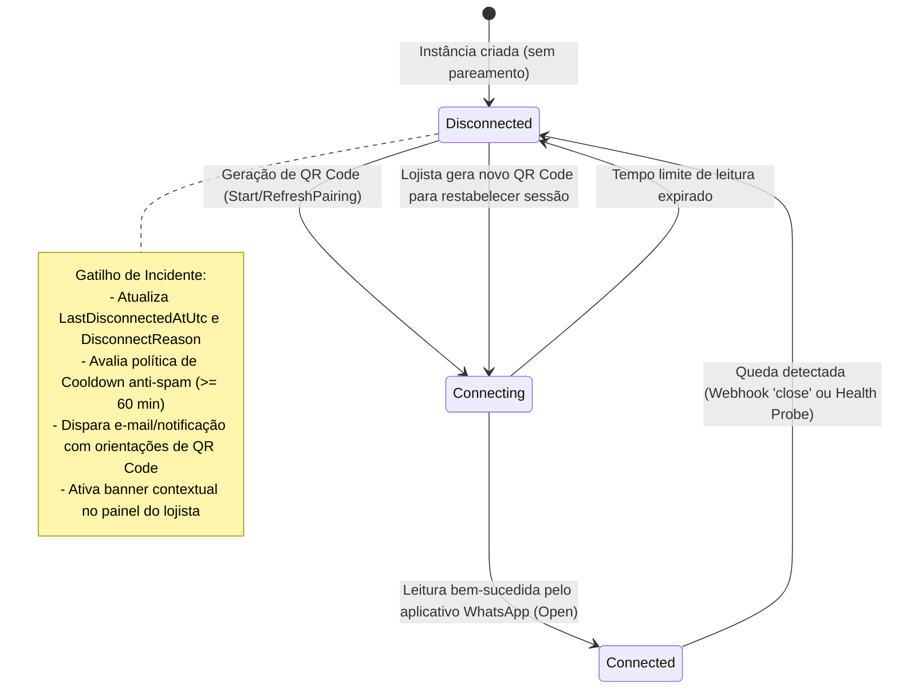
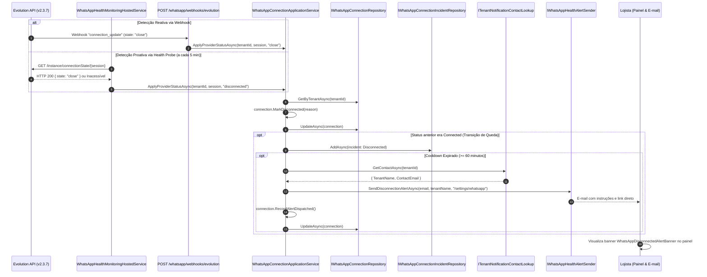
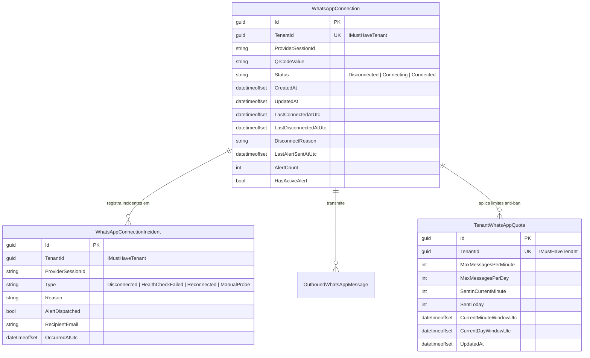

# Saúde das Instâncias WhatsApp e Monitoramento de Conexão — Subfase 6.4

Este documento descreve a arquitetura, modelos de dados, máquinas de estado, fluxos de sequência e especificações executáveis implementados para observabilidade contínua, governança no Backoffice e políticas de contingência e alerta de instâncias WhatsApp.

---

## 1. Máquina de Estados da Conexão e Alertas

---

## 2. Fluxo Sequencial de Detecção de Queda e Alerta

---

## 3. Diagrama de Entidades (Schema `whatsapp`)

---

## 4. Matriz de Endpoints da Subfase 6.4

| Método | Rota | Escopo / Autorização | Descrição |
| :--- | :--- | :--- | :--- |
| `GET` | `/whatsapp/health` | Lojista (`Administrator`, `Receptionist`) | Retorna diagnóstico de saúde, motivo da queda e orientações de contingência. |
| `GET` | `/platform/whatsapp/instances` | Backoffice (`PlatformSupport`, `SuperAdmin`) | Lista consolidada de instâncias de todos os estabelecimentos com métricas e filtros. |
| `GET` | `/platform/whatsapp/instances/{tenantId}/health` | Backoffice (`PlatformSupport`, `SuperAdmin`) | Diagnóstico detalhado da instância de um estabelecimento específico. |
| `POST` | `/platform/whatsapp/instances/{tenantId}/probe` | Backoffice (`PlatformSupport`, `SuperAdmin`) | Executa sondagem imediata de conectividade HTTP contra a Evolution API. |
| `POST` | `/platform/whatsapp/instances/{tenantId}/alert` | Backoffice (`PlatformSupport`, `SuperAdmin`) | Dispara manualmente o e-mail de contingência e orientações de QR Code para o lojista. |
| `GET` | `/platform/whatsapp/incidents` | Backoffice (`PlatformSupport`, `SuperAdmin`) | Trilha histórica de incidentes de desconexão e probes de todos os tenants. |

---

## 5. Especificações Executáveis de BDD / TDD

### Cenário 1: Queda detectada via webhook com disparo automático de alerta
- **Dado** que a conexão do estabelecimento está no estado `Connected`
- **Quando** a Evolution API envia webhook `connection_update` com estado `close`
- **Então** o status da conexão transiciona para `Disconnected`
- **E** o motivo da queda e carimbo de data são persistidos
- **E** um e-mail de alerta é enviado para o contato administrativo do lojista
- **E** um registro de incidente é gravado na trilha de auditoria de mensageria.

### Cenário 2: Prevenção de flood e spam de e-mails em quedas consecutivas
- **Dado** que um alerta foi enviado para o estabelecimento há menos de 60 minutos
- **Quando** um novo evento de desconexão é recebido para a mesma sessão
- **Então** o estado permanece `Disconnected`
- **Mas** nenhum novo e-mail é disparado, respeitando o período de *cooldown*.

### Cenário 3: Restabelecimento da conexão pelo lojista via novo QR Code
- **Dado** que a conexão do estabelecimento está `Disconnected` com alerta ativo
- **Quando** o lojista escaneia um novo QR Code e o provedor confirma o estado `open`
- **Então** a conexão transiciona para `Connected`
- **E** o indicador de alerta ativo é desmarcado (`HasActiveAlert = false`)
- **E** um incidente do tipo `Reconnected` é registrado.

### Cenário 4: Isolamento multi-tenant de incidentes
- **Dado** que o Tenant A possui incidentes de desconexão registrados
- **Quando** o Tenant B consulta seus incidentes
- **Então** nenhum incidente do Tenant A é retornado (isolamento estrito no EF Core).
