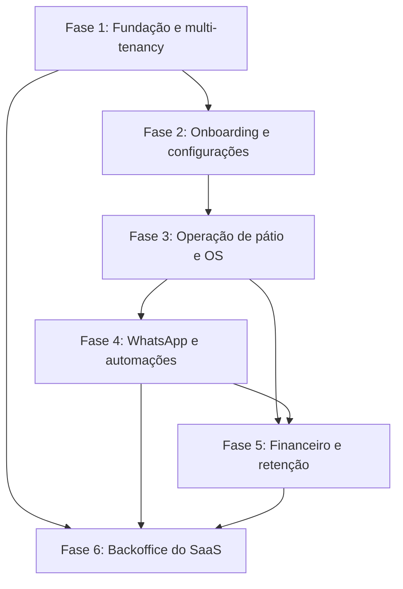

# Roadmap de Implementação — SaaS para Lava-Jato e Estética Automotiva

Este roadmap organiza a entrega do produto em seis fases e subfases menores. Cada subfase representa um resultado que pode ser desenvolvido, testado e demonstrado antes de avançar para a próxima. A duração indicada no cronograma é uma estimativa inicial; integrações externas, decisões de fornecedor e capacidade da equipe podem alterá-la.

## Visão Geral das Fases

**Ordem sugerida:** a Fase 1 é pré-requisito para todas as demais. As Fases 2 e 3 habilitam a operação principal. As Fases 4 e 5 podem avançar em paralelo após os eventos e estados da OS estarem definidos; a Fase 6 pode começar pela base administrativa, mas depende dos dados de billing e operação para entregar métricas completas.

---

## Fase 1: Fundação Arquitetural e Multi-Tenancy

**Objetivo:** Estabelecer a base segura, testável e isolada para múltiplos estabelecimentos.

### 1.1 Modelo de domínio e dados

- [x] Definir entidades e relações iniciais para `tenants`, `users`, `roles_permissions`, `customers`, `vehicles`, `services` e `work_orders`.
- [x] Definir identificadores, regras de propriedade por tenant e estratégia de isolamento (filtro por linha e/ou *Row-Level Security*).
- [ ] **Entrega:** modelo revisado e migrations iniciais aplicáveis em ambiente local.

Migrations e scripts idempotentes foram gerados e validados; aplicar ao SQL Server local ainda está pendente.

### 1.2 Isolamento multi-tenant

- [x] Implementar resolução do tenant no pipeline e disponibilizar o contexto atual à aplicação por claim `tenant_id` validada no JWT do gateway.
- [x] Aplicar filtros globais de consulta e atribuição/validação obrigatória do tenant na gravação.
- [x] Cobrir leitura e gravação cruzada com testes em SQL Server: dados do Tenant A não podem ser consultados nem alterados pelo Tenant B.
- [x] **Entrega:** testes de isolamento aprovados para consultas e comandos.

`Authentication:Authority` e `Authentication:Audience` são obrigatórios na configuração da API. Headers e outros identificadores enviados pelo cliente não definem o tenant; sem claim válida a request é negada. Os testes usam SQL Server efêmero via Testcontainers.

### 1.3 Identidade, sessão e permissões

- [ ] Implementar cadastro/autenticação com tokens JWT e refresh tokens (ou cookies seguros, conforme decisão de arquitetura).
- [ ] Criar os perfis Administrador da Loja, Recepcionista e Operador/Lavador e proteger as ações por permissão.
- [ ] **Entrega:** cada perfil autentica e só executa ações autorizadas.

### 1.4 Arquivos e processamento assíncrono

- [ ] Configurar armazenamento de objetos com segregação por tenant para fotos e comprovantes.
- [ ] Definir e configurar broker/fila para notificações e webhooks, incluindo política de retentativa e tratamento de falhas.
- [ ] **Entrega:** upload e leitura de arquivo isolados por tenant e processamento de uma mensagem de teste.

### 1.5 Qualidade e arquitetura da solução

- [ ] Criar a estrutura de módulos, contratos compartilhados e projetos de testes prevista nas diretrizes do repositório.
- [ ] Adicionar testes de arquitetura para dependências entre camadas e módulos, além do pipeline básico de build/teste.
- [ ] **Entrega:** solução compila e os testes arquiteturais iniciais passam.

---

## Fase 2: Onboarding e Configurações Iniciais

**Objetivo:** Permitir que o gestor configure a unidade para começar a operar.

### 2.1 Cadastro e perfil do estabelecimento

- [ ] Implementar o fluxo guiado para Razão Social, Nome Fantasia, CNPJ, telefone e endereço.
- [ ] Validar campos obrigatórios e permitir salvar/retomar o cadastro.
- [ ] **Entrega:** estabelecimento pode concluir e consultar seus dados cadastrais.

### 2.2 Identidade visual

- [ ] Permitir upload da logomarca e configuração de cores usadas em links públicos e comprovantes.
- [ ] Validar formato/tamanho do arquivo e armazená-lo no espaço do tenant.
- [ ] **Entrega:** identidade visual aparece em uma prévia de comprovante/link.

### 2.3 Catálogo, preços e duração

- [ ] Criar categorias e serviços: Ducha, Lavagem Completa, Higienização, Polimento e Vitrificação.
- [ ] Configurar preço por porte (Hatch/Sedan, SUV, Picape/Van e Moto) e duração estimada por serviço.
- [ ] **Entrega:** gestor cria e edita serviços e consulta preço/duração por porte.

### 2.4 Capacidade e equipe

- [ ] Configurar capacidade simultânea do pátio (boxes/vagas).
- [ ] Cadastrar colaboradores e, quando aplicável, regras de comissão por serviço.
- [ ] **Entrega:** capacidade e equipe cadastradas e disponíveis para uso na operação.

### 2.5 Pareamento do WhatsApp

- [ ] Integrar a geração/exibição de QR Code dinâmico da instância do estabelecimento.
- [ ] Exibir e atualizar os estados `connected`, `connecting` e `disconnected`.
- [ ] **Entrega:** gestor consegue parear a instância e identificar seu estado atual.

---

## Fase 3: Operação de Pátio, Check-in e Ordem de Serviço

**Objetivo:** Entregar o fluxo diário de recepção, execução e liberação dos veículos.

### 3.1 Cadastro e busca de clientes/veículos

- [ ] Criar ou localizar cliente e veículo por placa e telefone do proprietário.
- [ ] Reutilizar dados encontrados no fluxo de recepção sem duplicar cadastros.
- [ ] **Entrega:** recepção localiza rapidamente um cliente/veículo existente ou inicia um cadastro.

### 3.2 Abertura da ordem de serviço

- [ ] Selecionar serviços e porte do veículo durante o check-in.
- [ ] Calcular valor final e previsão de entrega usando preço e duração configurados.
- [ ] **Entrega:** OS é criada com cliente, veículo, serviços, valor e previsão registrados.

### 3.3 Vistoria digital de entrada

- [ ] Criar interface responsiva para celular/tablet com checklist e diagrama do veículo.
- [ ] Permitir marcar arranhões, mossas e trincas e anexar fotos obrigatórias.
- [ ] **Entrega:** vistoria fica vinculada à OS e suas fotos podem ser consultadas com isolamento por tenant.

### 3.4 Fluxo operacional e Kanban

- [ ] Implementar estados: *Aguardando* → *Em Lavagem* → *Secagem/Acabamento* → *Controle de Qualidade* → *Pronto para Retirada*.
- [ ] Permitir transição por clique ou *drag and drop*, com validação de transições e atualização em tempo real.
- [ ] Atribuir operador por veículo/OS.
- [ ] **Entrega:** equipe acompanha e atualiza o fluxo operacional, mantendo histórico do estado.

### 3.5 Registro de fotos pós-serviço

- [ ] Permitir fotos de "Depois" e associá-las às fotos de entrada para serviços elegíveis (detalhamento, vitrificação e bancos).
- [ ] **Entrega:** galeria comparativa fica disponível na OS para consulta e envio futuro.

---

## Fase 4: Mensageria e Chatbot WhatsApp

**Objetivo:** Automatizar comunicações e agendamentos sem acoplar regras de negócio ao provedor.

### 4.1 Base de integração e entrega confiável

- [ ] Definir o provedor e implementar adaptador para envio/recebimento de mensagens e webhooks.
- [ ] Processar eventos de forma assíncrona, com idempotência, retentativas e registro de falhas.
- [ ] Aplicar limites de envio por tenant e registrar consentimento/preferências de comunicação.
- [ ] **Entrega:** mensagem de teste é enviada e falhas podem ser rastreadas sem duplicar processamento.

### 4.2 Notificações da ordem de serviço

- [ ] Gerar e enviar comprovante PDF de entrada com dados da OS e checklist da vistoria.
- [ ] Enviar aviso de veículo pronto quando a OS chegar ao estado *Pronto para Retirada*.
- [ ] Enviar galeria comparativa "Antes e Depois" quando houver fotos.
- [ ] **Entrega:** eventos da OS disparam as mensagens correspondentes e o resultado do envio é registrado.

### 4.3 Agendamento conversacional

- [ ] Disponibilizar catálogo de serviços e horários vagos pelo menu do chatbot.
- [ ] Criar a reserva na agenda operacional após confirmação e evitar conflito de capacidade.
- [ ] **Entrega:** cliente agenda pelo WhatsApp e a reserva aparece para a equipe.

### 4.4 Confirmação e prevenção de faltas

- [ ] Enviar lembretes 24h e 2h antes do horário agendado.
- [ ] Processar ações *Confirmar*, *Remarcar* e *Cancelar* e atualizar a reserva.
- [ ] **Entrega:** respostas do cliente atualizam o agendamento sem intervenção manual.

### 4.5 Pós-venda e reativação

- [ ] Enviar pesquisa de 1 a 5 estrelas uma hora após a retirada.
- [ ] Programar campanhas para clientes ausentes há 15, 30 e 45 dias.
- [ ] Aplicar limites de frequência e registrar opt-out para evitar mensagens excessivas.
- [ ] **Entrega:** avaliações e campanhas respeitam preferências e limites configurados.

---

## Fase 5: Financeiro, Pix e Retenção

**Objetivo:** Simplificar recebimentos, fechamento financeiro e retorno dos clientes.

### 5.1 Pix associado à OS

- [ ] Escolher o gateway e gerar QR Code e código Copia e Cola para o valor devido na OS.
- [ ] Enviar os dados de pagamento ao cliente por WhatsApp quando solicitado.
- [ ] **Entrega:** cobrança Pix é vinculada à OS e pode ser consultada pela equipe.

### 5.2 Confirmação e conciliação de pagamento

- [ ] Validar assinatura/autenticidade do webhook do gateway e processar eventos de forma idempotente.
- [ ] Atualizar pagamento e baixar a OS somente após confirmação válida.
- [ ] **Entrega:** pagamento confirmado atualiza a OS uma única vez; eventos inválidos ou repetidos são tratados com segurança.

### 5.3 Caixa e comissões

- [ ] Registrar receitas por Pix, dinheiro, cartão de crédito e débito.
- [ ] Gerar fechamento diário e relatório por método de pagamento.
- [ ] Calcular comissões por colaborador/lavador conforme regras configuradas.
- [ ] **Entrega:** gestor confere totais do dia e detalhamento das comissões.

### 5.4 Fidelidade

- [ ] Atribuir pontos/selos após a conclusão de serviços elegíveis.
- [ ] Notificar o cliente quando estiver próximo do resgate, incluindo a mensagem de um serviço restante.
- [ ] **Entrega:** saldo e progresso de fidelidade são consultáveis e consistentes com os serviços concluídos.

### 5.5 Assinaturas e créditos recorrentes

- [ ] Criar planos mensais e integrar cobrança recorrente no cartão pelo gateway escolhido.
- [ ] Controlar créditos e utilizações por placa cadastrada.
- [ ] **Entrega:** consumo de créditos é registrado e não ultrapassa o saldo disponível.

---

## Fase 6: Backoffice do SaaS

**Objetivo:** Operar assinantes, faturamento, saúde das integrações e indicadores globais.

### 6.1 Acesso administrativo e auditoria

- [ ] Definir perfil administrativo da plataforma separado dos perfis dos tenants.
- [ ] Registrar ações administrativas e eventos relevantes em trilha de auditoria.
- [ ] **Entrega:** ações sensíveis têm autor, data e alvo registrados.

### 6.2 Gestão global de tenants

- [ ] Listar estabelecimentos e status: Ativo, Em Período de Testes, Inadimplente e Cancelado.
- [ ] Implementar *impersonation* para suporte com autorização restrita, auditoria e encerramento explícito da sessão.
- [ ] **Entrega:** suporte encontra um tenant e acessa contexto de diagnóstico com trilha auditável.

### 6.3 Planos, billing e acesso

- [ ] Integrar o provedor de billing recorrente do SaaS (ex.: Asaas, Stripe ou Iugu).
- [ ] Implementar planos Básico, Pro e Enterprise, upgrades/downgrades e cotas de OS ou mensagens.
- [ ] Aplicar regras de inadimplência, incluindo bloqueio automático de acesso conforme política definida.
- [ ] **Entrega:** estado da assinatura e cotas refletem os eventos confirmados do provedor.

### 6.4 Saúde das instâncias WhatsApp

- [ ] Exibir estado das instâncias conectadas por tenant.
- [ ] Alertar por e-mail/notificação quando uma conexão cair e orientar o lojista a gerar novo QR Code.
- [ ] **Entrega:** falhas de conexão são detectáveis e acionam alerta para o tenant correto.

### 6.5 Métricas e observabilidade global

- [ ] Consolidar MRR, ARR, *churn rate* e LTV a partir de dados de billing definidos.
- [ ] Exibir volume de veículos atendidos e volume transacionado via Pix.
- [ ] Disponibilizar logs de webhooks, falhas de envio e trilhas de auditoria administrativa.
- [ ] **Entrega:** métricas têm fonte e período definidos, e eventos operacionais podem ser investigados.

---

## Sugestão de Cronograma de Lançamento

O cronograma abaixo mantém os marcos de 16 semanas como referência. As subfases podem ser divididas em histórias menores dentro de cada sprint, e a previsão deve ser revista após escolher os provedores de WhatsApp, pagamentos e billing.

| Marco | Período de referência | Subfases principais | Entregável / Meta |
| :--- | :--- | :--- | :--- |
| **M1** | Semanas 1-3 | 1.1-1.5 e 2.1-2.4 | Base multi-tenant validada e onboarding essencial disponível. |
| **M2** | Semanas 4-6 | 3.1-3.5 | Operação de pátio funcional, da abertura da OS à conclusão, sem dependência de mensageria externa. |
| **M3** | Semanas 7-9 | 2.5, 4.1-4.2 | Instância conectada e notificações transacionais funcionando. |
| **M4** | Semanas 10-12 | 4.3-4.4 e 5.1-5.2 | Agendamento pelo WhatsApp e pagamento Pix conciliado. |
| **M5** | Semanas 13-14 | 4.5 e 5.3-5.5 | Pós-venda, fidelidade, recorrência e fechamento financeiro disponíveis. |
| **M6** | Semanas 15-16 | 6.1-6.5 | Backoffice inicial com gestão de tenants, billing, monitoramento e métricas. |

**Critério para avançar de subfase:** a entrega está demonstrável, os testes do fluxo e de isolamento por tenant passam, e a documentação correspondente foi atualizada conforme as diretrizes do projeto.
