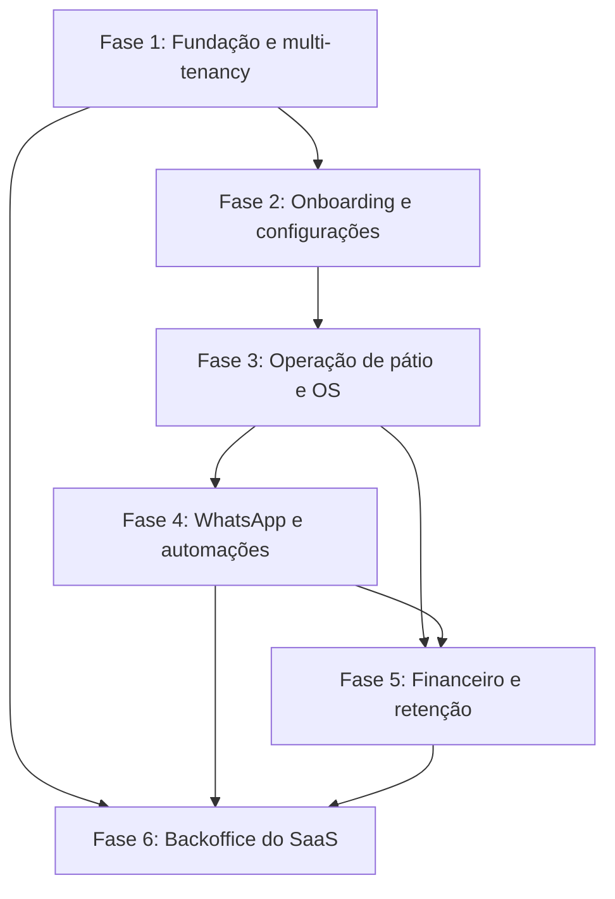

# Roadmap de Implementação — SaaS para Lava-Jato e Estética Automotiva

Este roadmap organiza a entrega do produto em seis fases e subfases menores. Cada subfase representa um resultado que pode ser desenvolvido, testado e demonstrado antes de avançar para a próxima. A duração indicada no cronograma é uma estimativa inicial; integrações externas, decisões de fornecedor e capacidade da equipe podem alterá-la.

## Visão Geral das Fases

**Ordem sugerida:** a Fase 1 é pré-requisito para todas as demais. As Fases 2 e 3 habilitam a operação principal. As Fases 4 e 5 podem avançar em paralelo após os eventos e estados da OS estarem definidos; a Fase 6 pode começar pela base administrativa, mas depende dos dados de billing e operação para entregar métricas completas.

---

## Fase 1: Fundação Arquitetural e Multi-Tenancy

**Objetivo:** Estabelecer a base segura, testável e isolada para múltiplos estabelecimentos.

### 1.1 Modelo de domínio e dados

- [x] Definir entidades e relações iniciais para `tenants`, `users`, `roles_permissions`, `customers`, `vehicles`, `services` e `work_orders`.
- [x] Definir identificadores, regras de propriedade por tenant e estratégia de isolamento (filtro por linha e/ou *Row-Level Security*).
- [x] **Entrega:** modelo revisado e migrations iniciais aplicáveis em ambiente local.

Migrations e scripts idempotentes foram gerados em `scripts/sql/` e aplicados com sucesso ao SQL Server local via `scripts/apply-migrations.sh`. Schemas `tenants`, `identity` e `yard` validados com isolamento de `__EFMigrationsHistory` por contexto.

### 1.2 Isolamento multi-tenant

- [x] Implementar resolução do tenant no pipeline e disponibilizar o contexto atual à aplicação por claim `tenant_id` validada no JWT do gateway.
- [x] Aplicar filtros globais de consulta e atribuição/validação obrigatória do tenant na gravação.
- [x] Cobrir leitura e gravação cruzada com testes em SQL Server: dados do Tenant A não podem ser consultados nem alterados pelo Tenant B.
- [x] **Entrega:** testes de isolamento aprovados para consultas e comandos.

`Authentication:Authority` e `Authentication:Audience` são obrigatórios na configuração da API. Headers e outros identificadores enviados pelo cliente não definem o tenant; sem claim válida a request é negada. Os testes usam SQL Server efêmero via Testcontainers.

### 1.3 Identidade, sessão e permissões

- [x] Implementar cadastro/autenticação com tokens JWT e refresh tokens (ou cookies seguros, conforme decisão de arquitetura).
- [x] Definir os perfis Administrador da Loja, Recepcionista e Operador/Lavador e mapear as permissões por papel na camada de domínio.
- [x] **Entrega:** fluxo completo de emissão de Access Token (JWT), gestão de sessão com Refresh Token criptográfico e rotação automática, detecção de reutilização, endpoints de login/refresh/revoke/usuários na API e provedor de autenticação no frontend Blazor.

> Decisão de arquitetura formalizada na ADR-0005. O módulo `CarWashSaaS.Identity` gerencia de ponta a ponta as credenciais, emissão com chave configurada, persistência de `RefreshToken` com isolamento multi-tenant no schema `identity`, e o frontend consome via `AuthApiClient` e `JwtAuthenticationStateProvider`. Documentação completa em `docs/living-docs/identidade-sessao-permissoes-1.3.md`.

### 1.4 Arquivos e processamento assíncrono

- [x] Implementar armazenamento de objetos MinIO com namespace por tenant para arquivos privados.
- [x] Implementar fila RabbitMQ durável com confirmação explícita, retentativa e dead-letter queue.
- [x] **Entrega:** validar upload/leitura isolados por tenant e processamento de mensagem em execução com os serviços reais.

> A entrega da Fase 1.4 está concluída e validada operacionalmente. O adapter MinIO foi coberto por testes de integração reais via Testcontainers (`cgr.dev/chainguard/minio`), garantindo gravação, leitura de stream com verificação de Content-Type e isolamento estrito contra acesso cross-tenant. O `TenantQueueWorker` foi testado ponta a ponta com RabbitMQ 4 em Testcontainers, comprovando a injeção do `TenantId` no escopo do DI e o processamento de eventos pelo handler de negócio registrado `TenantBrandingAuditQueueHandler`. A documentação viva foi consolidada em `docs/living-docs/arquivos-processamento-assincrono-1.4.md`.

**Checklist de implementação vigente:**

- [x] Path de arquivo scoped por tenant: `tenants/{tenantId}/{category}/{fileName}`
- [x] Storage privado MinIO registrado por `ITenantObjectStorage`; endpoint de logo usa o tenant autenticado
- [x] Fila RabbitMQ quorum com mensagem persistente, `MessageId`, ack/nack explícito, retry exponencial e DLQ
- [x] `TenantQueueWorker` cria escopo por entrega e estabelece o tenant antes de invocar o handler
- [x] Integrações MinIO, RabbitMQ e SQL Server validadas com Testcontainers em execução real
- [x] Upload/download e isolamento cross-tenant validados via testes automatizados
- [x] Handler de negócio registrado no DI (`TenantBrandingAuditQueueHandler`) e ciclo de processamento validado ponta a ponta

### 1.5 Qualidade e arquitetura da solução

- [x] Validar a base de arquitetura atual: módulos, contratos compartilhados, DI e middleware de tenant já estão alinhados com o projeto.
- [x] Confirmar a aplicação do padrão `Result<T>` e a resolução do `tenant_id` no pipeline HTTP, com filtros globais e validação de gravação em `SaveChangesAsync`.
- [x] Registrar a decisão de isolamento em ADR e manter a documentação viva atualizada com o estado do modelo e do ciclo de autenticação.
- [x] Implementar suíte inicial de arquitetura (`NetArchTest`) para validar dependências entre camadas e políticas de módulo.
- [x] Consolidar o pipeline de build/test da solução com verificação automatizada de multi-tenancy e qualidade do código.
- [x] **Entrega:** a solução compila, a base arquitetural está coberta por testes e a documentação registra o estado real do projeto.

> Estado verificado e consolidado: a suíte de arquitetura foi formalizada com `NetArchTest.Rules` (8 guardrails automatizados cobrindo pureza de Domain, isolamento de Application/Infrastructure, ausência de IQueryable em repositórios e adesão a IMustHaveTenant/UUID/Result), a documentação viva foi registrada em [docs/living-docs/qualidade-arquitetura-1.5.md](docs/living-docs/qualidade-arquitetura-1.5.md) e [docs/living-docs/isolamento-multi-tenant-1.2.md](docs/living-docs/isolamento-multi-tenant-1.2.md), e os gates de qualidade foram consolidados via [.editorconfig](.editorconfig), script local [scripts/verify-quality.sh](scripts/verify-quality.sh) e pipeline de CI no GitHub Actions ([.github/workflows/ci.yml](.github/workflows/ci.yml)). A camada HTTP segue padronizada com Minimal APIs modulares organizadas em classes de extensão por domínio (`Endpoints/*.cs`), mantendo `Program.cs` como Composition Root (formalizado na [ADR-0006](docs/architecture/ADR-0006-organizacao-minimal-apis-modulares.md)).

---

## Fase 2: Onboarding e Configurações Iniciais

**Objetivo:** Permitir que o gestor configure a unidade para começar a operar.

### 2.1 Cadastro e perfil do estabelecimento

- [x] Implementar o fluxo guiado para Razão Social, Nome Fantasia, CNPJ, telefone e endereço.
- [x] Validar campos obrigatórios e permitir salvar/retomar o cadastro.
- [x] **Entrega:** estabelecimento pode concluir, consultar e atualizar seus dados cadastrais.

> Implementação concluída de ponta a ponta (Backend e Frontend Blazor): o módulo de tenants inclui o agregado `StoreProfile` com validação de negócio, `TenantId`, isolamento multi-tenant, mapeamento no `TenantsDbContext`, repositório persistente, endpoints autenticados e política de administrador. Contratos compartilhados (`StoreProfileDto`, `CreateStoreProfileRequest`, `UpdateStoreProfileRequest`) conectam a API ao cliente `StoreProfileApiClient`. O frontend Blazor dispõe de fluxo guiado de 3 etapas (`StoreProfileWizard`), tela de visualização e edição (`StoreProfilePage`), validação e formatação automática de CNPJ/CEP e item no menu restrito a administradores. A entrega está 100% coberta por testes unitários, testes de arquitetura, testes de integração SQL Server e testes de componentes bUnit. Detalhes em `docs/living-docs/cadastro-perfil-estabelecimento-2.1.md`.

### 2.2 Identidade visual

- [x] Permitir upload da logomarca e configuração de cores usadas em links públicos e comprovantes.
- [x] Validar formato/tamanho do arquivo e armazená-lo no espaço do tenant.
- [x] **Entrega:** identidade visual aparece em uma prévia de comprovante/link.

> Implementação concluída de ponta a ponta (Backend e Frontend Blazor): o módulo de tenants possui suporte a logomarca e paleta de cores (primária e secundária) com validação rígida de domínio (`#RRGGBB` e URLs), retorno `Result<T>`, persistência protegida por `TenantId` no SQL Server e armazenamento seguro no MinIO (`tenants/{tenantId}/branding/`) com limite de 2 MB e extensões permitidas. A API conta com upload multipart autenticado (`POST /tenants/profile/logo`), endpoint autenticado de logo e rota pública segura para comprovantes e links (`GET /tenants/{tenantId}/public/logo`), além de auditoria assíncrona no RabbitMQ. O frontend Blazor dispõe de suporte completo no cliente tipado (`StoreProfileApiClient.UploadLogoAsync`), etapa dedicada de Identidade Visual no `StoreProfileWizard` com upload drag-and-drop, seletores de cor e presets rápidos automotivos, e o componente `BrandReceiptPreview` que exibe a identidade visual em tempo real em dois formatos (comprovante térmico/digital de OS e link público de acompanhamento no WhatsApp). A tela `StoreProfilePage` exibe a logomarca e a paleta ativa da loja com gaveta interativa de visualização. Coberto por testes unitários, testes de componentes bUnit e testes de integração SQL Server/MinIO/RabbitMQ. Detalhes em `docs/living-docs/identidade-visual-2.2.md`.

### 2.3 Catálogo, preços e duração

- [x] Criar categorias e serviços: Ducha, Lavagem Completa, Higienização, Polimento e Vitrificação.
- [x] Configurar preço por porte (Hatch/Sedan, SUV, Picape/Van e Moto) e duração estimada por serviço.
- [x] **Entrega:** gestor cria e edita serviços e consulta preço/duração por porte.

> Implementação concluída no backend: o módulo `YardOperations` agora possui catálogo de serviços em `Service`, `ServicePrice` e `ServiceCatalogApplicationService`, com `IServiceRepository`, endpoints autenticados em `/services` e validação por tenant e tamanho de veículo. O catálogo aceita uma ou mais faixas de preço por porte e evita duplicidade de valor para o mesmo tipo de veículo.

### 2.4 Capacidade e equipe

- [x] Configurar capacidade simultânea do pátio (boxes/vagas).
- [x] Cadastrar colaboradores e, quando aplicável, regras de comissão por serviço.
- [x] **Entrega:** capacidade e equipe cadastradas e disponíveis para uso na operação.

> Implementação concluída de ponta a ponta (Backend e Frontend Blazor): o módulo `YardOperations` implementa os agregados `YardCapacity`, `TeamMember` e `CommissionRule` com validação de domínio puro, invariantes protegidas, ciclo de vida completo (criação, edição, ativação/desativação e exclusão) e retorno `Result<T>`. Contratos compartilhados em `CarWashSaaS.Shared.Contracts` (`YardCapacityDto`, `TeamMemberDto`, `CommissionRuleDto`, requisições tipadas) padronizam a comunicação eliminando o vazamento de entidades de domínio na API. Os endpoints em `/yard/capacity`, `/team-members` e `/commission-rules` contam com autorização por tenant e política `Administrator`. No frontend Blazor WebAssembly, o cliente `YardSetupApiClient` e os componentes isolados (`YardCapacityCard`, `TeamMemberModal`, `CommissionRuleModal`) integram a nova tela administrativa `CapacityAndTeamPage` (`/settings/team`), adicionada ao `NavMenu`. A entrega conta com 100% de aprovação nos testes unitários, testes de arquitetura e testes de componentes bUnit. Detalhes em `docs/living-docs/capacidade-equipe-2.4.md`.

### 2.5 Pareamento do WhatsApp

- [x] Integrar a geração/exibição de QR Code dinâmico da instância do estabelecimento.
- [x] Exibir e atualizar os estados `connected`, `connecting` e `disconnected`.
- [x] **Entrega:** gestor consegue parear a instância e identificar seu estado atual.

> Implementação concluída de ponta a ponta (Backend e Frontend Blazor): o módulo WhatsApp dispõe de pareamento via Evolution API com fallback seguro, isolamento multi-tenant estrito por `TenantId`, contratos tipados compartilhados em `CarWashSaaS.Shared.Contracts` (`WhatsAppConnectionDto`, `WhatsAppStatusConstants`), ciclo de vida com endpoints autenticados para status (`GET /whatsapp/status`), início (`POST /whatsapp/pairing/start`), atualização (`POST /whatsapp/pairing/refresh`) e desconexão (`POST /whatsapp/pairing/disconnect`), além de webhook assíncrono `CONNECTION_UPDATE` com validação de segredo compartilhado em tempo constante. No frontend Blazor WebAssembly, o cliente fortemente tipado `WhatsAppApiClient` alimenta o componente `WhatsAppPairingCard` com design premium automotivo, badges de status com indicador luminoso/pulsante, exibição do QR Code dinâmico com instruções passo a passo para o celular e a tela administrativa `WhatsAppSettingsPage` (`/settings/whatsapp`), integrada com item dedicado `05 WhatsApp` no `NavMenu` e polling reativo automático (3s) para detecção instantânea da leitura do código. A subfase está 100% coberta por testes unitários, testes de arquitetura (NetArchTest), testes de integração multi-tenant SQL Server e testes de componentes bUnit. Detalhes em `docs/living-docs/pareamento-whatsapp-2.5.md`.

---

## Fase 3: Operação de Pátio, Check-in e Ordem de Serviço

**Objetivo:** Entregar o fluxo diário de recepção, execução e liberação dos veículos.

### 3.1 Cadastro e busca de clientes/veículos

- [x] Criar ou localizar cliente e veículo por placa e telefone do proprietário.
- [x] Reutilizar dados encontrados no fluxo de recepção sem duplicar cadastros.
- [x] **Entrega:** recepção localiza rapidamente um cliente/veículo existente ou inicia um cadastro.

> Implementação concluída de ponta a ponta (Backend e Frontend Blazor WebAssembly): o módulo `YardOperations` implementa os agregados `Customer` e `Vehicle` com normalização rigorosa de placa Mercosul/antiga e telefone, busca tenant-scoped combinada ou individual, persistência atômica cliente+primeiro veículo e adição subsequente de novos veículos sem duplicidade. A API conta com endpoints autenticados em `/customers/search`, `/customers/{id}` e inclusão de veículos com isolamento estrito via `TenantId` e retorno em `Result<T>`. No frontend Blazor WebAssembly, os componentes isolados `CustomerMatchRow`, `CustomerVehicleCreateCard` e `AddVehicleCard` em `CarWashSaaS.Client.Components` integram-se à `ReceptionPage` com design automotivo e o novo state container `ReceptionSessionState` em `CarWashSaaS.Client.Core`, viabilizando transição reativa imediata para a subfase 3.2 (Abertura de OS). A solução conta com 100% de aprovação nos 209 testes da solution (testes unitários, testes de integração SQL Server Testcontainers com validação cross-tenant, testes de limites de arquitetura NetArchTest e testes de componentes bUnit). Detalhes em `docs/living-docs/cadastro-clientes-veiculos-3.1.md`.

### 3.2 Abertura da ordem de serviço

- [x] Selecionar serviços e porte do veículo durante o check-in.
- [x] Calcular valor final e previsão de entrega usando preço e duração configurados.
- [x] **Entrega:** OS é criada com cliente, veículo, serviços, valor e previsão registrados.

> Implementação concluída de ponta a ponta (Backend e Frontend Blazor WebAssembly): o módulo `YardOperations` implementa a abertura de ordens de serviço (`WorkOrder` e `WorkOrderItem`) com snapshot de preços e durações configurados por porte de veículo, cálculo dinâmico da previsão estimada de conclusão (`EstimatedCompletionAtUtc`), registro de observações do check-in (`Notes`) e status inicial `Waiting`. A API conta com endpoints autenticados em `/work-orders` (criação via política `CreateWorkOrders`, consulta por ID e listagem recente via `ViewCustomers`) com isolamento multi-tenant estrito e contratos tipados compartilhados em `CarWashSaaS.Shared.Contracts` (`CreateWorkOrderRequest`, `WorkOrderDto`, `WorkOrderItemDto`). No frontend Blazor WebAssembly, a tela de check-in `NewWorkOrderPage` (`/work-orders/new`) integra-se com os componentes isolados `CheckinCustomerHeader` (com placa estilizada e seletor de porte interativo), `ServiceSelectorCard` (com filtragem, precificação dinâmica por porte e controladores de quantidade), `WorkOrderSummaryCard` (com cálculo reativo em tempo real do total financeiro, tempo total e banner de previsão de entrega com relógio) e `WorkOrderCreatedModal` (modal de confirmação de abertura de OS com ações direcionadas). A solução conta com 100% de aprovação nos 226 testes da solution (testes unitários, testes de integração SQL Server Testcontainers com validação cross-tenant, testes de arquitetura NetArchTest e testes de componentes bUnit). Detalhes em `docs/living-docs/abertura-ordem-servico-3.2.md`.

### 3.3 Vistoria digital de entrada

- [x] Criar interface responsiva para celular/tablet com checklist e diagrama do veículo.
- [x] Permitir marcar arranhões, mossas e trincas e anexar fotos obrigatórias.
- [x] **Entrega:** vistoria fica vinculada à OS e suas fotos podem ser consultadas com isolamento por tenant.

> Implementação concluída de ponta a ponta (Backend e Frontend Blazor WebAssembly): o módulo `YardOperations` implementa o agregado `VehicleInspection` com avarias vetoriais (`InspectionDamage` com coordenadas normatizadas X% e Y% em 5 vistas da carroceria), checklist de pertences e combustível (`InspectionChecklistItem`), galeria de fotos privadas (`InspectionPhoto`) com validação de obrigatoriedade das 4 fotos de perímetro (Frente, Traseira, Lateral Esquerda e Lateral Direita) para conclusão. A API conta com endpoints REST autenticados em `/work-orders/{workOrderId}/inspection` (início, checklist, avarias, upload multipart de fotos no MinIO sob `tenants/{tenantId}/inspections/...`, download seguro e conclusão). No frontend Blazor WebAssembly, a tela `InspectionPage` (`/work-orders/{id}/inspection`) e os componentes isolados `VehicleInspectionDiagram`, `InspectionChecklistCard` e `InspectionPhotoGallery` oferecem experiência responsiva e tátil para celular/tablet com captura de câmera integrada, conectados diretamente ao modal da OS (`WorkOrderCreatedModal`). Detalhes em `docs/living-docs/vistoria-digital-entrada-3.3.md`.

### 3.4 Fluxo operacional e Kanban

- [x] Implementar estados: *Aguardando* → *Em Lavagem* → *Secagem/Acabamento* → *Controle de Qualidade* → *Pronto para Retirada*.
- [x] Permitir transição por clique ou *drag and drop*, com validação de transições e atualização em tempo real.
- [x] Atribuir operador por veículo/OS.
- [x] **Entrega:** equipe acompanha e atualiza o fluxo operacional, mantendo histórico do estado.

> Implementação concluída de ponta a ponta (Backend e Frontend Blazor WebAssembly): o módulo `YardOperations` implementa a máquina de estados operacional no agregado `WorkOrder` com transições estritas nos 5 estados (*Aguardando* → *Em Lavagem* → *Secagem/Acabamento* → *Controle de Qualidade* → *Pronto para Retirada*), mecanismo de refação com justificativa obrigatória e registro imutável em `WorkOrderStatusHistory`. Permite atribuição e desassociação de operadores ativos (`TeamMember`), cálculo em tempo real de ocupação de boxes versus `YardCapacity` e canais de tempo real com SignalR (`YardHub` em `/hubs/yard` com grupos por `TenantId`). A API conta com endpoints REST autenticados em `/yard/kanban`, `/work-orders/{id}/status`, `/work-orders/{id}/operator` e `/work-orders/{id}/history` sob as políticas `UpdateWorkOrderStatus` e `ViewCustomers`. No frontend Blazor WebAssembly, a tela `YardPage` (`/yard`) e os componentes isolados `YardKanbanBoard`, `YardKanbanColumn`, `YardKanbanCard` e `WorkOrderHistoryDrawer` oferecem layout em 5 colunas com drag and drop nativo, ações rápidas de avanço/retorno por clique, modais táteis de refação e atribuição de operador, busca rápida por placa/cliente, filtro por operador e medidor de capacidade do pátio. A solução conta com 100% de aprovação nos 268 testes da solution (testes unitários, testes de integração SQL Server Testcontainers com isolamento cross-tenant, testes de limites de arquitetura NetArchTest e testes de componentes bUnit). Detalhes em `docs/living-docs/fluxo-operacional-kanban-3.4.md`.

### 3.5 Registro de fotos pós-serviço

- [x] Permitir fotos de "Depois" e associá-las às fotos de entrada para serviços elegíveis (detalhamento, vitrificação e bancos).
- [x] **Entrega:** galeria comparativa fica disponível na OS para consulta e envio futuro.

> Implementação concluída de ponta a ponta (Backend e Frontend Blazor WebAssembly): o módulo `YardOperations` implementa o registro de fotos de conclusão ("Depois") associadas opcionalmente às fotos de entrada ("Antes") no agregado `WorkOrder` por meio da entidade `PostServicePhoto` (`IMustHaveTenant`, Guid v7 e metadados contextuais). A regra de domínio `PostServiceEligibilityRule` identifica automaticamente serviços elegíveis (polimento/detalhamento, vitrificação e higienização de bancos/interiores) impedindo anexação fora do fluxo operacional ou em ordens inelegíveis. O armazenamento utiliza `ITenantObjectStorage` (MinIO) sob o caminho isolado `tenants/{tenantId}/post-service-photos/{file}`, validando tamanho máximo (10MB) e tipos MIME seguros (`image/jpeg`, `image/png`, `image/webp`). A API expõe endpoints autenticados sob a política `UpdateWorkOrderStatus` em `/work-orders/{id}/comparison-gallery`, `/work-orders/{id}/post-service-photos` (upload multipart, streaming seguro e remoção). No frontend Blazor WebAssembly, o componente interativo `PhotoComparisonGallery` oferece visualização em tela cheia com slider divisor "Antes/Depois" interativo (com recorte CSS preciso), modo lado a lado (*side-by-side*), cartões de fotos avulsas e modal responsivo de captura de fotos otimizado para celulares/tablets, integrado diretamente aos cards do Kanban (`YardKanbanCard` com badge visual `📸 Antes/Depois`) e na página operacional `YardPage`. A solução conta com 100% de aprovação nos 283 testes da solution (testes unitários de domínio, testes de integração SQL Server Testcontainers com validação cross-tenant, testes de limites de arquitetura NetArchTest e testes de componentes bUnit). Detalhes em `docs/living-docs/registro-fotos-pos-servico-3.5.md`.

---

## Fase 4: Mensageria e Chatbot WhatsApp

**Objetivo:** Automatizar comunicações e agendamentos sem acoplar regras de negócio ao provedor.

### 4.1 Base de integração e entrega confiável

- [x] Definir o provedor e implementar adaptador para envio/recebimento de mensagens e webhooks.
- [x] Processar eventos de forma assíncrona, com idempotência, retentativas e registro de falhas.
- [x] Aplicar limites de envio por tenant e registrar consentimento/preferências de comunicação.
- [x] **Entrega:** mensagem de teste é enviada e falhas podem ser rastreadas sem duplicar processamento.

> Implementação concluída de ponta a ponta (Backend e Frontend Blazor WebAssembly): o módulo WhatsApp dispõe de envio assíncrono durável via RabbitMQ (`IBackgroundQueue` com `OutboundWhatsAppMessageQueueHandler`), adaptador HTTP tipado para Evolution API (`EvolutionApiWhatsAppMessageSender`), garantia estrita de idempotência por `IdempotencyKey`, isolamento multi-tenant completo no schema `whatsapp` (`OutboundWhatsAppMessage`, `WhatsAppDeliveryAttempt`, `TenantWhatsAppQuota` e `CustomerCommunicationPreference`), governança anti-ban com controle de taxa de envio por minuto e cota diária, registro de consentimento LGPD (Opt-in/Opt-out) e ingestão de webhooks de status de entrega (`MESSAGES_UPDATE` e `SEND_MESSAGE`). A API expõe endpoints autenticados sob política `Administrator` em `/whatsapp/messages/test`, `/whatsapp/messages`, `/whatsapp/messages/{id}` e `/whatsapp/quota`. No frontend Blazor WebAssembly, a tela administrativa `WhatsAppSettingsPage` integra os novos componentes isolados `WhatsAppTestMessageCard` (disparo de teste com validação em tempo real de telefone), `WhatsAppQuotaMeter` (medidor de cota diária e velocidade de envio anti-ban) e `WhatsAppMessageHistoryTable` (tabela de mensagens recentes com badges de status e rastreamento de falhas). A solução conta com 100% de aprovação nos 272 testes da solution (testes unitários, testes de arquitetura NetArchTest e testes de componentes bUnit). Decisão formalizada na [ADR-0007](docs/architecture/ADR-0007-mensageria-assincrona-e-entrega-confiavel-whatsapp.md) e documentação viva em [docs/living-docs/base-integracao-entrega-confiavel-4.1.md](docs/living-docs/base-integracao-entrega-confiavel-4.1.md).

### 4.2 Notificações da ordem de serviço

- [x] Gerar e enviar comprovante PDF de entrada com dados da OS e checklist da vistoria.
- [x] Enviar aviso de veículo pronto quando a OS chegar ao estado *Pronto para Retirada*.
- [x] Enviar galeria comparativa "Antes e Depois" quando houver fotos.
- [x] **Entrega:** eventos da OS disparam as mensagens correspondentes e o resultado do envio é registrado.

> Implementação concluída de ponta a ponta (Backend e Frontend Blazor WebAssembly): geração determinística de comprovante em PDF 1.4 streaming em C# puro (`WorkOrderReceiptPdfGenerator`) com dados cadastrais do estabelecimento via `ITenantStoreProfileLookup`, identificação do cliente e veículo, discriminação de serviços, dados de odômetro/combustível e tabela de checklist e avarias mapeadas na vistoria, com persistência multi-tenant em `ITenantObjectStorage` (`work-orders/{id}/receipt.pdf`). O módulo WhatsApp foi estendido para envio de documentos e imagens (`OutboundWhatsAppMessage.CreateWithMedia` com migração EF Core `AddMediaSupportToWhatsAppMessage` e suporte a `POST /message/sendMedia` na Evolution API). Disparo automatizado desacoplado via RabbitMQ (`IBackgroundQueue`) com os eventos `WorkOrderReceiptRequestedEvent` e `WorkOrderReadyForPickupEvent` consumidos por `WorkOrderReceiptNotificationQueueHandler` e `WorkOrderReadyNotificationQueueHandler`. A API expõe endpoints em `/work-orders/{id}/receipt-pdf`, `/work-orders/{id}/notifications/receipt`, `/work-orders/{id}/notifications/ready`, `/work-orders/{id}/notifications/comparison-photos` e `/work-orders/{id}/notifications`. No frontend Blazor WebAssembly, o modal pós check-in (`WorkOrderCreatedModal`) oferece botões diretos para download do PDF e envio de comprovante via WhatsApp com feedback instantâneo; o quadro do pátio (`YardKanbanCard` e `YardPage`) exibe ação de notificação de retirada no status `ReadyForPickup` com alerta de confirmação; e a galeria comparativa (`PhotoComparisonGallery`) permite disparar o comparativo "Antes e Depois" diretamente para o WhatsApp do cliente. Cobertura completa de testes unitários, testes de arquitetura NetArchTest, testes de integração de isolamento de banco e testes de componentes bUnit. Decisão formalizada na [ADR-0008](docs/architecture/ADR-0008-notificacoes-ordem-servico-whatsapp-e-pdf.md) e documentação viva em [docs/living-docs/notificacoes-ordem-servico-4.2.md](docs/living-docs/notificacoes-ordem-servico-4.2.md).

### 4.3 Agendamento conversacional

- [x] Disponibilizar catálogo de serviços e horários vagos pelo menu do chatbot.
- [x] Criar a reserva na agenda operacional após confirmação e evitar conflito de capacidade.
- [x] **Entrega:** cliente agenda pelo WhatsApp e a reserva aparece para a equipe.

> Implementação concluída de ponta a ponta (Backend e Frontend Blazor WebAssembly): motor de chatbot conversacional baseado em máquina de estados finitos (`ChatbotConversationEngine` e agregado `ChatbotConversationSession` no schema `whatsapp`), processando mensagens recebidas via webhook da Evolution API (`POST /whatsapp/webhooks/evolution` com evento `messages_upsert` e descarte de loops com `fromMe == true`), enfileiradas assincronamente via RabbitMQ (`InboundWhatsAppMessageHandler` sob `whatsapp.inbound.dispatch`). O cliente consulta catálogo de serviços, seleciona o porte do veículo, escolhe a data e os horários vagos calculados dinamicamente com base na capacidade de boxes do pátio (`BookingCapacityChecker` consumindo `YardCapacity.TotalBoxes`). A confirmação é atômica e previne conflitos de lotação concorrente (`booking.capacity.exceeded`), persistindo o agregado `Booking` com protocolo exclusivo `#BK-YYMM-XXXX` e isolamento multi-tenant (`IMustHaveTenant`). A integração entre os módulos WhatsApp e YardOperations opera com desacoplamento absoluto via interface pública `ISchedulingBookingLookup` em `Shared.Contracts`. A API expõe endpoints autenticados para a equipe em `/scheduling/bookings`, `/scheduling/bookings/{id}`, `/scheduling/slots` e `/scheduling/bookings/{id}/cancel`. No frontend Blazor WebAssembly, a nova tela operacional `SchedulingPage` (`/scheduling`, integrada como item `03` no `NavMenu`) exibe o medidor de pico de boxes ocupados (`BookingCapacityMeter`), filtros rápidos por data ("Hoje", "Amanhã") e status, cards detalhados com padrão de placa Mercosul (`BookingCard`) com destaque para agendamentos via WhatsApp Bot, criação de agendamento manual e botão "Iniciar Atendimento" que redireciona diretamente para a `ReceptionPage` com placa e telefone pré-preenchidos para abertura imediata de OS. Total conformidade nos 344 testes da solução (testes unitários, testes de arquitetura NetArchTest, integração Testcontainers SQL Server e testes de componentes bUnit). Decisão formalizada na [ADR-0009](docs/architecture/ADR-0009-agendamento-conversacional-whatsapp-capacidade.md) e documentação viva em [docs/living-docs/agendamento-conversacional-4.3.md](docs/living-docs/agendamento-conversacional-4.3.md).

### 4.4 Confirmação e prevenção de faltas

- [x] Enviar lembretes 24h e 2h antes do horário agendado.
- [x] Processar ações *Confirmar*, *Remarcar* e *Cancelar* e atualizar a reserva.
- [x] **Entrega:** respostas do cliente atualizam o agendamento sem intervenção manual.

> Implementação concluída de ponta a ponta (Backend e Frontend Blazor WebAssembly): mecanismo proativo de prevenção de faltas e no-show com disparo automatizado de lembretes ativos via WhatsApp com 24h e 2h de antecedência em relação ao horário agendado da reserva (`BookingReminderHostedService` executando varredura multi-tenant a cada 5 minutos através do `BookingReminderApplicationService`, com chaves determinísticas de idempotência `reminder-24h-{id}` e `reminder-2h-{id}`). A entidade de domínio `Booking` no schema `yard` foi estendida com os carimbos `Reminder24hSentAt`, `Reminder2hSentAt` e `ConfirmedAtUtc`, além dos métodos `Confirm()`, `Reschedule(DateOnly, TimeOnly)` e marcação de envio de lembretes (migração EF Core `AddBookingRemindersAndConfirmation`). O motor do chatbot conversacional (`ChatbotConversationEngine` com migração `AddTargetBookingIdToChatbotSession`) processa as respostas interativas do cliente diretamente no WhatsApp: opção 1 confirma presença e atualiza status para `Confirmed` (`ConfirmBookingAsync`); opção 2 orienta a escolha de nova data e novos horários vagos com validação estrita de capacidade física de boxes (`RescheduleBookingAsync`); e opção 3 cancela o agendamento (`CancelBookingAsync`), liberando imediatamente a vaga do box no pátio sem qualquer intervenção manual da equipe. A API expõe endpoints autenticados sob `/scheduling/bookings/{id}/confirm`, `/scheduling/bookings/{id}/reschedule` e `/scheduling/bookings/{id}/reminders/send`. No frontend Blazor WebAssembly, a tela operacional `SchedulingPage` e o componente `BookingCard` foram enriquecidos com selos visuais em tempo real (`✅ Confirmado`, `🔔 24h`, `⏳ 2h`), ações para confirmação e reenvio de lembrete pontual via WhatsApp, e o modal `RescheduleBookingModal` para remarcações manuais no balcão. Suite completa com 359 testes aprovados (100% de sucesso em testes unitários, testes de arquitetura NetArchTest, integração Testcontainers SQL Server e testes de componentes bUnit). Decisão formalizada na [ADR-0010](docs/architecture/ADR-0010-confirmacao-prevencao-faltas-e-lembretes-whatsapp.md) e documentação viva em [docs/living-docs/confirmacao-prevencao-faltas-4.4.md](docs/living-docs/confirmacao-prevencao-faltas-4.4.md).

### 4.5 Pós-venda e reativação

- [x] Enviar pesquisa de 1 a 5 estrelas uma hora após a retirada.
- [x] Programar campanhas para clientes ausentes há 15, 30 e 45 dias.
- [x] Aplicar limites de frequência e registrar opt-out para evitar mensagens excessivas.
- [x] **Entrega:** avaliações e campanhas respeitam preferências e limites configurados.

> Implementação concluída de ponta a ponta (Backend e Frontend Blazor WebAssembly): fluxo automatizado de pós-venda, mensuração de CSAT e retenção inteligente. O disparo da pesquisa avaliativa de 1 a 5 estrelas via WhatsApp ocorre exatamente 1 hora após a retirada do veículo (`PickedUpAtUtc` na entidade `WorkOrder`, acionado pelo worker `AfterSalesSurveyHostedService` a cada 2 minutos através do `AfterSalesApplicationService`). A resposta do cliente (de 1 a 5 estrelas ou emojis) é interceptada conversacionalmente pelo `ChatbotConversationEngine` e persistida via porta desacoplada `IAfterSalesLookup`, computando notas e feedback, além de fornecer respostas empáticas automáticas (agradecimento caloroso para 4-5 estrelas e pedido de desculpas com acionamento da gerência para 1-3 estrelas). Foram implementadas réguas automáticas de reativação para clientes inativos há 15, 30 e 45 dias (`ReactivationCampaignRule` e logs de auditoria idempotentes `ReactivationCampaignLog` executados por `ReactivationCampaignHostedService` via `ReactivationCampaignApplicationService`). Foi concebido o motor de frequência anti-spam (`IFrequencyCappingService` e `FrequencyCappingService`) que impõe período de resfriamento (*cooling-off*) obrigatório de no mínimo 7 dias entre envios promocionais e desqualifica clientes com ordens ativas ou agendamentos futuros. O sistema garante conformidade estrita com LGPD interceptando comandos de opt-out ("PARAR", "SAIR", "STOP") e opt-in ("QUERO") no WhatsApp, persistindo preferências via porta `ICustomerCommunicationPreferenceLookup`. No frontend Blazor, o Kanban (`YardKanbanCard`) foi enriquecido com botão "🚗 Retirada" e badges de status de pesquisa ("⏳ Pesquisa 1h", "📩 Enviada", "⭐ 5/5"). A nova página de gestão `AfterSalesPage` (`/after-sales`, item `04` no `NavMenu`) disponibiliza abas para: 1. Pesquisas & CSAT (KPIs de satisfação, taxa de resposta, distribuição gráfica de estrelas e tabela de avaliações); 2. Campanhas de Reativação (réguas de 15, 30 e 45 dias com toggle ON/OFF, templates dinâmicos com preview de balão WhatsApp, análise de audiência elegível vs bloqueada e disparo manual sob demanda); e 3. Gestão de Anti-Spam e Opt-Out LGPD (busca de preferências e alternância de consentimento). Suite com 100% de sucesso nos testes unitários, testes de arquitetura NetArchTest, integração Testcontainers SQL Server e testes de componentes bUnit. Decisão formalizada na [ADR-0011](docs/architecture/ADR-0011-pos-venda-pesquisa-satisfacao-reativacao-campanhas.md) e documentação viva em [docs/living-docs/pos-venda-reativacao-4.5.md](docs/living-docs/pos-venda-reativacao-4.5.md).

---

## Fase 5: Financeiro, Pix e Retenção

**Objetivo:** Simplificar recebimentos, fechamento financeiro e retorno dos clientes.

### 5.1 Pix associado à OS

- [x] Escolher o gateway e gerar QR Code e código Copia e Cola para o valor devido na OS.
- [x] Enviar os dados de pagamento ao cliente por WhatsApp quando solicitado.
- [x] **Entrega:** cobrança Pix é vinculada à OS e pode ser consultada pela equipe.

> Implementação concluída de ponta a ponta (Backend e Frontend Blazor WebAssembly): criação do novo módulo vertical autônomo `Billing` (`CarWashSaaS.Billing.Domain`, `CarWashSaaS.Billing.Application` e `CarWashSaaS.Billing.Infrastructure` com schema dedicado `billing` e migração EF Core `InitialBilling`). A porta de saída de pagamentos `IPixGatewayProvider` suporta múltiplos gateways através de adaptadores desacoplados (`MercadoPagoPixGatewayProvider` consumindo a API REST oficial do Mercado Pago com tokens seguros por tenant, e `SimulatedPixGatewayProvider` determinístico no padrão EMV do Banco Central com imagem vetorial SVG/Base64 para desenvolvimento local, CI/CD e testes automatizados). A comunicação intermodular entre `Billing`, `YardOperations` e `WhatsApp` opera sob isolamento estrito via interfaces públicas em `Shared.Contracts` (`IWorkOrderPaymentLookup` e `IPixBillingLookup`). O agregado de domínio `PixCharge` implementa `IMustHaveTenant`, chaves UUID Version 7 e controle de ciclo de vida idempotente (`Pending`, `Paid`, `Expired`, `Cancelled`). A API expõe endpoints autenticados sob `/billing/work-orders/{id}/pix` e `/billing/work-orders/{id}/pix/send-whatsapp`. No chatbot conversacional (`ChatbotConversationEngine`), palavras-chave como "PIX", "PAGAR" ou "SEGUNDA VIA" identificam proativamente a OS ativa do cliente pelo telefone e devolvem o código Pix Copia e Cola instantaneamente. No frontend Blazor WebAssembly, o Kanban operacional (`YardKanbanCard.razor` e `YardKanbanBoard.razor`) disponibiliza o botão de ação rápida "💠 Pix" que aciona o modal dedicado `WorkOrderPixModal.razor`, exibindo resumo da OS, QR Code responsivo, código Copia e Cola com cópia em 1 clique via Clipboard API com feedback visual, botão de despacho para o WhatsApp do cliente e carimbo de auditoria de envio. Total conformidade com 467 testes aprovados na solução (NetArchTest, testes unitários, integração multi-tenant com Testcontainers SQL Server e componentes bUnit). Decisão formalizada na [ADR-0012](docs/architecture/ADR-0012-pix-associado-ordem-servico-gateway.md) e documentação viva em [docs/living-docs/pix-associado-os-5.1.md](docs/living-docs/pix-associado-os-5.1.md).

### 5.2 Confirmação e conciliação de pagamento

- [x] Validar assinatura/autenticidade do webhook do gateway e processar eventos de forma idempotente.
- [x] Atualizar pagamento e baixar a OS somente após confirmação válida.
- [x] **Entrega:** pagamento confirmado atualiza a OS uma única vez; eventos inválidos ou repetidos são tratados com segurança.

> Implementação concluída de ponta a ponta (Backend e Frontend Blazor WebAssembly): mecanismo robusto de confirmação automática, validação criptográfica e conciliação de pagamentos Pix via webhooks REST. A porta de entrada `IPaymentWebhookValidator` valida a autenticidade dos webhooks do Mercado Pago através de assinaturas HMAC-SHA256 no cabeçalho `x-signature` com proteção estrita contra *replay attacks* (janela de tolerância de 5 minutos no timestamp) e comparação de tempo constante (`CryptographicOperations.FixedTimeEquals`), além de suporte ao gateway simulado via segredo seguro constante para desenvolvimento e testes. A garantia de idempotência absoluta opera a nível de banco de dados e aplicação através da nova entidade `ProcessedPaymentWebhook` no schema `billing` (migração EF Core `AddProcessedPaymentWebhooks`), com índice único composto `(TenantId, Provider, EventId)`, impedindo reprocessamento, duplicidade de históricos ou envios redundantes de mensagens. O orquestrador `PixBillingApplicationService` atualiza o agregado `PixCharge` para `Paid` e aciona a porta intermodular desacoplada `IWorkOrderPaymentSettlementService` implementada no módulo `YardOperations`, atualizando os campos `IsPaid`, `PaidAtUtc`, `PaymentMethod`, `PaidAmount` e `PaymentTransactionId` na `WorkOrder` (migração EF Core `AddWorkOrderPaymentSettlement`), registrando o evento no histórico de auditoria e emitindo notificação em tempo real via `IYardRealtimeNotifier`. Quando o pagamento é liquidado com sucesso, o sistema despacha automaticamente uma mensagem de confirmação amigável via WhatsApp ao cliente. No frontend Blazor WebAssembly, o card operacional do Kanban (`YardKanbanCard.razor`) exibe imediatamente a badge verde `💳 Pago` e o botão de ação rápida `✅ Pix Pago`, enquanto o modal dedicado `WorkOrderPixModal.razor` substitui a área do QR Code por um painel de comprovante de liquidação (`pix-settled-box`), com data/hora de confirmação, valor quitado, TxId, selo de autenticação e botão de verificação pontual sob demanda. Total conformidade com 485 testes aprovados na solução (100% de sucesso em testes unitários, testes de arquitetura NetArchTest, integração multi-tenant com Testcontainers SQL Server e componentes bUnit). Decisão formalizada na [ADR-0013](docs/architecture/ADR-0013-confirmacao-conciliacao-pagamento-pix-webhooks.md) e documentação viva em [docs/living-docs/conciliacao-pagamento-5.2.md](docs/living-docs/conciliacao-pagamento-5.2.md).

### 5.3 Caixa e comissões

- [x] Registrar receitas por Pix, dinheiro, cartão de crédito e débito.
- [x] Gerar fechamento diário e relatório por método de pagamento.
- [x] Calcular comissões por colaborador/lavador conforme regras configuradas.
- [x] **Entrega:** gestor confere totais do dia e detalhamento das comissões.

> Implementação concluída de ponta a ponta (Backend e Frontend Blazor WebAssembly): módulo financeiro de controle de caixa, movimentações manuais, conciliação de fechamento diário e motor automatizado de comissões por colaborador/lavador. No módulo `Billing`, foram introduzidos os agregados `CashTransaction` e `DailyCashClosing` (migração EF Core `AddCashRegisterAndDailyClosing`), suportando receitas de ordens de serviço (`PaymentMethodConstants`: Pix, Cash, CreditCard, DebitCard) com controle de troco calculado, aportes e sangrias manuais, além de integração automática com o gateway de Pix via webhook para registro idempotente de transações. O orquestrador `CashRegisterApplicationService` gera o resumo diário de faturamento agrupado por método de pagamento e realiza o fechamento cego com auditoria de conferência de gaveta (`ActualCashAmount` vs `ExpectedCashAmount`), apurando sobras ou faltas com justificativas obrigatórias. No módulo `YardOperations`, o serviço de domínio `CommissionCalculator` e o serviço aplicacional `CommissionApplicationService` calculam comissões dinâmicas sobre itens de ordens de serviço finalizadas e pagas, aplicando regras configuradas por serviço e cargo (`CommissionRule`: percentual ou valor fixo com taxa de split), gerando relatórios detalhados com deduções de descontos proporcionais. No frontend Blazor WebAssembly, a nova página `CashierPage.razor` (`/cashier`, restrita a `Administrator` e `Receptionist`) disponibiliza cartões de KPI consolidados, gráfico de distribuição percentual por método, tabela de transações do dia com filtros rápidos, modal de registro de recebimento de OS (`RegisterWorkOrderPaymentModal.razor`) com cálculo de troco em tempo real integrado ao card do Kanban (`YardKanbanCard.razor`), modais de sangria/aporte (`CashMovementModal.razor`) e fechamento de caixa (`CloseDailyCashModal.razor`), além de visualização analítica das comissões individuais com sanfonas detalhadas por item de serviço e histórico auditado de fechamentos anteriores. Total conformidade com 515 testes aprovados na solução (100% de sucesso em testes unitários, testes de arquitetura NetArchTest, integração multi-tenant com Testcontainers SQL Server e componentes bUnit). Decisão formalizada na [ADR-0014](docs/architecture/ADR-0014-caixa-fechamento-diario-e-comissoes.md) e documentação viva em [docs/living-docs/caixa-comissoes-5.3.md](docs/living-docs/caixa-comissoes-5.3.md).

### 5.4 Fidelidade

- [x] Atribuir pontos/selos após a conclusão de serviços elegíveis.
- [x] Notificar o cliente quando estiver próximo do resgate, incluindo a mensagem de um serviço restante.
- [x] **Entrega:** saldo e progresso de fidelidade são consultáveis e consistentes com os serviços concluídos.

> Implementação concluída de ponta a ponta (Backend e Frontend Blazor WebAssembly): mecânica de fidelização de clientes com acúmulo de pontos/selos, notificações ativas no WhatsApp, resgate auditável e consulta omni-channel. No módulo `YardOperations`, foram introduzidos os agregados `LoyaltyProgram`, `CustomerLoyaltyAccount` e `LoyaltyTransaction` (migração EF Core `AddLoyaltyTables`), com ledger contábil estrito (`Earned`, `Redeemed`, `Adjustment`) e proteção irrestrita contra concorrência e duplicidade via índice exclusivo composto `(TenantId, CustomerLoyaltyAccountId, WorkOrderId)` no banco de dados. O orquestrador `LoyaltyApplicationService` processa o crédito automático de selos integrado ao ciclo de vida das ordens de serviço (`ChangeStatusAsync(ReadyForPickup)` e `SettlePaymentAsync`), verificando elegibilidade e limiares de proximidade de resgate. Quando o cliente se aproxima do benefício — em especial quando resta **apenas 1 serviço** (`Remaining == 1`) ou quando a meta é alcançada (`Remaining == 0`) —, o sistema despacha automaticamente notificações personalizadas e humanas via fila confiável do WhatsApp (`IWhatsAppDispatchQueue`). Para consulta conversacional direta pelo cliente no WhatsApp, a interface pública `ILoyaltyLookup` em `Shared.Contracts` permite ao `ChatbotConversationEngine` responder a termos como `FIDELIDADE`, `SELOS` ou `PONTOS` sem violar o isolamento hexagonal dos módulos de aplicação (`ModuleBoundaryTests`). No frontend Blazor WebAssembly, a nova página `LoyaltyPage.razor` (`/loyalty`, item `07` do menu lateral) oferece dashboard completo com métricas consolidadas (Clientes Ativos, Total de Selos, Recompensas Entregues, Clientes Próximos do Resgate), tabela com barra de progresso visual de selos por cliente, modal de resgate ágil (`RedeemLoyaltyRewardModal.razor`) e extrato cronológico auditável de transações (`CustomerLoyaltyHistoryModal.razor`). Total conformidade com suíte expandida de testes aprovados (100% de sucesso em testes unitários, testes de arquitetura NetArchTest, integração multi-tenant com Testcontainers SQL Server e componentes bUnit). Decisão formalizada na [ADR-0015](docs/architecture/ADR-0015-programa-fidelidade-selos-notificacoes.md) e documentação viva em [docs/living-docs/fidelidade-5.4.md](docs/living-docs/fidelidade-5.4.md).

### 5.5 Assinaturas e créditos recorrentes

- [x] Criar planos mensais e integrar cobrança recorrente no cartão pelo gateway escolhido.
- [x] Controlar créditos e utilizações por placa cadastrada.
- [x] **Entrega:** consumo de créditos é registrado e não ultrapassa o saldo disponível.

> Implementação concluída de ponta a ponta (Backend e Frontend Blazor WebAssembly): modelo completo de monetização recorrente previsível (MRR) baseado em clubes de assinatura e pacotes mensais de serviços com controle estrito por placa de veículo. No módulo `Billing`, foram introduzidos os agregados de domínio `SubscriptionPlan` e `CustomerSubscription`, com as entidades internas `SubscriptionVehiclePlate` e `SubscriptionUsage` (migração EF Core `AddSubscriptionsAndRecurringCredits`), mapeados no schema `billing`. A cobrança recorrente no cartão de crédito opera desacoplada via porta `IRecurringBillingGatewayProvider` e gateway simulado `SimulatedRecurringBillingGatewayProvider` (com detecção de bandeira, tokenização mascarada e simulação de recusa para testes), preparada para integração com adquirentes e gateways de mercado. O controle de consumo impõe regras invariantes no domínio: apenas placas formalmente autorizadas na assinatura podem usufruir dos benefícios, respeitando o limite do plano (`AllowedPlatesLimit`), e o consumo é estritamente limitado ao saldo disponível no ciclo (`AvailableCredits > 0`), impedindo qualquer ultrapassagem de créditos. O histórico contábil auditável registra data/hora, placa, serviço e OS vinculada, com índice exclusivo no banco de dados (`(TenantId, WorkOrderId)` onde `WorkOrderId IS NOT NULL`) que assegura proteção definitiva contra concorrência e cobranças duplicadas. Na integração intermodular, as portas públicas `ISubscriptionLookup` e `ISubscriptionUsageService` em `CarWashSaaS.Shared.Contracts` permitem ao balcão e ao caixa verificar assinaturas ativas por placa e consumir créditos na liquidação da OS sem violar o isolamento modular (`ModuleBoundaryTests`). No frontend Blazor WebAssembly, a nova página `SubscriptionsPage.razor` (`/subscriptions`, item `08` do menu lateral) oferece dashboard com KPIs consolidados (Assinaturas Ativas, MRR Estimado, Créditos Disponíveis, Usos no Mês), abas para gestão de assinantes e catálogo de planos comerciais, além dos modais `CreateSubscriptionPlanModal.razor`, `SubscribeCustomerModal.razor`, `SubscriptionUsageHistoryModal.razor` e `ManageSubscriptionPlatesModal.razor`. O modal de recebimento do caixa (`RegisterWorkOrderPaymentModal.razor`) e o Kanban (`YardKanbanCard.razor`) detectam automaticamente veículos com assinatura e exibem o badge e botão rápido de liquidação por crédito recorrente. Total conformidade com suíte expandida de testes aprovados (100% de sucesso em testes unitários, testes de arquitetura NetArchTest, integração multi-tenant com Testcontainers SQL Server e componentes bUnit). Decisão formalizada na [ADR-0016](docs/architecture/ADR-0016-assinaturas-creditos-recorrentes-placa.md) e documentação viva em [docs/living-docs/assinaturas-creditos-5.5.md](docs/living-docs/assinaturas-creditos-5.5.md).

---

## Fase 6: Backoffice do SaaS

**Objetivo:** Operar assinantes, faturamento, saúde das integrações e indicadores globais.

### 6.1 Acesso administrativo e auditoria

- [x] Definir perfil administrativo da plataforma separado dos perfis dos tenants.
- [x] Registrar ações administrativas e eventos relevantes em trilha de auditoria.
- [x] **Entrega:** ações sensíveis têm autor, data e alvo registrados.

> Implementação concluída de ponta a ponta (Backend e Frontend Blazor WebAssembly): arquitetura robusta de separação de perfis de plataforma e trilha de auditoria imutável (append-only) para o Backoffice do SaaS. No módulo `Identity`, foram introduzidos os papéis e permissões exclusivas de plataforma (`PlatformRole`: `SuperAdmin`, `PlatformSupport`, `PlatformBillingAdmin`, `PlatformAuditor`; `PlatformPermission`: `ManageTenants`, `ImpersonateTenant`, `ManagePlatformBilling`, `ViewAuditLogs`, `ManagePlatformUsers`, `ViewSystemMetrics`) e o agregado de domínio `PlatformUser` com identificadores UUIDv7, desacoplado dos usuários e papéis dos lojistas (`ShopRole`). O middleware `TenantResolverMiddleware` foi evoluído para reconhecer operadores autenticados da plataforma via claims `user_realm = "Platform"` e `is_platform_admin = "true"`, permitindo tráfego global no backoffice sem amarras a tenants específicos e habilitando o cabeçalho seguro de impersonation `X-Impersonate-Tenant-Id` para diagnóstico de suporte. Para a governança e conformidade, foi modelado o agregado de domínio imutável `AdministrativeAuditEvent` e seu repositório `AdministrativeAuditEventRepository` (migração EF Core `AddPlatformUsersAndAdministrativeAuditEvents` no schema `identity`), com regras de bloqueio estritas no `DbContext` que impedem qualquer operação de mutação ou deleção (`InvalidOperationException: append-only`). Os serviços `PlatformAuthApplicationService` e `AuditTrailApplicationService` gerenciam o ciclo de vida de operadores e a emissão de tokens JWT de plataforma, registrando compulsoriamente autor (`ActorEmail`/`ActorId`), data/hora UTC com microssegundos, ação, tipo e ID do alvo (`TargetType`/`TargetId`), tenant afetado (se aplicável), endereço IP, User-Agent e snapshot estruturado (`DetailsJson`), tanto em operações bem-sucedidas quanto em tentativas bloqueadas ou acessos inválidos. No frontend Blazor WebAssembly, o novo cliente tipado `PlatformAuditApiClient` alimenta a página do Backoffice `PlatformAuditPage.razor` (`/platform/audit`, item `13` do menu lateral `NavMenu.razor`), oferecendo painel analítico com KPIs consolidados, filtros dinâmicos multifatoriais (Data De/Até, Autor, Ação, Tipo de Alvo, Desfecho e Busca Textual Livre), paginação otimizada e o modal de inspeção forense `AuditEventDetailsModal.razor` com visualizador formatado de payload JSON. Total conformidade com suíte expandida de 624 testes automatizados aprovados (100% de sucesso em testes unitários, testes de arquitetura NetArchTest, integração multi-tenant com Testcontainers SQL Server e componentes bUnit). Decisão formalizada na [ADR-0018](docs/architecture/ADR-0018-acesso-administrativo-plataforma-e-trilha-auditoria.md) e documentação viva em [docs/living-docs/acesso-administrativo-auditoria-6.1.md](docs/living-docs/acesso-administrativo-auditoria-6.1.md).

### 6.2 Gestão global de tenants

- [x] Listar estabelecimentos e status: Ativo, Em Período de Testes, Inadimplente e Cancelado.
- [x] Implementar *impersonation* para suporte com autorização restrita, auditoria e encerramento explícito da sessão.
- [x] **Entrega:** suporte encontra um tenant e acessa contexto de diagnóstico com trilha auditável.

> Implementação concluída de ponta a ponta (Backend e Frontend Blazor WebAssembly): arquitetura de governança global de estabelecimentos e motor seguro de diagnóstico assistido por *impersonation* no Backoffice do SaaS. No módulo `Tenants`, o agregado de domínio `Tenant` foi expandido com controle de ciclo de vida (`TenantStatus`: `Active`, `Trial`, `Delinquent`, `Canceled`), carimbo de data da última alteração (`StatusChangedAtUtc`), justificativa administrativa (`StatusReason`) e controle de prazo de testes (`TrialEndsAtUtc`), mapeados no banco via migração EF Core `AddTenantStatusAndLifecycle`. Para operações globais da plataforma, foram introduzidos o repositório `TenantRepository` e os serviços `GlobalTenantApplicationService` e `TenantImpersonationApplicationService` (módulo `Identity`), implementando a porta pública `IGlobalTenantLookup` em `CarWashSaaS.Shared.Contracts` para garantir comunicação intermodular desacoplada sem quebra de limites hexagonais. O motor de impersonation valida compulsoriamente a permissão de plataforma `PlatformPermission.ImpersonateTenant` (restrita a `PlatformSupport` e `SuperAdmin`) e a presença obrigatória de justificativa técnica e referência de chamado, gerando registros imutáveis na trilha de auditoria `AdministrativeAuditEvent` na abertura (`Tenant.Impersonated`) e no encerramento explícito (`Tenant.ImpersonationEnded`), bloqueando qualquer tentativa de acesso não autorizada. No pipeline HTTP, o `TenantResolverMiddleware` propaga o contexto de diagnóstico com o cabeçalho seguro `X-Impersonate-Tenant-Id` exclusivamente para operadores de plataforma, enquanto ignora sumariamente tentativas indevidas de lojistas comuns de violar o isolamento multi-tenant. No frontend Blazor WebAssembly, o novo cliente tipado `GlobalTenantApiClient` e o container de estado `ImpersonationSessionState` coordenam a interface: a nova página `GlobalTenantsPage.razor` (`/platform/tenants`, item `14` do menu lateral `NavMenu.razor`) disponibiliza cards de KPIs por estado comercial, filtros multifatoriais em tempo real, listagem de alta densidade e os modais `StartImpersonationModal.razor` e `UpdateTenantStatusModal.razor`. Durante qualquer sessão de diagnóstico ativa, o componente `ImpersonationDiagnosticBanner.razor` permanece fixado no topo do layout principal (`MainLayout.razor`), exibindo os dados do estabelecimento, chamado e operador, com botão de encerramento rápido com feedback via toast. Total conformidade com as diretrizes do `agents.md` e 100% de aprovação na suíte de testes (443 testes unitários, 137 testes de componentes bUnit, 8 testes de arquitetura NetArchTest e testes de integração de segurança multi-tenant). Decisão formalizada na [ADR-0019](docs/architecture/ADR-0019-gestao-global-tenants-e-impersonation.md) e documentação viva em [docs/living-docs/gestao-global-tenants-impersonation-6.2.md](docs/living-docs/gestao-global-tenants-impersonation-6.2.md).

### 6.3 Planos, billing e acesso

- [x] Integrar o provedor de billing recorrente do SaaS (ex.: Asaas, Stripe ou Iugu).
- [x] Implementar planos Básico, Pro e Enterprise, upgrades/downgrades e cotas de OS ou mensagens.
- [x] Aplicar regras de inadimplência, incluindo bloqueio automático de acesso conforme política definida.
- [x] **Entrega:** estado da assinatura e cotas refletem os eventos confirmados do provedor.

> Implementação concluída de ponta a ponta (Backend e Frontend Blazor WebAssembly): esteira completa de monetização recorrente B2B da plataforma, catálogo comercial de planos e controle automático de cotas e inadimplência. No módulo `Billing`, foram introduzidos os agregados e entidades `SaasPlan`, `TenantSaasSubscription`, `TenantQuotaUsage`, `SaasInvoice` e `ProcessedSaasWebhookEvent` (migração EF Core `AddSaasBillingAndQuotas` no schema `billing`). A cobrança recorrente do SaaS opera desacoplada via porta `ISaasBillingGatewayProvider` e gateway simulado `SimulatedSaasBillingGatewayProvider` (com QR Code Pix dinâmico, código copia-e-cola e verificação de assinatura HMAC-SHA256), preparada para integração com Asaas, Stripe ou Iugu. A comunicação intermodular desacoplada é garantida pela porta pública `ITenantPlanQuotaLookup` em `CarWashSaaS.Shared.Contracts`: a criação de ordens de serviço (`WorkOrderApplicationService` em `YardOperations`) e os disparos de mensagens (`WhatsAppMessageApplicationService` em `WhatsApp`) validam compulsoriamente os limites do plano e o status operacional do tenant antes de qualquer execução, respeitando os limites de cada tier (`Basic`: 150 OS e 300 msgs; `Pro`: 600 OS e 1.500 msgs; `Enterprise`: ilimitado). A política de inadimplência adota carência (*grace period*) de 5 dias com banner de tolerância e avança automaticamente para suspensão (`Delinquent`) bloqueando novas OS e mensagens em caso de não quitação, com reativação autônoma e instantânea após o webhook `invoice.paid` ou confirmação de pagamento. No frontend Blazor WebAssembly, o novo cliente tipado `SaasBillingApiClient` alimenta a página do lojista `TenantSubscriptionSettingsPage.razor` (`/settings/subscription`, item `13` do menu) com barras visuais de consumo de cotas `PlanQuotaProgressBar.razor`, alertas de carência `DelinquencyAlertBanner.razor`, histórico de faturas e os modais `UpgradePlanModal.razor` e `SettleInvoiceModal.razor`. Para a governança corporativa, a página do Backoffice `PlatformBillingPage.razor` (`/platform/billing`, item `16` do menu) consolida KPIs globais de MRR, contadores de assinantes por status e ações administrativas. Total conformidade com as diretrizes do `agents.md` e 100% de aprovação na suíte de testes (675 testes aprovados entre testes unitários, testes de arquitetura NetArchTest, integração multi-tenant com Testcontainers SQL Server e componentes bUnit). Decisão formalizada na [ADR-0020](docs/architecture/ADR-0020-planos-billing-saas-politica-acesso-cotas.md) e documentação viva em [docs/living-docs/planos-billing-acesso-6.3.md](docs/living-docs/planos-billing-acesso-6.3.md).

### 6.4 Saúde das instâncias WhatsApp

- [x] Exibir estado das instâncias conectadas por tenant.
- [x] Alertar por e-mail/notificação quando uma conexão cair e orientar o lojista a gerar novo QR Code.
- [x] **Entrega:** falhas de conexão são detectáveis e acionam alerta para o tenant correto.

> Implementação concluída de ponta a ponta (Backend e Frontend Blazor WebAssembly): arquitetura completa de observabilidade contínua, governança de instâncias no Backoffice e esteira de contingência e alertas de desconexão do WhatsApp. No módulo `WhatsApp`, a entidade de domínio `WhatsAppConnection` foi expandida com propriedades imutáveis de saúde (`LastConnectedAtUtc`, `LastDisconnectedAtUtc`, `DisconnectReason`, `LastAlertSentAtUtc`, `AlertCount`, `HasActiveAlert`) e regras invariantes de *cooldown anti-spam* de 60 minutos (`ShouldSendAlert`), além da introdução da entidade de auditoria `WhatsAppConnectionIncident` e tabela `whatsapp.WhatsAppConnectionIncidents` (migração EF Core `AddWhatsAppHealthAndIncidents`). A detecção opera no modo híbrido: reativa instantânea via webhook Evolution API (`connection_update` $\rightarrow$ `close`/`disconnected`) e proativa via sondagem em background (`WhatsAppHealthMonitoringHostedService`) consultando a porta `IWhatsAppHealthCheckProvider` para identificar quedas silenciosas a cada 5 minutos. Em caso de queda, a aplicação resolve os dados de contato do lojista via porta intermodular `ITenantNotificationContactLookup` em `CarWashSaaS.Shared.Contracts` e dispara alerta com orientações de novo QR Code via `IWhatsAppHealthAlertSender` (`SimulatedWhatsAppHealthAlertSender`). No backend, a nova controladora de endpoints `PlatformWhatsAppEndpoints` expõe operações de governança protegidas por `PlatformAuthorizationPolicyNames.PlatformSupport` (`/platform/whatsapp/instances`, `/platform/whatsapp/instances/{tenantId}/health`, `/platform/whatsapp/instances/{tenantId}/probe`, `/platform/whatsapp/instances/{tenantId}/alert` e `/platform/whatsapp/incidents`), enquanto os lojistas contam com o endpoint de diagnóstico `/whatsapp/health`. No frontend Blazor WebAssembly, o novo cliente tipado `PlatformWhatsAppApiClient` alimenta a página do Backoffice `PlatformWhatsAppHealthPage.razor` (`/platform/whatsapp`, item `17` do menu lateral `NavMenu.razor`) com 4 cards de KPIs globais (Total, Online, Offline, Alertas Ativos), filtros em tempo real e o modal `WhatsAppInstanceDiagnosticModal.razor` com sondagem de conectividade ao vivo (probe). No painel do lava-jato (`WhatsAppSettingsPage.razor`), o novo componente `WhatsAppDisconnectedAlertBanner.razor` alerta visualmente o lojista sobre o canal interrompido com botão de ação rápida para escanear novo QR Code. Total conformidade com as diretrizes do `agents.md` e 100% de aprovação na suíte de testes (692 testes aprovados entre testes unitários, testes de arquitetura NetArchTest, integração multi-tenant com Testcontainers SQL Server e componentes bUnit). Decisão formalizada na [ADR-0021](docs/architecture/ADR-0021-saude-instancias-whatsapp-monitoramento-alertas.md) e documentação viva em [docs/living-docs/saude-instancias-whatsapp-6.4.md](docs/living-docs/saude-instancias-whatsapp-6.4.md).

### 6.5 Métricas e observabilidade global

- [x] Consolidar MRR, ARR, *churn rate* e LTV a partir de dados de billing definidos.
- [x] Exibir volume de veículos atendidos e volume transacionado via Pix.
- [x] Disponibilizar logs de webhooks, falhas de envio e trilhas de auditoria administrativa.
- [x] **Entrega:** métricas têm fonte e período definidos, e eventos operacionais podem ser investigados.

> Implementação concluída de ponta a ponta (Backend e Frontend Blazor WebAssembly): plataforma integrada de inteligência corporativa, consolidação financeira e observabilidade operacional global do SaaS. A solução foi estruturada através de portas públicas hexagonais em `CarWashSaaS.Shared.Contracts` (`IPlatformBillingMetricsLookup`, `IPlatformYardMetricsLookup`, `IPlatformWhatsAppObservabilityLookup`), permitindo agregação cross-modular limpa e desacoplada sem violação dos limites de contexto delimitado (*Bounded Contexts*). No módulo `Billing`, o serviço `PlatformBillingMetricsService` consolida indicadores SaaS essenciais (MRR, ARR com projeção de 12 meses, taxa de *churn* com detecção de cancelamentos/inadimplência e LTV calculado pela receita histórica média e ciclo de vida), agrega volumes Pix faturados (quantidade de cobranças e montante transacionado com ticket médio), e unifica o log de eventos de webhooks de pagamento de clientes e faturamento SaaS com filtros por tenant e status. No módulo `YardOperations`, o serviço `PlatformYardMetricsService` computa o total de veículos atendidos e concluídos com série temporal diária. No módulo `WhatsApp`, o serviço `PlatformWhatsAppObservabilityService` rastreia a taxa global de entrega e consolida incidentes e mensagens com falha com mascaramento de dados sensíveis (LGPD) e orientações técnicas de resolução. No módulo `Identity`, a trilha de auditoria administrativa (`AdministrativeAuditEvent`) permanece vinculada para rastreabilidade de ações executivas. Os endpoints `/platform/metrics/overview`, `/platform/observability/webhooks` e `/platform/observability/whatsapp-failures` são resguardados pela política de segurança `PlatformAuthorizationPolicyNames.PlatformUser`. No frontend Blazor WebAssembly, o cliente `PlatformObservabilityApiClient` e a nova página `PlatformObservabilityPage.razor` (`/platform/metrics`, item `18` do menu `NavMenu.razor`) oferecem um dashboard executivo moderno com 4 cards de KPIs executivos, seletor dinâmico de período (7d, 30d, 90d, 12m) e 3 abas temáticas de análise detalhada com os modais `WebhookPayloadInspectionModal.razor` e `WhatsAppFailureDetailsModal.razor`. Total conformidade com as diretrizes do `agents.md` e 100% de aprovação na suíte de testes (703 testes aprovados entre testes unitários, testes de arquitetura NetArchTest, integração multi-tenant com Testcontainers SQL Server e componentes bUnit). Decisão formalizada na [ADR-0022](docs/architecture/ADR-0022-metricas-observabilidade-global-plataforma.md) e documentação viva em [docs/living-docs/metricas-observabilidade-global-6.5.md](docs/living-docs/metricas-observabilidade-global-6.5.md).

---

## Sugestão de Cronograma de Lançamento

O cronograma abaixo mantém os marcos de 16 semanas como referência. As subfases podem ser divididas em histórias menores dentro de cada sprint, e a previsão deve ser revista após escolher os provedores de WhatsApp, pagamentos e billing.

| Marco | Período de referência | Subfases principais | Entregável / Meta |
| :--- | :--- | :--- | :--- |
| **M1** | Semanas 1-3 | 1.1-1.5 e 2.1-2.4 | Base multi-tenant validada e onboarding essencial disponível. |
| **M2** | Semanas 4-6 | 3.1-3.5 | Operação de pátio funcional, da abertura da OS à conclusão, sem dependência de mensageria externa. |
| **M3** | Semanas 7-9 | 2.5, 4.1-4.2 | Instância conectada e notificações transacionais funcionando. |
| **M4** | Semanas 10-12 | 4.3-4.4 e 5.1-5.2 | Agendamento pelo WhatsApp e pagamento Pix conciliado. |
| **M5** | Semanas 13-14 | 4.5 e 5.3-5.5 | Pós-venda, fidelidade, recorrência e fechamento financeiro disponíveis. |
| **M6** | Semanas 15-16 | 6.1-6.5 | Backoffice inicial com gestão de tenants, billing, monitoramento e métricas. |

**Critério para avançar de subfase:** a entrega está demonstrável, os testes do fluxo e de isolamento por tenant passam, e a documentação correspondente foi atualizada conforme as diretrizes do projeto.
